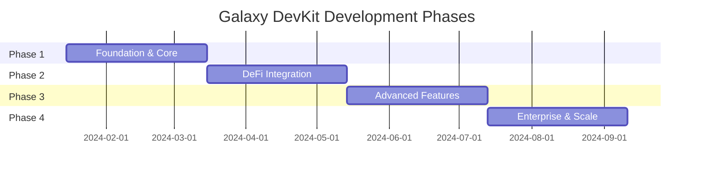

# 🗺️ Galaxy DevKit - Development Roadmap

## 🎯 Vision

Transform Galaxy DevKit into the **most comprehensive development framework for Stellar**, with deep DeFi protocol integration, robust oracle systems, and seamless developer experience.

---

## 📊 Roadmap Overview

---

## 🚀 Phase 1: Foundation & Core (Issues #1-#20)

**Duration**: 2 months
**Focus**: Establish robust foundation for DeFi and oracle integration

### Architecture & Setup (5 issues)

- [x] **#1** Setup DeFi protocols package structure (Issue #68 ✅)
- [x] **#2** Setup oracles package structure (Issue #69 ✅)
- [ ] **#3** Create IDefiProtocol interface and base classes (Issue #70 🔄)
- [x] **#4** Create IOracleSource interface and aggregator (Issue #71 ✅)
- [ ] **#5** Setup integration tests infrastructure (Issue #72 🔄)

### Wallet Enhancements (5 issues)

- [x] **#6** Add multi-signature wallet support (Issue #73 ✅)
- [x] **#7** Implement hardware wallet integration (Ledger) (Issue #74 ✅)
- [x] **#8** Add wallet backup/restore encryption improvements (Issue #75 ✅)
- [x] **#9** Implement social recovery system (Issue #76 ✅)
- [x] **#10** Add biometric authentication support (Issue #77 ✅)

### Stellar SDK Extensions (5 issues)
- [x] **#11** Add liquidity pool operations (Issue #78 ✅)
- [x] **#12** Add claimable balances support (Issue #79 ✅)
- [x] **#13** Add sponsored reserves functionality (Issue #80 ✅)
- [ ] **#14** Implement path payment (swap) improvements (Issue #81 🔄)
- [x] **#15** Add Soroban contract invocation utilities (Issue #82 ✅)

### CLI Improvements (5 issues)

- [ ] **#16** Implement wallet management commands
- [ ] **#17** Add protocol interaction commands
- [X] **#18** Create oracle data query commands
- [ ] **#19** Add interactive mode with prompts
- [ ] **#20** Implement watch mode for real-time monitoring

---

## 💰 Phase 2: DeFi Integration (Issues #21-#40)

**Duration**: 2 months
**Focus**: Integrate major Stellar DeFi protocols

### Blend Protocol (5 issues)

- [ ] **#21** Implement Blend protocol service
- [ ] **#22** Add supply/withdraw operations
- [ ] **#23** Add borrow/repay operations
- [ ] **#24** Implement position management and health factor
- [ ] **#25** Add liquidation functionality

### Soroswap DEX (5 issues)

- [ ] **#26** Implement Soroswap protocol service
- [ ] **#27** Add token swap functionality
- [ ] **#28** Add liquidity provision operations
- [ ] **#29** Implement price quote system
- [ ] **#30** Add liquidity pool analytics

### DEX Aggregator (5 issues)

- [ ] **#31** Create DEX aggregator service
- [ ] **#32** Integrate Stellar DEX (SDEX)
- [ ] **#33** Integrate Aquarius protocol
- [ ] **#34** Implement smart routing algorithm
- [ ] **#35** Add split trade execution

### Oracle System (5 issues)

- [ ] **#36** Create on-chain oracle Soroban contract
- [ ] **#37** Implement off-chain oracle aggregator service
- [ ] **#38** Add price feed integrations (CoinGecko, CMC)
- [ ] **#39** Implement TWAP (Time-Weighted Average Price)
- [ ] **#40** Add oracle data validation and anomaly detection

---

## 🎨 Phase 3: Advanced Features (Issues #41-#60)

**Duration**: 2 months
**Focus**: Advanced DeFi features and automation

### Yield Strategies (5 issues)

- [ ] **#41** Create yield vault Soroban contract
- [ ] **#42** Implement auto-compounding strategy
- [ ] **#43** Add yield farming aggregator
- [ ] **#44** Implement strategy analytics dashboard
- [ ] **#45** Add APY/APR calculation utilities

### Advanced Automation (5 issues)

- [ ] **#46** Add price oracle triggers to automation
- [ ] **#47** Implement event-based triggers (blockchain events)
- [ ] **#48** Add volume-based triggers
- [ ] **#49** Create strategy templates (DCA, Grid, Stop-loss)
- [ ] **#50** Implement execution chain (multi-step actions)

### Risk Management (5 issues)

- [ ] **#51** Enhance security limits contract
- [ ] **#52** Add risk scoring system
- [ ] **#53** Implement position monitoring alerts
- [ ] **#54** Add impermanent loss calculator
- [ ] **#55** Create risk dashboard UI

### Smart Contracts (5 issues)

- [ ] **#56** Create NFT marketplace contract
- [ ] **#57** Implement governance voting contract
- [ ] **#58** Add time-lock contract
- [ ] **#59** Create token vesting contract
- [ ] **#60** Implement flash loan contract

---

## 🏢 Phase 4: Enterprise & Scale (Issues #61-#80)

**Duration**: 2 months
**Focus**: Enterprise features and production readiness

### Multi-User & Teams (5 issues)

- [ ] **#61** Implement team accounts system
- [ ] **#62** Add role-based access control (RBAC)
- [ ] **#63** Create organization management
- [ ] **#64** Add shared wallet functionality
- [ ] **#65** Implement approval workflows

### Audit & Compliance (5 issues)

- [ ] **#66** Enhance audit logging system
- [ ] **#67** Add compliance reporting tools
- [ ] **#68** Implement transaction monitoring
- [ ] **#69** Add KYC/AML integration points
- [ ] **#70** Create audit trail export functionality

### Analytics & Monitoring (5 issues)

- [ ] **#71** Build comprehensive analytics dashboard
- [ ] **#72** Add real-time performance monitoring
- [ ] **#73** Implement alerting system
- [ ] **#74** Create custom metrics and KPIs
- [ ] **#75** Add business intelligence integrations

### Performance & Scale (5 issues)

- [ ] **#76** Optimize database queries and indexing
- [ ] **#77** Implement advanced caching strategies
- [ ] **#78** Add horizontal scaling support
- [ ] **#79** Optimize smart contract gas usage
- [ ] **#80** Add load testing and benchmarks

---

## 📈 Success Metrics

### Phase 1

- ✅ 100% test coverage for core packages
- ✅ CLI commands functional
- ✅ Multi-sig wallets working
- ✅ Documentation complete

### Phase 2

- ✅ Blend protocol fully integrated
- ✅ Soroswap operational
- ✅ DEX aggregator routing correctly
- ✅ Oracle providing accurate prices

### Phase 3

- ✅ At least 3 yield strategies live
- ✅ Automation executing reliably
- ✅ 5+ smart contracts deployed
- ✅ Risk management system active

### Phase 4

- ✅ Team accounts in production
- ✅ Audit logging comprehensive
- ✅ Analytics dashboard live
- ✅ Performance benchmarks met

---

## 🎯 Current Status

**Phase**: Phase 1 - Foundation & Core
**Progress**: 13/20 issues completed (65% ✅)
**Remaining**: 3 open issues + 4 CLI improvements pending
**Next Milestones**:
- Complete IDefiProtocol interface (#70)
- Setup integration tests infrastructure (#72)
- Path payment improvements (#81)
- CLI improvements (#16-#20)

---

## 🔗 Quick Links

- [Issues Board](https://github.com/galaxy-devkit/galaxy-devkit/issues)
- [Project Milestones](https://github.com/galaxy-devkit/galaxy-devkit/milestones)
- [Contributing Guide](./CONTRIBUTING.md)
- [Architecture Documentation](./docs/ARCHITECTURE.md)
- [AI Development Guide](./docs/AI.md)

---

**Last Updated**: 2026-01-25
**Maintained By**: Galaxy DevKit Team
