# 🏗️ Galaxy DevKit - Architecture Documentation

## 📋 Table of Contents
- [System Overview](#system-overview)
- [Core Components](#core-components)
- [DeFi Integration Architecture](#defi-integration-architecture)
- [Oracle System](#oracle-system)
- [Data Flow](#data-flow)
- [Security Architecture](#security-architecture)
- [Scalability](#scalability)

---

## 🎯 System Overview

Galaxy DevKit is a **modular, layered architecture** for Stellar blockchain development.

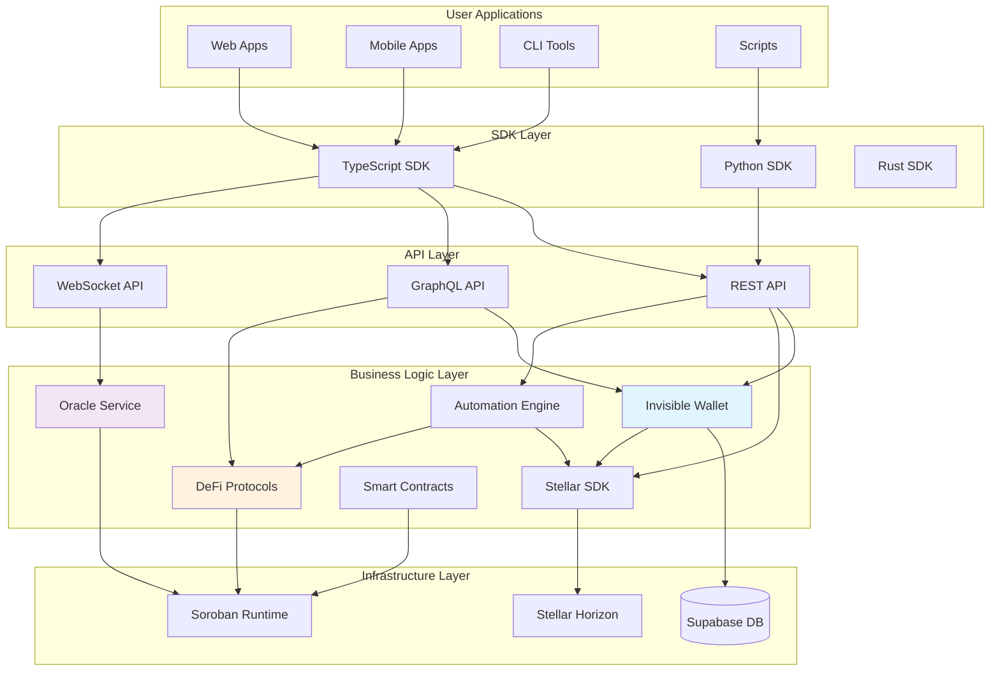

---

## 🔧 Core Components

### 1. Invisible Wallet System

**Purpose**: Provide seamless wallet management without exposing private keys to users.

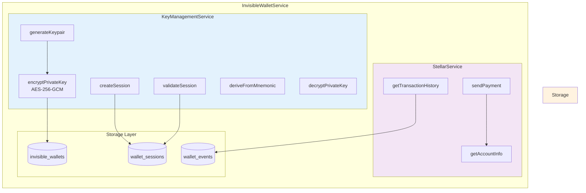

**Key Features**:
- ED25519 keypair generation (Stellar native)
- BIP39/BIP44 mnemonic derivation (m/44'/148'/0')
- AES-256-GCM encryption with PBKDF2 key derivation
- Session-based authentication with configurable timeout
- Multi-device support with device fingerprinting
- Event logging for audit trail

**Database Schema**:
```sql
-- Wallets table
CREATE TABLE invisible_wallets (
  id TEXT PRIMARY KEY,
  user_id TEXT NOT NULL,
  public_key TEXT NOT NULL,
  encrypted_private_key TEXT NOT NULL,
  encrypted_seed TEXT,
  network JSONB NOT NULL,
  created_at TIMESTAMP NOT NULL,
  updated_at TIMESTAMP NOT NULL,
  last_accessed_at TIMESTAMP,
  metadata JSONB,
  backup_status JSONB
);

-- Sessions table
CREATE TABLE wallet_sessions (
  id TEXT PRIMARY KEY,
  wallet_id TEXT REFERENCES invisible_wallets(id),
  user_id TEXT NOT NULL,
  session_token TEXT UNIQUE NOT NULL,
  expires_at TIMESTAMP NOT NULL,
  created_at TIMESTAMP NOT NULL,
  is_active BOOLEAN DEFAULT true,
  device_info JSONB
);

-- Events table
CREATE TABLE wallet_events (
  id TEXT PRIMARY KEY,
  wallet_id TEXT REFERENCES invisible_wallets(id),
  user_id TEXT NOT NULL,
  event_type TEXT NOT NULL,
  timestamp TIMESTAMP NOT NULL,
  metadata JSONB
);
```

---

### 2. Stellar SDK Wrapper

**Purpose**: Abstract and simplify Stellar SDK operations.


**Network Configurations**:
```typescript
// Testnet
{
  network: 'testnet',
  horizonUrl: 'https://horizon-testnet.stellar.org',
  passphrase: 'Test SDF Network ; September 2015'
}

// Mainnet
{
  network: 'mainnet',
  horizonUrl: 'https://horizon.stellar.org',
  passphrase: 'Public Global Stellar Network ; September 2015'
}
```

---

### 2.1 Sponsored Reserves System

**Purpose**: Allow sponsor accounts to pay base reserves for another account's ledger entries, enabling user onboarding without requiring new users to hold XLM.

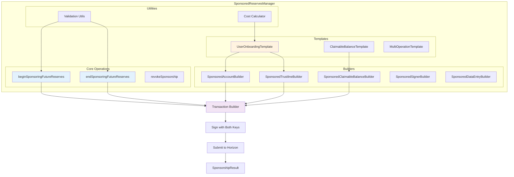

**Sponsorship Transaction Flow**:

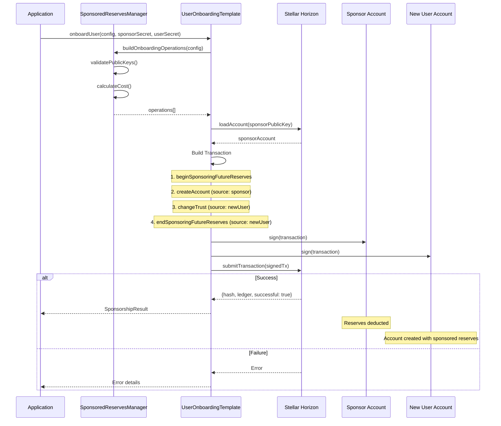

**Base Reserve Costs**:

| Entry Type | Base Reserves | XLM Cost |
|------------|---------------|----------|
| Account | 2 | 1.0 XLM |
| Trustline | 1 | 0.5 XLM |
| Offer | 1 | 0.5 XLM |
| Data Entry | 1 | 0.5 XLM |
| Signer | 1 | 0.5 XLM |
| Claimable Balance | 1 | 0.5 XLM |

**Key Files**:
- `packages/core/stellar-sdk/src/sponsored-reserves/services/sponsored-reserves-manager.ts`
- `packages/core/stellar-sdk/src/sponsored-reserves/builders/`
- `packages/core/stellar-sdk/src/sponsored-reserves/templates/`

---

### 3. Automation Engine

**Purpose**: Enable DeFi automation with triggers, conditions, and actions.

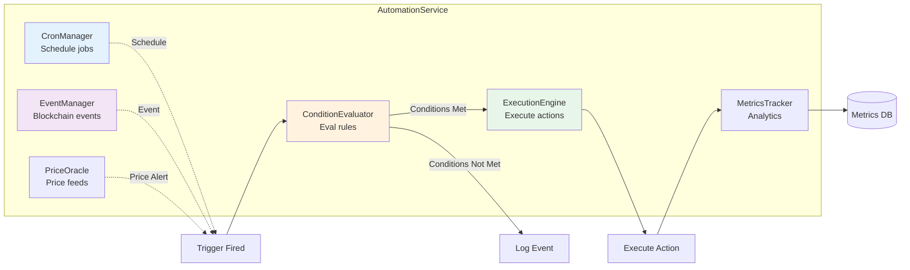

**Trigger Types**:
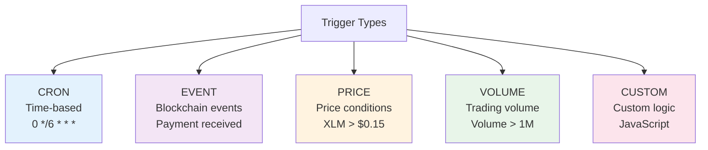

**Execution Flow**:
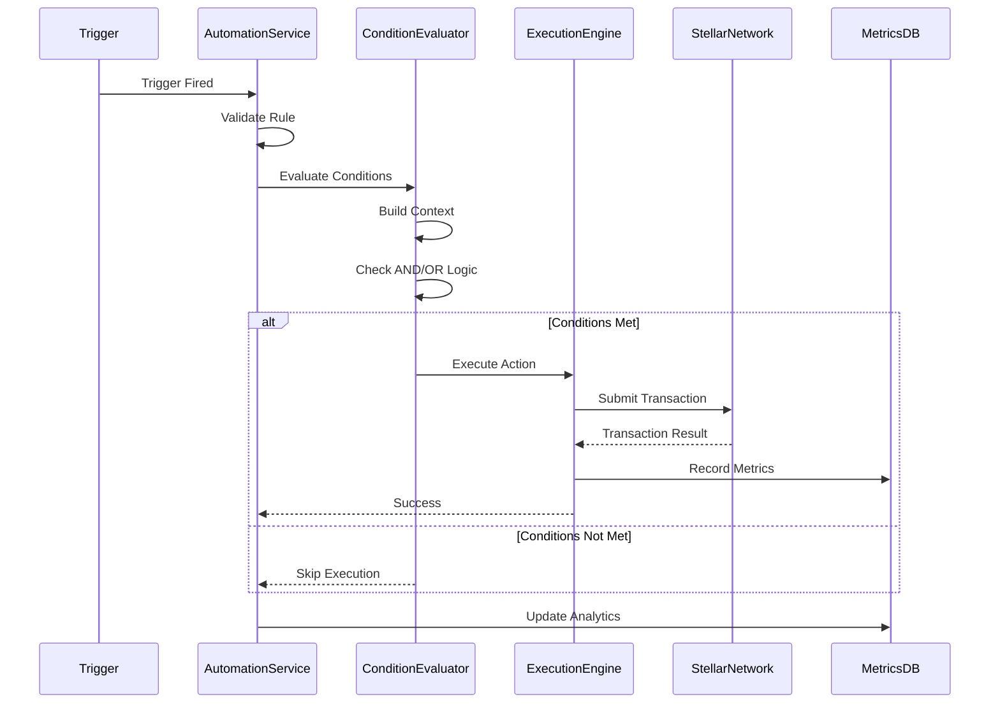

---

## 💰 DeFi Integration Architecture

### Overview

The DeFi protocols package (`@galaxy/core-defi-protocols`) provides a unified integration layer for Stellar DeFi protocols. It uses the **Abstract Factory** pattern combined with **Template Method** pattern to ensure consistent interfaces while allowing protocol-specific implementations.

### Architecture Layers

```mermaid
graph TD
    subgraph "Application Layer"
        App[Application Code]
        API[REST/GraphQL APIs]
    end

    subgraph "DeFi Protocols Package"
        Factory[ProtocolFactory<br/>Singleton]
        IProtocol[IDefiProtocol<br/>Interface]
        BaseProtocol[BaseProtocol<br/>Abstract Class]

        subgraph "Protocol Implementations"
            Blend[BlendProtocol]
            Soroswap[SoroswapProtocol]
            Custom[CustomProtocol]
        end
    end

    subgraph "Infrastructure"
        Horizon[Stellar Horizon]
        Soroban[Soroban Runtime]
    end

    App --> Factory
    API --> Factory
    Factory --> IProtocol
    IProtocol <|.. BaseProtocol
    BaseProtocol <|-- Blend
    BaseProtocol <|-- Soroswap
    BaseProtocol <|-- Custom

    Blend --> Horizon
    Blend --> Soroban
    Soroswap --> Horizon
    Soroswap --> Soroban

    style Factory fill:#e3f2fd
    style IProtocol fill:#f3e5f5
    style BaseProtocol fill:#fff3e0
```

### Protocol Abstraction Layer

The `IDefiProtocol` interface defines the contract that all protocols must implement:

```typescript
interface IDefiProtocol {
  // Protocol Identification
  readonly protocolId: string;
  readonly name: string;
  readonly type: ProtocolType;
  readonly config: ProtocolConfig;

  // Lifecycle Management
  initialize(): Promise<void>;
  isInitialized(): boolean;
  getStats(): Promise<ProtocolStats>;

  // Lending & Borrowing Operations
  supply(walletAddress: string, privateKey: string, asset: Asset, amount: string): Promise<TransactionResult>;
  borrow(walletAddress: string, privateKey: string, asset: Asset, amount: string): Promise<TransactionResult>;
  repay(walletAddress: string, privateKey: string, asset: Asset, amount: string): Promise<TransactionResult>;
  withdraw(walletAddress: string, privateKey: string, asset: Asset, amount: string): Promise<TransactionResult>;

  // Position Management
  getPosition(address: string): Promise<Position>;
  getHealthFactor(address: string): Promise<HealthFactor>;

  // Protocol Information
  getSupplyAPY(asset: Asset): Promise<APYInfo>;
  getBorrowAPY(asset: Asset): Promise<APYInfo>;
  getTotalSupply(asset: Asset): Promise<string>;
  getTotalBorrow(asset: Asset): Promise<string>;

  // DEX Operations (Optional)
  swap?(walletAddress: string, privateKey: string, tokenIn: Asset, tokenOut: Asset, amountIn: string, minAmountOut: string): Promise<TransactionResult>;
  getSwapQuote?(tokenIn: Asset, tokenOut: Asset, amountIn: string): Promise<SwapQuote>;
  addLiquidity?(walletAddress: string, privateKey: string, tokenA: Asset, tokenB: Asset, amountA: string, amountB: string): Promise<TransactionResult>;
  removeLiquidity?(walletAddress: string, privateKey: string, poolAddress: string, liquidity: string): Promise<TransactionResult>;
}
```

### BaseProtocol Abstract Class

The `BaseProtocol` class provides common functionality and enforces implementation patterns:

```typescript
abstract class BaseProtocol implements IDefiProtocol {
  // Common properties
  protected horizonServer: HorizonServer;
  protected sorobanRpcUrl: string;
  protected networkPassphrase: string;
  protected initialized: boolean;

  // Template methods (implemented)
  public async initialize(): Promise<void> {
    await this.validateConfiguration();
    await this.setupProtocol(); // Abstract - must be implemented
    this.initialized = true;
  }

  // Validation utilities (implemented)
  protected validateAddress(address: string): void;
  protected validateAmount(amount: string): void;
  protected validateAsset(asset: Asset): void;

  // Abstract methods (must be implemented by subclasses)
  protected abstract getProtocolType(): ProtocolType;
  protected abstract setupProtocol(): Promise<void>;
  public abstract supply(...): Promise<TransactionResult>;
  public abstract borrow(...): Promise<TransactionResult>;
  // ... other abstract methods
}
```

### Protocol Factory Pattern

The factory uses singleton pattern for global protocol registry:

```typescript
class ProtocolFactory {
  private static instance: ProtocolFactory;
  private protocols: Map<string, ProtocolConstructor>;

  // Singleton access
  public static getInstance(): ProtocolFactory;

  // Protocol registration
  public register(protocolId: string, constructor: ProtocolConstructor): void;
  public createProtocol(config: ProtocolConfig): IDefiProtocol;

  // Protocol discovery
  public getSupportedProtocols(): string[];
  public isProtocolRegistered(protocolId: string): boolean;
}
```

### Protocol Integration Flow

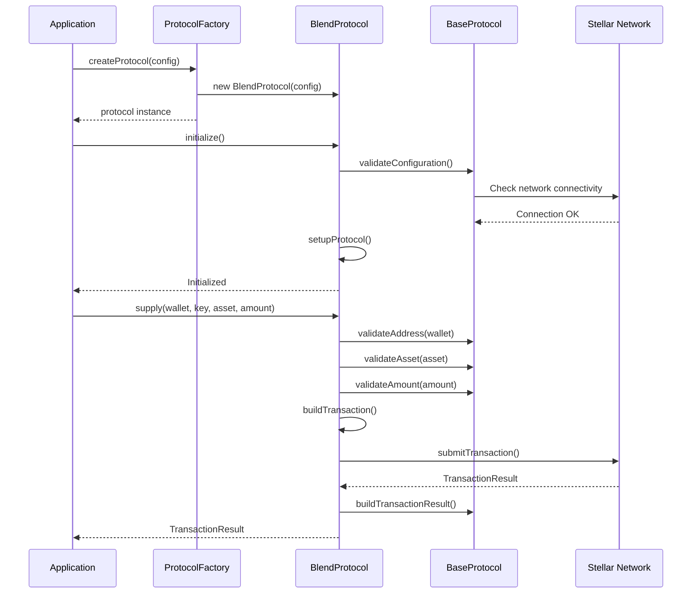

### Security Architecture

**Input Validation Flow:**

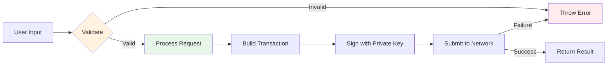

**Validation Layers:**
1. **Type Validation** - TypeScript compile-time checks
2. **Input Validation** - Runtime validation of addresses, amounts, assets
3. **Business Logic Validation** - Protocol-specific rules (e.g., health factor checks)
4. **Network Validation** - Stellar network validation before submission

### Blend Protocol Integration

**Blend** is a lending protocol on Stellar Soroban.

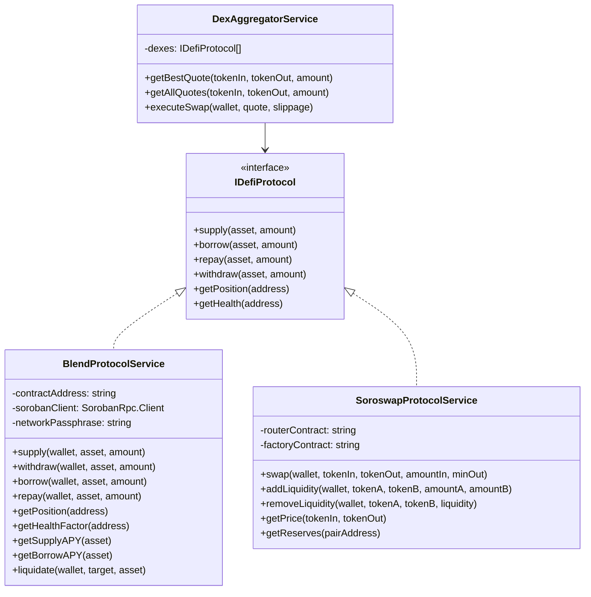

**Example Usage**:
```typescript
const blend = new BlendProtocolService({
  contractAddress: 'BLEND_CONTRACT_ADDRESS',
  network: 'mainnet'
});

// Supply USDC to earn interest
await blend.supply(wallet, { code: 'USDC', issuer: 'USDC_ISSUER' }, '1000');

// Borrow XLM against supplied collateral
await blend.borrow(wallet, { code: 'XLM' }, '500');

// Check position health
const health = await blend.getHealthFactor(wallet.publicKey);
console.log('Health factor:', health); // > 1.0 is healthy
```

### DEX Aggregator Flow

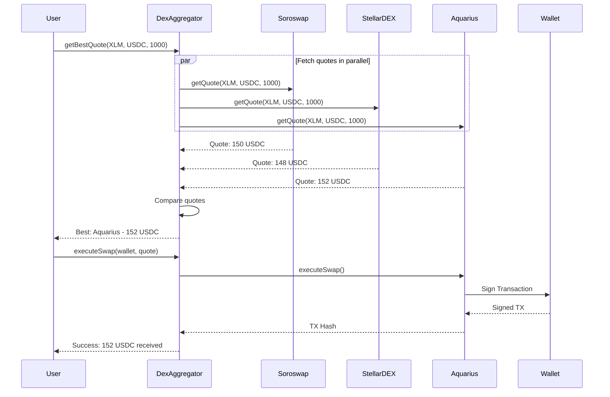

---

## 🔮 Oracle System

### Architecture

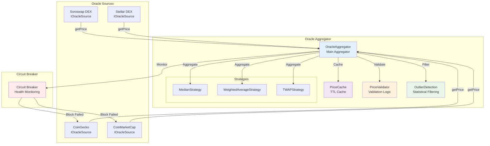

### Oracle Aggregation Flow

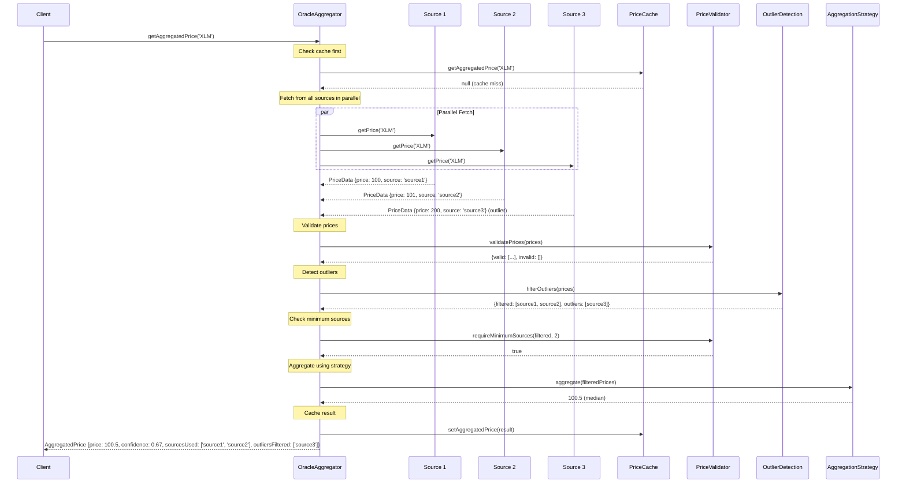

### Price Validation Logic

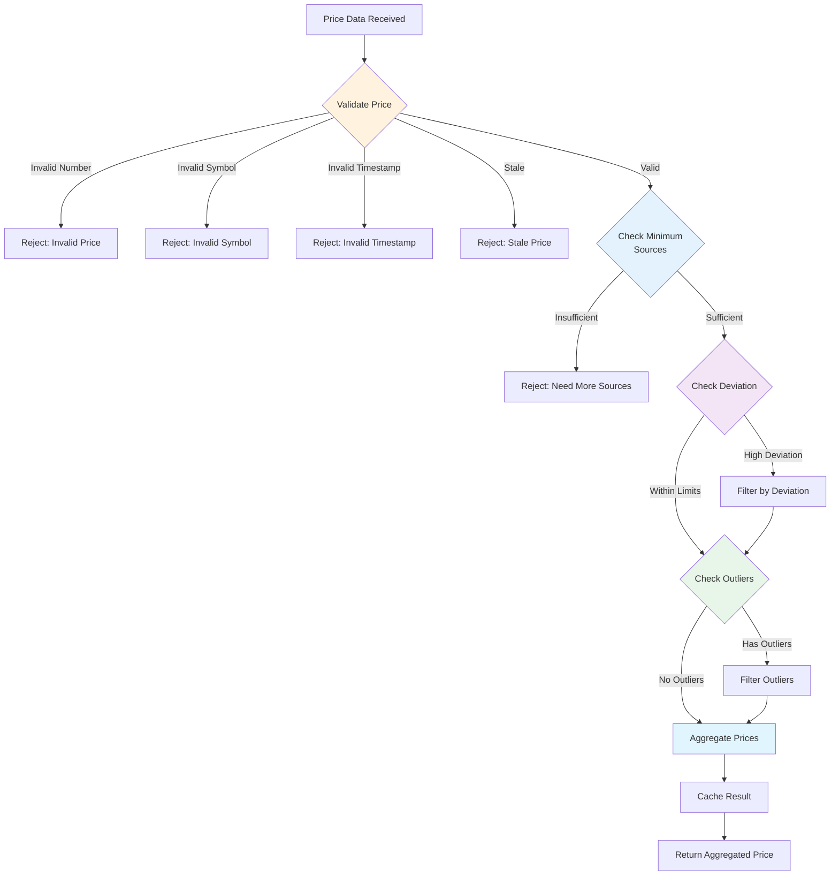

### Caching Architecture

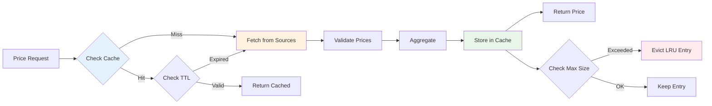

### Source Health Monitoring

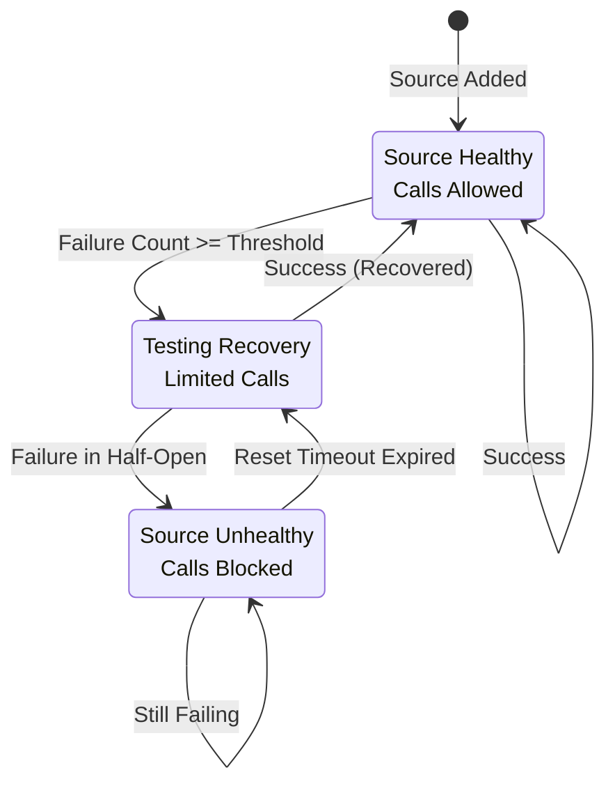

### On-Chain Oracle Contract

```rust
pub struct PriceOracle;

#[contractimpl]
impl PriceOracle {
    /// Set price (only trusted sources)
    pub fn set_price(
        env: &Env,
        source: Address,
        pair: Symbol,
        price: u128,
        timestamp: u64
    );

    /// Get latest price
    pub fn get_price(env: &Env, pair: Symbol) -> PriceData;

    /// Get TWAP (Time-Weighted Average Price)
    pub fn get_twap(env: &Env, pair: Symbol, window: u64) -> u128;

    /// Add trusted source
    pub fn add_trusted_source(env: &Env, source: Address);
}
```

### Price Update Flow

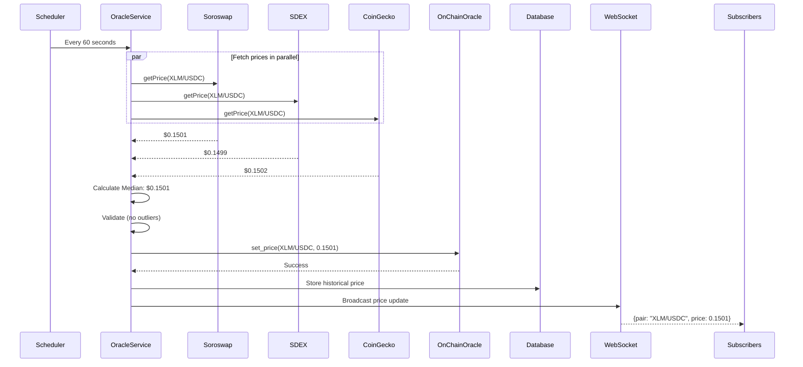

---

## 🔄 Data Flow

### Wallet Creation Flow

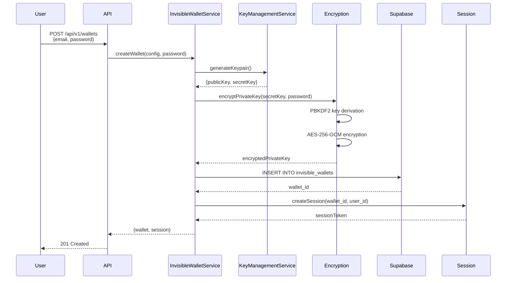

### Payment Flow

```mermaid
sequenceDiagram
    participant User
    participant API
    participant IWService as InvisibleWalletService
    participant KeyMgmt as KeyManagementService
    participant StellarService
    participant Horizon
    participant EventLog

    User->>API: POST /api/v1/payments<br/>{walletId, destination, amount}
    API->>IWService: sendPayment(walletId, sessionToken, params)
    
    IWService->>KeyMgmt: validateSession(sessionToken)
    KeyMgmt-->>IWService: valid
    
    IWService->>KeyMgmt: decryptPrivateKey(password)
    KeyMgmt-->>IWService: privateKey
    
    IWService->>StellarService: sendPayment(wallet, params)
    StellarService->>StellarService: buildTransaction()
    StellarService->>StellarService: signTransaction(privateKey)
    
    StellarService->>Horizon: submitTransaction()
    
    alt Success
        Horizon-->>StellarService: {hash, ledger, status: success}
        StellarService->>EventLog: Log TRANSACTION_SENT
        StellarService-->>IWService: PaymentResult
        IWService-->>API: {hash, status, ledger}
        API-->>User: 200 OK
    else Failure
        Horizon-->>StellarService: Error
        StellarService->>StellarService: Retry (up to 3 times)
        StellarService-->>API: Error details
        API-->>User: 400 Bad Request
    end
```

### Claimable Balance Flow

```mermaid
sequenceDiagram
    participant Sender
    participant StellarService
    participant CBM as ClaimableBalanceManager
    participant Horizon
    participant Claimant
    participant Network

    Note over Sender,Network: Create Claimable Balance Flow
    Sender->>StellarService: createClaimableBalance(wallet, params, password)
    StellarService->>CBM: createClaimableBalance(wallet, params, password)
    CBM->>CBM: Validate parameters & predicates
    CBM->>CBM: Build claimants with Stellar predicates
    CBM->>CBM: Build transaction with createClaimableBalance operation
    CBM->>Network: Submit transaction
    Network-->>CBM: Transaction result
    CBM->>Horizon: Query operations for balance ID
    Horizon-->>CBM: Balance ID
    CBM-->>StellarService: ClaimableBalanceResult {balanceId, hash}
    StellarService-->>Sender: Balance created

    Note over Claimant,Network: Claim Balance Flow
    Claimant->>StellarService: claimBalance(wallet, {balanceId}, password)
    StellarService->>CBM: claimBalance(wallet, params, password)
    CBM->>CBM: Validate balance ID
    CBM->>Horizon: Get balance details
    Horizon-->>CBM: Balance info with predicates
    CBM->>CBM: Evaluate predicates (check time, conditions)
    alt Predicate Valid
        CBM->>CBM: Build transaction with claimClaimableBalance operation
        CBM->>Network: Submit transaction
        Network-->>CBM: Transaction result
        CBM-->>StellarService: ClaimableBalanceResult
        StellarService-->>Claimant: Balance claimed
    else Predicate Invalid
        CBM-->>StellarService: Error: Cannot claim
        StellarService-->>Claimant: Claim failed
    end
```

### Predicate Evaluation

```mermaid
graph TD
    Start[Evaluate Predicate] --> CheckType{Check Type}
    
    CheckType -->|unconditional| Unconditional[Return TRUE]
    CheckType -->|abs_before| CheckAbsTime{Current Time < Deadline?}
    CheckType -->|rel_before| CheckRelTime{Current Time < Creation + Duration?}
    CheckType -->|not| EvalNot[Evaluate Sub-Predicate<br/>Return NOT Result]
    CheckType -->|and| EvalAnd1[Evaluate Predicate 1]
    CheckType -->|or| EvalOr1[Evaluate Predicate 1]
    
    CheckAbsTime -->|Yes| ReturnTrue[Return TRUE]
    CheckAbsTime -->|No| ReturnFalse[Return FALSE]
    
    CheckRelTime -->|Yes| ReturnTrue
    CheckRelTime -->|No| ReturnFalse
    
    EvalNot --> NotResult{Sub-Predicate Result}
    NotResult -->|TRUE| ReturnFalse
    NotResult -->|FALSE| ReturnTrue
    
    EvalAnd1 --> AndResult1{Result 1}
    AndResult1 -->|TRUE| EvalAnd2[Evaluate Predicate 2]
    AndResult1 -->|FALSE| ReturnFalse
    EvalAnd2 --> AndResult2{Result 2}
    AndResult2 -->|TRUE| ReturnTrue
    AndResult2 -->|FALSE| ReturnFalse
    
    EvalOr1 --> OrResult1{Result 1}
    OrResult1 -->|TRUE| ReturnTrue
    OrResult1 -->|FALSE| EvalOr2[Evaluate Predicate 2]
    EvalOr2 --> OrResult2{Result 2}
    OrResult2 -->|TRUE| ReturnTrue
    OrResult2 -->|FALSE| ReturnFalse
    
    style Start fill:#e3f2fd
    style ReturnTrue fill:#e8f5e9
    style ReturnFalse fill:#ffebee
```

### Automation Execution Flow

```mermaid
flowchart TD
    Start[Trigger Fired<br/>CRON/Event/Price] --> Validate{Validate Rule}
    Validate -->|Invalid| LogError[Log Error]
    Validate -->|Valid| CheckStatus{Check Status}

    CheckStatus -->|Inactive| Skip[Skip Execution]
    CheckStatus -->|Active| CheckLimits{Check Limits}

    CheckLimits -->|Exceeded| Disable[Disable Rule]
    CheckLimits -->|OK| BuildContext[Build Context<br/>Market data, Account data]

    BuildContext --> EvalConditions[Evaluate Conditions]
    EvalConditions --> ConditionsMet{Conditions Met?}

    ConditionsMet -->|No| LogConditions[Log: Conditions Not Met]
    ConditionsMet -->|Yes| Execute[Execute Action]

    Execute --> ActionType{Action Type}

    ActionType -->|PAYMENT| SendPayment[Send Payment]
    ActionType -->|SWAP| ExecuteSwap[Execute Swap]
    ActionType -->|CONTRACT| CallContract[Call Contract]
    ActionType -->|WEBHOOK| CallWebhook[Call Webhook]

    SendPayment --> RecordMetrics
    ExecuteSwap --> RecordMetrics
    CallContract --> RecordMetrics
    CallWebhook --> RecordMetrics

    RecordMetrics[Record Metrics] --> Emit[Emit Event]
    Emit --> Broadcast[WebSocket Broadcast]
    Broadcast --> End[End]

    LogError --> End
    Skip --> End
    Disable --> End
    LogConditions --> End

    style Start fill:#e3f2fd
    style Execute fill:#e8f5e9
    style RecordMetrics fill:#fff3e0
    style End fill:#f3e5f5
```

---

## 🔐 Security Architecture

### Encryption

**Wallet Private Keys**:
```mermaid
graph LR
    PK[Private Key<br/>Plain Text] --> PBKDF2[PBKDF2<br/>100k iterations]
    Password[Password] --> PBKDF2
    Salt[Salt<br/>32 bytes] --> PBKDF2

    PBKDF2 --> DerivedKey[Derived Key<br/>256 bits]

    DerivedKey --> AES[AES-256-GCM<br/>Encryption]
    PK --> AES
    IV[IV<br/>16 bytes] --> AES

    AES --> Ciphertext[Ciphertext]
    AES --> AuthTag[Auth Tag<br/>16 bytes]

    Ciphertext --> Store[(Encrypted Data<br/>Supabase)]
    AuthTag --> Store
    Salt --> Store
    IV --> Store

    style PBKDF2 fill:#e3f2fd
    style AES fill:#f3e5f5
    style Store fill:#fff3e0
```

**Encrypted Data Structure**:
```typescript
interface EncryptedData {
  ciphertext: string;  // Base64
  iv: string;          // Base64
  salt: string;        // Base64
  authTag: string;     // Base64
  algorithm: 'aes-256-gcm';
}
```

### Access Control

```mermaid
graph TD
    Request[HTTP Request] --> CheckAPI{API Key Valid?}
    CheckAPI -->|No| Reject1[401 Unauthorized]
    CheckAPI -->|Yes| CheckRL{Rate Limit OK?}

    CheckRL -->|No| Reject2[429 Too Many Requests]
    CheckRL -->|Yes| CheckSession{Session Valid?}

    CheckSession -->|No| Reject3[403 Forbidden]
    CheckSession -->|Yes| CheckOwnership{Resource Ownership?}

    CheckOwnership -->|No| Reject4[403 Forbidden]
    CheckOwnership -->|Yes| Execute[Execute Operation]

    Execute --> LogEvent[Log Audit Event]
    LogEvent --> Response[200 OK]

    style Request fill:#e3f2fd
    style Execute fill:#e8f5e9
    style LogEvent fill:#fff3e0
```

### Audit Logging

```typescript
interface WalletEvent {
  id: string;
  walletId: string;
  userId: string;
  eventType: WalletEventType;
  timestamp: Date;
  metadata: {
    ipAddress?: string;
    userAgent?: string;
    deviceInfo?: DeviceInfo;
    [key: string]: any;
  };
}

enum WalletEventType {
  CREATED = 'created',
  UNLOCKED = 'unlocked',
  LOCKED = 'locked',
  TRANSACTION_SENT = 'transaction_sent',
  BACKUP_CREATED = 'backup_created',
  PASSWORD_CHANGED = 'password_changed',
  RECOVERY_INITIATED = 'recovery_initiated'
}
```

---

## 📈 Scalability

### Horizontal Scaling

```mermaid
graph TB
    LB[Load Balancer<br/>Nginx/HAProxy]

    subgraph "API Servers (Stateless)"
        API1[API Server 1]
        API2[API Server 2]
        API3[API Server N]
    end

    subgraph "WebSocket Servers"
        WS1[WS Server 1]
        WS2[WS Server 2]
        WS3[WS Server N]
        Redis[(Redis Adapter<br/>Pub/Sub)]
    end

    subgraph "Background Workers"
        W1[Worker 1<br/>Automation]
        W2[Worker 2<br/>Oracles]
        W3[Worker N<br/>Jobs]
        Queue[(Job Queue<br/>Bull/BullMQ)]
    end

    subgraph "Database Layer"
        Primary[(Primary DB<br/>Write)]
        Replica1[(Replica 1<br/>Read)]
        Replica2[(Replica N<br/>Read)]
    end

    LB --> API1
    LB --> API2
    LB --> API3

    LB --> WS1
    LB --> WS2
    LB --> WS3

    WS1 --> Redis
    WS2 --> Redis
    WS3 --> Redis

    API1 --> Primary
    API2 --> Replica1
    API3 --> Replica2

    Queue --> W1
    Queue --> W2
    Queue --> W3

    W1 --> Primary
    W2 --> Primary
    W3 --> Primary

    style LB fill:#e3f2fd
    style Redis fill:#fff3e0
    style Queue fill:#f3e5f5
    style Primary fill:#e8f5e9
```

### Caching Strategy

```mermaid
graph LR
    Request[Request] --> L1{Redis Cache<br/>Layer 1}

    L1 -->|Hit| Return1[Return Cached]
    L1 -->|Miss| L2{Application Cache<br/>Layer 2}

    L2 -->|Hit| Return2[Return + Cache L1]
    L2 -->|Miss| DB[(Database)]

    DB --> Cache[Cache Result]
    Cache --> Return3[Return]

    style L1 fill:#e3f2fd
    style L2 fill:#f3e5f5
    style DB fill:#fff3e0
```

**Cache TTLs**:
- Account Info: 60 seconds
- Transaction History: 300 seconds (5 minutes)
- Price Data: 60 seconds
- Protocol Stats: 300 seconds (5 minutes)

### Rate Limiting

```mermaid
graph TD
    Request[Incoming Request] --> Identify[Identify Client<br/>API Key / IP]
    Identify --> Check{Rate Limit<br/>Check}

    Check -->|Within Limit| Allow[Allow Request]
    Check -->|Exceeded| Block[Block Request<br/>429 Too Many Requests]

    Allow --> Tiers{Client Tier}

    Tiers -->|Free| T1[100 req/min]
    Tiers -->|Basic| T2[1,000 req/min]
    Tiers -->|Pro| T3[10,000 req/min]
    Tiers -->|Enterprise| T4[Unlimited]

    style Request fill:#e3f2fd
    style Allow fill:#e8f5e9
    style Block fill:#ffebee
```

---

## 🧪 Testing Strategy

```mermaid
graph TB
    subgraph "Testing Pyramid"
        E2E[E2E Tests<br/>Full user flows]
        Integration[Integration Tests<br/>API + DB + Stellar]
        Unit[Unit Tests<br/>Core logic<br/>90%+ coverage]
    end

    subgraph "Contract Testing"
        Soroban[Soroban Contract Tests<br/>Every public function]
        Edge[Edge Cases<br/>Failure scenarios]
    end

    subgraph "CI/CD Pipeline"
        Lint[Linting<br/>ESLint/Prettier]
        Type[Type Check<br/>TypeScript]
        Test[Run Tests]
        Build[Build]
        Deploy[Deploy]
    end

    Unit --> Integration
    Integration --> E2E

    Soroban --> Edge

    Lint --> Type
    Type --> Test
    Test --> Build
    Build --> Deploy

    style Unit fill:#e8f5e9
    style Integration fill:#fff3e0
    style E2E fill:#e3f2fd
    style Soroban fill:#f3e5f5
```

---

**Last Updated**: 2024-01-15
**Version**: 1.0.0
