# 🏗️ Galaxy DevKit - Architecture Documentation

## 📋 Table of Contents
- [System Overview](#system-overview)
- [Core Components](#core-components)
  - [Invisible Wallet System](#1-invisible-wallet-system)
  - [Hardware Wallet Integration (Ledger)](#2-hardware-wallet-integration-ledger)
  - [Stellar SDK Wrapper](#3-stellar-sdk-wrapper)
  - [Automation Engine](#4-automation-engine)
- [DeFi Integration Architecture](#defi-integration-architecture)
- [Oracle System](#oracle-system)
- [Data Flow](#data-flow)
- [Security Architecture](#security-architecture)
- [Scalability](#scalability)

---

## 🎯 System Overview

Galaxy DevKit is a **modular, layered architecture** for Stellar blockchain development.

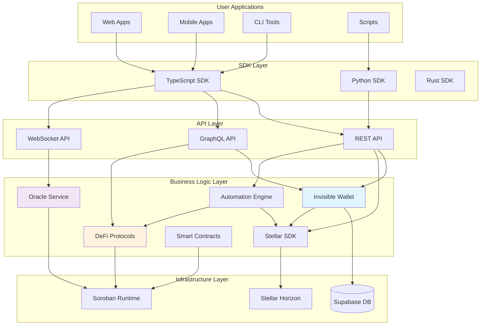
```mermaid
graph TB
    subgraph "User Applications"
        WebApp[Web Apps]
        MobileApp[Mobile Apps]
        CLI[CLI Tools]
        Scripts[Scripts]
    end

    subgraph "SDK Layer"
        TSSDK[TypeScript SDK]
        PySdk[Python SDK]
        RustSdk[Rust SDK]
    end

    subgraph "API Layer"
        REST[REST API]
        GraphQL[GraphQL API]
        WS[WebSocket API]
    end

    subgraph "Business Logic Layer"
        IW[Invisible Wallet]
        SS[Stellar SDK]
        AE[Automation Engine]
        DP[DeFi Protocols]
        OS[Oracle Service]
        SC[Smart Contracts]
    end

    subgraph "Infrastructure Layer"
        Supabase[(Supabase DB)]
        Horizon[Stellar Horizon]
        Soroban[Soroban Runtime]
    end

    WebApp --> TSSDK
    MobileApp --> TSSDK
    CLI --> TSSDK
    Scripts --> PySdk

    TSSDK --> REST
    TSSDK --> GraphQL
    TSSDK --> WS
    PySdk --> REST

    REST --> IW
    REST --> SS
    REST --> AE
    GraphQL --> IW
    GraphQL --> DP
    WS --> OS

    IW --> Supabase
    IW --> SS
    SS --> Horizon
    AE --> SS
    AE --> DP
    DP --> Soroban
    OS --> Soroban
    SC --> Soroban

    style IW fill:#e1f5ff
    style DP fill:#fff3e0
    style OS fill:#f3e5f5
```

---

## 🔧 Core Components

### 1. Invisible Wallet System

**Purpose**: Provide seamless wallet management without exposing private keys to users.

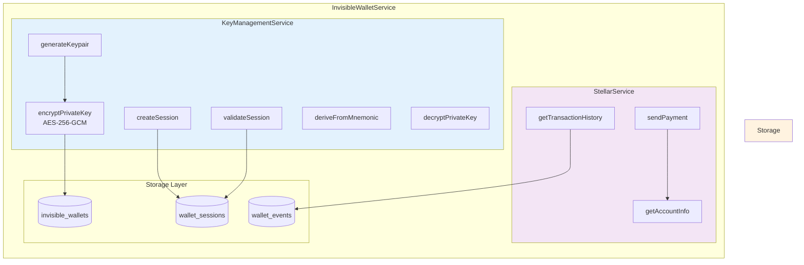
```mermaid
graph TB
    subgraph "InvisibleWalletService"
        direction TB

        subgraph "KeyManagementService"
            Gen[generateKeypair]
            Derive[deriveFromMnemonic]
            Encrypt[encryptPrivateKey<br/>AES-256-GCM]
            Decrypt[decryptPrivateKey]
            Session[createSession]
            Validate[validateSession]
        end

        subgraph "StellarService"
            AccInfo[getAccountInfo]
            Send[sendPayment]
            History[getTransactionHistory]
        end

        subgraph "Storage Layer"
            WalletTable[(invisible_wallets)]
            SessionTable[(wallet_sessions)]
            EventTable[(wallet_events)]
        end
    end

    Gen --> Encrypt
    Encrypt --> WalletTable
    Session --> SessionTable
    Validate --> SessionTable
    Send --> AccInfo
    History --> EventTable

    style KeyManagementService fill:#e3f2fd
    style StellarService fill:#f3e5f5
    style Storage fill:#fff3e0
```

**Key Features**:
- ED25519 keypair generation (Stellar native)
- BIP39/BIP44 mnemonic derivation (m/44'/148'/0')
- AES-256-GCM encryption with PBKDF2 key derivation
- Session-based authentication with configurable timeout
- Multi-device support with device fingerprinting
- Event logging for audit trail

**Database Schema**:
```sql
-- Wallets table
CREATE TABLE invisible_wallets (
  id TEXT PRIMARY KEY,
  user_id TEXT NOT NULL,
  public_key TEXT NOT NULL,
  encrypted_private_key TEXT NOT NULL,
  encrypted_seed TEXT,
  network JSONB NOT NULL,
  created_at TIMESTAMP NOT NULL,
  updated_at TIMESTAMP NOT NULL,
  last_accessed_at TIMESTAMP,
  metadata JSONB,
  backup_status JSONB
);

-- Sessions table
CREATE TABLE wallet_sessions (
  id TEXT PRIMARY KEY,
  wallet_id TEXT REFERENCES invisible_wallets(id),
  user_id TEXT NOT NULL,
  session_token TEXT UNIQUE NOT NULL,
  expires_at TIMESTAMP NOT NULL,
  created_at TIMESTAMP NOT NULL,
  is_active BOOLEAN DEFAULT true,
  device_info JSONB
);

-- Events table
CREATE TABLE wallet_events (
  id TEXT PRIMARY KEY,
  wallet_id TEXT REFERENCES invisible_wallets(id),
  user_id TEXT NOT NULL,
  event_type TEXT NOT NULL,
  timestamp TIMESTAMP NOT NULL,
  metadata JSONB
);
```

---

### 2. Hardware Wallet Integration (Ledger)

**Purpose**: Provide secure transaction signing and key management using Ledger hardware wallets.

#### Architecture Overview

Hardware wallet integration enables users to leverage Ledger devices for secure key storage and transaction signing without exposing private keys to the application layer. The architecture consists of three main layers:

1. **Application Layer**: High-level wallet operations and user interactions
2. **Transport Layer**: Communication protocol between application and Ledger device
3. **Stellar App Layer**: On-device transaction processing and signing

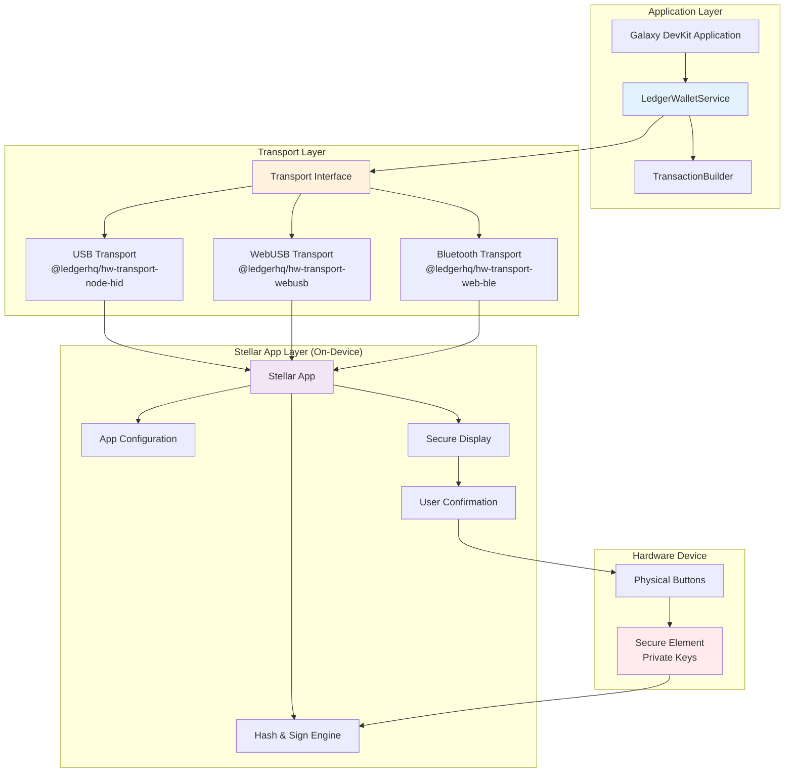
```mermaid
graph TB
    subgraph "Application Layer"
        App[Galaxy DevKit Application]
        LedgerService[LedgerWalletService]
        TxBuilder[TransactionBuilder]
    end

    subgraph "Transport Layer"
        Transport[Transport Interface]
        USB[USB Transport<br/>@ledgerhq/hw-transport-node-hid]
        WebUSB[WebUSB Transport<br/>@ledgerhq/hw-transport-webusb]
        BLE[Bluetooth Transport<br/>@ledgerhq/hw-transport-web-ble]
    end

    subgraph "Stellar App Layer (On-Device)"
        StellarApp[Stellar App]
        AppConfig[App Configuration]
        HashSign[Hash & Sign Engine]
        Display[Secure Display]
        Confirm[User Confirmation]
    end

    subgraph "Hardware Device"
        SecureElement[Secure Element<br/>Private Keys]
        UserButton[Physical Buttons]
    end

    App --> LedgerService
    LedgerService --> TxBuilder
    LedgerService --> Transport

    Transport --> USB
    Transport --> WebUSB
    Transport --> BLE

    USB --> StellarApp
    WebUSB --> StellarApp
    BLE --> StellarApp

    StellarApp --> AppConfig
    StellarApp --> HashSign
    StellarApp --> Display

    Display --> Confirm
    Confirm --> UserButton
    UserButton --> SecureElement
    SecureElement --> HashSign

    style LedgerService fill:#e3f2fd
    style Transport fill:#fff3e0
    style StellarApp fill:#f3e5f5
    style SecureElement fill:#ffebee
```

#### Component Diagram

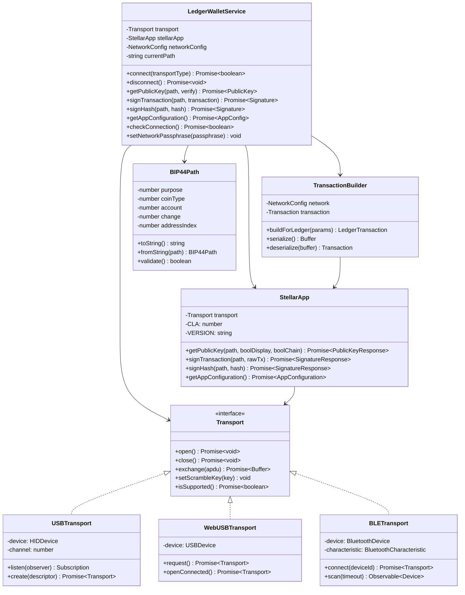
```mermaid
classDiagram
    class LedgerWalletService {
        -Transport transport
        -StellarApp stellarApp
        -NetworkConfig networkConfig
        -string currentPath

        +connect(transportType) Promise~boolean~
        +disconnect() Promise~void~
        +getPublicKey(path, verify) Promise~PublicKey~
        +signTransaction(path, transaction) Promise~Signature~
        +signHash(path, hash) Promise~Signature~
        +getAppConfiguration() Promise~AppConfig~
        +checkConnection() Promise~boolean~
        +setNetworkPassphrase(passphrase) void
    }

    class Transport {
        <<interface>>
        +open() Promise~void~
        +close() Promise~void~
        +exchange(apdu) Promise~Buffer~
        +setScrambleKey(key) void
        +isSupported() Promise~boolean~
    }

    class USBTransport {
        -device: HIDDevice
        -channel: number
        +listen(observer) Subscription
        +create(descriptor) Promise~Transport~
    }

    class WebUSBTransport {
        -device: USBDevice
        +request() Promise~Transport~
        +openConnected() Promise~Transport~
    }

    class BLETransport {
        -device: BluetoothDevice
        -characteristic: BluetoothCharacteristic
        +connect(deviceId) Promise~Transport~
        +scan(timeout) Observable~Device~
    }

    class StellarApp {
        -Transport transport
        -CLA: number
        -VERSION: string

        +getPublicKey(path, boolDisplay, boolChain) Promise~PublicKeyResponse~
        +signTransaction(path, rawTx) Promise~SignatureResponse~
        +signHash(path, hash) Promise~SignatureResponse~
        +getAppConfiguration() Promise~AppConfiguration~
    }

    class TransactionBuilder {
        -NetworkConfig network
        -Transaction transaction

        +buildForLedger(params) LedgerTransaction
        +serialize() Buffer
        +deserialize(buffer) Transaction
    }

    class BIP44Path {
        -number purpose
        -number coinType
        -number account
        -number change
        -number addressIndex

        +toString() string
        +fromString(path) BIP44Path
        +validate() boolean
    }

    LedgerWalletService --> Transport
    LedgerWalletService --> StellarApp
    LedgerWalletService --> TransactionBuilder
    LedgerWalletService --> BIP44Path

    Transport <|.. USBTransport
    Transport <|.. WebUSBTransport
    Transport <|.. BLETransport

    StellarApp --> Transport
    TransactionBuilder --> StellarApp
```

#### Connection and Signing Flow

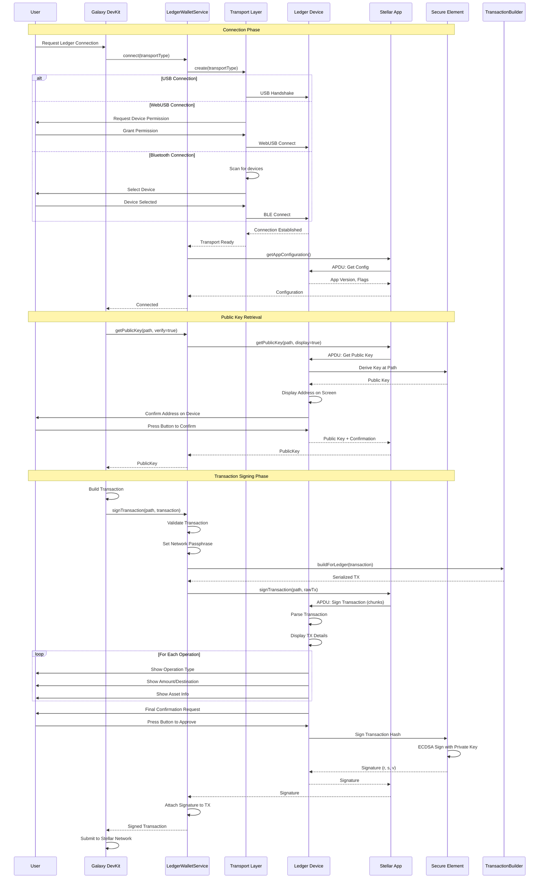
```mermaid
sequenceDiagram
    participant User
    participant App as Galaxy DevKit
    participant LedgerService as LedgerWalletService
    participant Transport as Transport Layer
    participant Device as Ledger Device
    participant StellarApp as Stellar App
    participant SecureElement as Secure Element

    Note over User,SecureElement: Connection Phase
    User->>App: Request Ledger Connection
    App->>LedgerService: connect(transportType)
    LedgerService->>Transport: create(transportType)

    alt USB Connection
        Transport->>Device: USB Handshake
    else WebUSB Connection
        Transport->>User: Request Device Permission
        User->>Transport: Grant Permission
        Transport->>Device: WebUSB Connect
    else Bluetooth Connection
        Transport->>Transport: Scan for devices
        Transport->>User: Select Device
        User->>Transport: Device Selected
        Transport->>Device: BLE Connect
    end

    Device-->>Transport: Connection Established
    Transport-->>LedgerService: Transport Ready

    LedgerService->>StellarApp: getAppConfiguration()
    StellarApp->>Device: APDU: Get Config
    Device-->>StellarApp: App Version, Flags
    StellarApp-->>LedgerService: Configuration
    LedgerService-->>App: Connected

    Note over User,SecureElement: Public Key Retrieval
    App->>LedgerService: getPublicKey(path, verify=true)
    LedgerService->>StellarApp: getPublicKey(path, display=true)
    StellarApp->>Device: APDU: Get Public Key
    Device->>SecureElement: Derive Key at Path
    SecureElement-->>Device: Public Key
    Device->>Device: Display Address on Screen
    Device->>User: Confirm Address on Device
    User->>Device: Press Button to Confirm
    Device-->>StellarApp: Public Key + Confirmation
    StellarApp-->>LedgerService: PublicKey
    LedgerService-->>App: PublicKey

    Note over User,SecureElement: Transaction Signing Phase
    App->>App: Build Transaction
    App->>LedgerService: signTransaction(path, transaction)
    LedgerService->>LedgerService: Validate Transaction
    LedgerService->>LedgerService: Set Network Passphrase
    LedgerService->>TransactionBuilder: buildForLedger(transaction)
    TransactionBuilder-->>LedgerService: Serialized TX

    LedgerService->>StellarApp: signTransaction(path, rawTx)
    StellarApp->>Device: APDU: Sign Transaction (chunks)
    Device->>Device: Parse Transaction
    Device->>Device: Display TX Details

    loop For Each Operation
        Device->>User: Show Operation Type
        Device->>User: Show Amount/Destination
        Device->>User: Show Asset Info
    end

    Device->>User: Final Confirmation Request
    User->>Device: Press Button to Approve

    Device->>SecureElement: Sign Transaction Hash
    SecureElement->>SecureElement: ECDSA Sign with Private Key
    SecureElement-->>Device: Signature (r, s, v)
    Device-->>StellarApp: Signature
    StellarApp-->>LedgerService: Signature

    LedgerService->>LedgerService: Attach Signature to TX
    LedgerService-->>App: Signed Transaction
    App->>App: Submit to Stellar Network
```

#### Security Architecture for Hardware Wallets

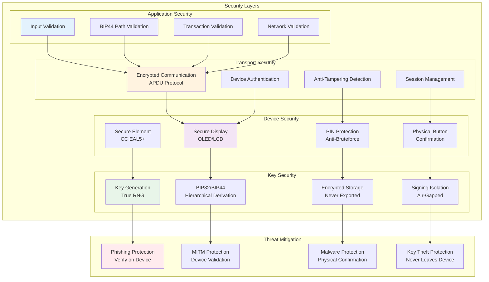
```mermaid
graph TB
    subgraph "Security Layers"
        subgraph "Application Security"
            InputVal[Input Validation]
            PathVal[BIP44 Path Validation]
            TxVal[Transaction Validation]
            NetworkVal[Network Validation]
        end

        subgraph "Transport Security"
            EncComm[Encrypted Communication<br/>APDU Protocol]
            DeviceAuth[Device Authentication]
            SessionMgmt[Session Management]
            AntiTamper[Anti-Tampering Detection]
        end

        subgraph "Device Security"
            SecureDisplay[Secure Display<br/>OLED/LCD]
            PhysicalButton[Physical Button<br/>Confirmation]
            PINProtection[PIN Protection<br/>Anti-Bruteforce]
            SecureElement[Secure Element<br/>CC EAL5+]
        end

        subgraph "Key Security"
            KeyGen[Key Generation<br/>True RNG]
            KeyDerivation[BIP32/BIP44<br/>Hierarchical Derivation]
            KeyStorage[Encrypted Storage<br/>Never Exported]
            SigningIsolation[Signing Isolation<br/>Air-Gapped]
        end
    end

    subgraph "Threat Mitigation"
        Phishing[Phishing Protection<br/>Verify on Device]
        MITM[MITM Protection<br/>Device Validation]
        Malware[Malware Protection<br/>Physical Confirmation]
        KeyTheft[Key Theft Protection<br/>Never Leaves Device]
    end

    InputVal --> EncComm
    PathVal --> EncComm
    TxVal --> EncComm
    NetworkVal --> EncComm

    EncComm --> SecureDisplay
    DeviceAuth --> SecureDisplay
    SessionMgmt --> PhysicalButton
    AntiTamper --> PINProtection

    SecureDisplay --> KeyDerivation
    PhysicalButton --> SigningIsolation
    PINProtection --> KeyStorage
    SecureElement --> KeyGen

    KeyGen --> Phishing
    KeyDerivation --> MITM
    KeyStorage --> Malware
    SigningIsolation --> KeyTheft

    style InputVal fill:#e3f2fd
    style EncComm fill:#fff3e0
    style SecureDisplay fill:#f3e5f5
    style KeyGen fill:#e8f5e9
    style Phishing fill:#ffebee
```

**Security Features**:

1. **Private Key Isolation**
   - Private keys never leave the secure element
   - All signing operations occur on-device
   - Encrypted storage with tamper detection
   - Physical device required for every transaction

2. **Transaction Verification**
   - Human-readable transaction display
   - Multi-step confirmation process
   - Network passphrase validation
   - Operation-by-operation review

3. **Communication Security**
   - APDU (Application Protocol Data Unit) encryption
   - Device authentication handshake
   - Session timeout and auto-lock
   - Transport layer validation

4. **Physical Security**
   - PIN protection (3-8 attempts before wipe)
   - Secure bootloader
   - Tamper-resistant hardware
   - Supply chain attack mitigation

#### BIP44 Path Structure

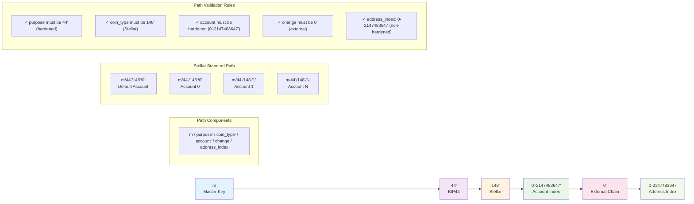
```mermaid
graph LR
    Root[m<br/>Master Key] --> Purpose[44'<br/>BIP44]
    Purpose --> CoinType[148'<br/>Stellar]
    CoinType --> Account[0'-2147483647'<br/>Account Index]
    Account --> Change[0'<br/>External Chain]
    Change --> Address[0-2147483647<br/>Address Index]

    subgraph "Path Components"
        PathInfo["m / purpose' / coin_type' / account' / change / address_index"]
    end

    subgraph "Stellar Standard Path"
        DefaultPath["m/44'/148'/0'<br/>Default Account"]
        Account0["m/44'/148'/0'<br/>Account 0"]
        Account1["m/44'/148'/1'<br/>Account 1"]
        AccountN["m/44'/148'/N'<br/>Account N"]
    end

    subgraph "Path Validation Rules"
        Rule1["✓ purpose must be 44' (hardened)"]
        Rule2["✓ coin_type must be 148' (Stellar)"]
        Rule3["✓ account must be hardened (0'-2147483647')"]
        Rule4["✓ change must be 0' (external)"]
        Rule5["✓ address_index: 0-2147483647 (non-hardened)"]
    end

    style Root fill:#e3f2fd
    style Purpose fill:#f3e5f5
    style CoinType fill:#fff3e0
    style Account fill:#e8f5e9
    style Change fill:#fce4ec
    style Address fill:#f1f8e9
```

**BIP44 Path Examples**:

```typescript
// Default Stellar account
const defaultPath = "m/44'/148'/0'";

// Multi-account structure
const account0 = "m/44'/148'/0'"; // Primary account
const account1 = "m/44'/148'/1'"; // Secondary account
const account2 = "m/44'/148'/2'"; // Trading account

// Path validation
interface BIP44PathComponents {
  purpose: 44;        // Always 44 for BIP44
  coinType: 148;      // Stellar coin type
  account: number;    // 0-2147483647 (hardened)
  change: 0;          // Always 0 for Stellar (external)
  addressIndex: 0;    // Always 0 for Stellar (not used)
}
```

**Path Derivation Process**:

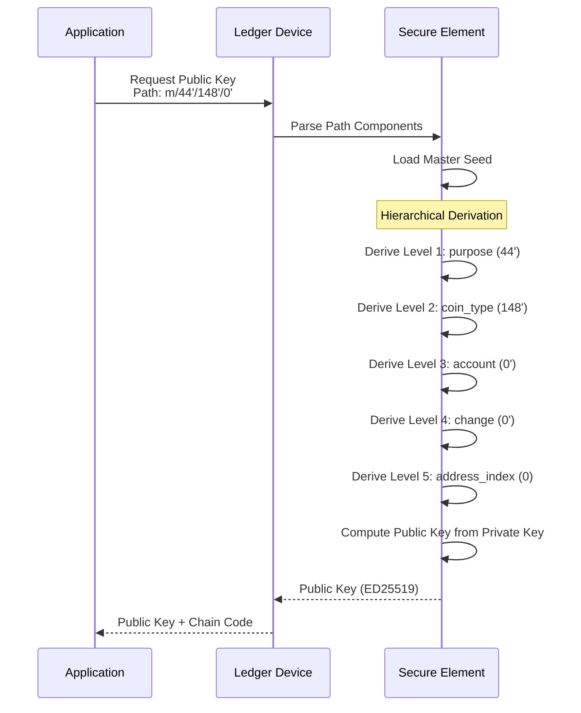
```mermaid
sequenceDiagram
    participant App as Application
    participant Ledger as Ledger Device
    participant SE as Secure Element

    App->>Ledger: Request Public Key<br/>Path: m/44'/148'/0'
    Ledger->>SE: Parse Path Components
    SE->>SE: Load Master Seed

    Note over SE: Hierarchical Derivation
    SE->>SE: Derive Level 1: purpose (44')
    SE->>SE: Derive Level 2: coin_type (148')
    SE->>SE: Derive Level 3: account (0')
    SE->>SE: Derive Level 4: change (0')
    SE->>SE: Derive Level 5: address_index (0)

    SE->>SE: Compute Public Key from Private Key
    SE-->>Ledger: Public Key (ED25519)
    Ledger-->>App: Public Key + Chain Code
```

#### Error Handling Flow

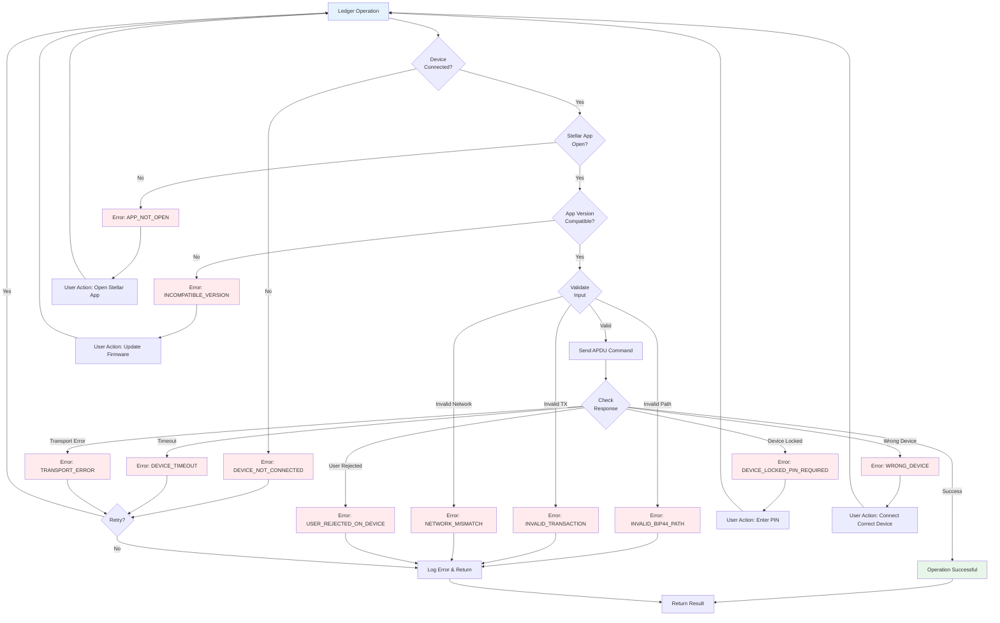
```mermaid
flowchart TD
    Start[Ledger Operation] --> CheckConnection{Device<br/>Connected?}

    CheckConnection -->|No| ErrorNoDevice[Error: DEVICE_NOT_CONNECTED]
    CheckConnection -->|Yes| CheckApp{Stellar App<br/>Open?}

    CheckApp -->|No| ErrorNoApp[Error: APP_NOT_OPEN]
    CheckApp -->|Yes| CheckVersion{App Version<br/>Compatible?}

    CheckVersion -->|No| ErrorVersion[Error: INCOMPATIBLE_VERSION]
    CheckVersion -->|Yes| ValidateInput{Validate<br/>Input}

    ValidateInput -->|Invalid Path| ErrorPath[Error: INVALID_BIP44_PATH]
    ValidateInput -->|Invalid TX| ErrorTx[Error: INVALID_TRANSACTION]
    ValidateInput -->|Invalid Network| ErrorNetwork[Error: NETWORK_MISMATCH]
    ValidateInput -->|Valid| SendAPDU[Send APDU Command]

    SendAPDU --> CheckResponse{Check<br/>Response}

    CheckResponse -->|Timeout| ErrorTimeout[Error: DEVICE_TIMEOUT]
    CheckResponse -->|User Rejected| ErrorRejected[Error: USER_REJECTED_ON_DEVICE]
    CheckResponse -->|Device Locked| ErrorLocked[Error: DEVICE_LOCKED_PIN_REQUIRED]
    CheckResponse -->|Wrong Device| ErrorWrongDevice[Error: WRONG_DEVICE]
    CheckResponse -->|Transport Error| ErrorTransport[Error: TRANSPORT_ERROR]
    CheckResponse -->|Success| Success[Operation Successful]

    ErrorNoDevice --> Retry{Retry?}
    ErrorNoApp --> UserAction1[User Action: Open Stellar App]
    ErrorVersion --> UserAction2[User Action: Update Firmware]
    ErrorPath --> LogError[Log Error & Return]
    ErrorTx --> LogError
    ErrorNetwork --> LogError
    ErrorTimeout --> Retry
    ErrorRejected --> LogError
    ErrorLocked --> UserAction3[User Action: Enter PIN]
    ErrorWrongDevice --> UserAction4[User Action: Connect Correct Device]
    ErrorTransport --> Retry

    Retry -->|Yes| Start
    Retry -->|No| LogError
    UserAction1 --> Start
    UserAction2 --> Start
    UserAction3 --> Start
    UserAction4 --> Start

    Success --> Return[Return Result]
    LogError --> Return

    style Start fill:#e3f2fd
    style Success fill:#e8f5e9
    style ErrorNoDevice fill:#ffebee
    style ErrorNoApp fill:#ffebee
    style ErrorVersion fill:#ffebee
    style ErrorPath fill:#ffebee
    style ErrorTx fill:#ffebee
    style ErrorNetwork fill:#ffebee
    style ErrorTimeout fill:#ffebee
    style ErrorRejected fill:#ffebee
    style ErrorLocked fill:#ffebee
    style ErrorWrongDevice fill:#ffebee
    style ErrorTransport fill:#ffebee
```

**Error Types and Recovery**:

```typescript
enum LedgerErrorType {
  // Connection Errors
  DEVICE_NOT_CONNECTED = 'DEVICE_NOT_CONNECTED',
  TRANSPORT_ERROR = 'TRANSPORT_ERROR',
  DEVICE_TIMEOUT = 'DEVICE_TIMEOUT',

  // App Errors
  APP_NOT_OPEN = 'APP_NOT_OPEN',
  INCOMPATIBLE_VERSION = 'INCOMPATIBLE_VERSION',

  // Security Errors
  DEVICE_LOCKED_PIN_REQUIRED = 'DEVICE_LOCKED_PIN_REQUIRED',
  WRONG_DEVICE = 'WRONG_DEVICE',
  USER_REJECTED_ON_DEVICE = 'USER_REJECTED_ON_DEVICE',

  // Validation Errors
  INVALID_BIP44_PATH = 'INVALID_BIP44_PATH',
  INVALID_TRANSACTION = 'INVALID_TRANSACTION',
  NETWORK_MISMATCH = 'NETWORK_MISMATCH',

  // APDU Errors
  APDU_ERROR = 'APDU_ERROR',
  INVALID_RESPONSE = 'INVALID_RESPONSE'
}

interface LedgerError {
  type: LedgerErrorType;
  message: string;
  code?: number;
  recoverable: boolean;
  userAction?: string;
  retryable: boolean;
}

// Error recovery strategies
const errorRecovery: Record<LedgerErrorType, RecoveryStrategy> = {
  [LedgerErrorType.DEVICE_NOT_CONNECTED]: {
    retry: true,
    maxRetries: 3,
    userAction: 'Please connect your Ledger device and try again',
    delay: 2000
  },
  [LedgerErrorType.APP_NOT_OPEN]: {
    retry: false,
    userAction: 'Please open the Stellar app on your Ledger device',
    delay: 0
  },
  [LedgerErrorType.USER_REJECTED_ON_DEVICE]: {
    retry: false,
    userAction: 'Transaction was rejected on device',
    delay: 0
  },
  [LedgerErrorType.DEVICE_LOCKED_PIN_REQUIRED]: {
    retry: false,
    userAction: 'Please unlock your Ledger device by entering your PIN',
    delay: 0
  }
};
```

**Integration Example**:

```typescript
import { LedgerWalletService } from '@galaxy/ledger';

// Initialize Ledger service
const ledgerService = new LedgerWalletService({
  network: 'mainnet',
  transportType: 'webusb'
});

try {
  // Connect to device
  await ledgerService.connect();

  // Get public key with device verification
  const publicKey = await ledgerService.getPublicKey(
    "m/44'/148'/0'",
    true // verify on device
  );

  // Build transaction
  const transaction = await buildStellarTransaction({
    source: publicKey,
    destination: 'GDEST...',
    amount: '100',
    asset: 'XLM'
  });

  // Sign transaction on Ledger
  const signedTx = await ledgerService.signTransaction(
    "m/44'/148'/0'",
    transaction
  );

  // Submit to network
  await submitTransaction(signedTx);

} catch (error) {
  if (error.type === LedgerErrorType.USER_REJECTED_ON_DEVICE) {
    console.log('User rejected transaction on device');
  } else if (error.recoverable) {
    // Retry logic
    await retryWithBackoff(error);
  } else {
    // Show user action required
    showUserError(error.userAction);
  }
} finally {
  // Cleanup
  await ledgerService.disconnect();
}
```

---

### 3. Stellar SDK Wrapper

**Purpose**: Abstract and simplify Stellar SDK operations.

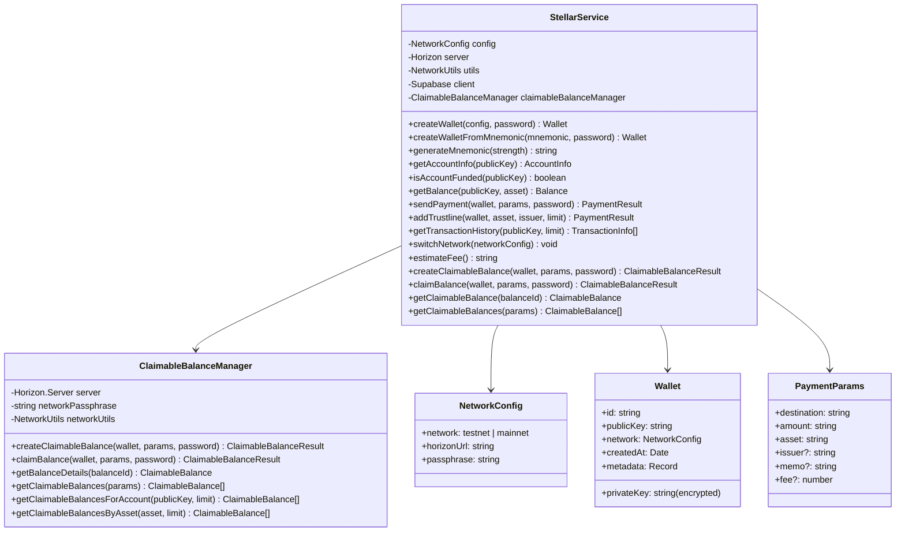
```mermaid
classDiagram
    class StellarService {
        -NetworkConfig config
        -Horizon server
        -NetworkUtils utils
        -Supabase client
        -ClaimableBalanceManager claimableBalanceManager

        +createWallet(config, password) Wallet
        +createWalletFromMnemonic(mnemonic, password) Wallet
        +generateMnemonic(strength) string
        +getAccountInfo(publicKey) AccountInfo
        +isAccountFunded(publicKey) boolean
        +getBalance(publicKey, asset) Balance
        +sendPayment(wallet, params, password) PaymentResult
        +addTrustline(wallet, asset, issuer, limit) PaymentResult
        +getTransactionHistory(publicKey, limit) TransactionInfo[]
        +switchNetwork(networkConfig) void
        +estimateFee() string
        +createClaimableBalance(wallet, params, password) ClaimableBalanceResult
        +claimBalance(wallet, params, password) ClaimableBalanceResult
        +getClaimableBalance(balanceId) ClaimableBalance
        +getClaimableBalances(params) ClaimableBalance[]
    }

    class ClaimableBalanceManager {
        -Horizon.Server server
        -string networkPassphrase
        -NetworkUtils networkUtils

        +createClaimableBalance(wallet, params, password) ClaimableBalanceResult
        +claimBalance(wallet, params, password) ClaimableBalanceResult
        +getBalanceDetails(balanceId) ClaimableBalance
        +getClaimableBalances(params) ClaimableBalance[]
        +getClaimableBalancesForAccount(publicKey, limit) ClaimableBalance[]
        +getClaimableBalancesByAsset(asset, limit) ClaimableBalance[]
    }

    StellarService --> ClaimableBalanceManager

    class NetworkConfig {
        +network: testnet | mainnet
        +horizonUrl: string
        +passphrase: string
    }

    class Wallet {
        +id: string
        +publicKey: string
        +privateKey: string (encrypted)
        +network: NetworkConfig
        +createdAt: Date
        +metadata: Record
    }

    class PaymentParams {
        +destination: string
        +amount: string
        +asset: string
        +issuer?: string
        +memo?: string
        +fee?: number
    }

    StellarService --> NetworkConfig
    StellarService --> Wallet
    StellarService --> PaymentParams
```

**Network Configurations**:
```typescript
// Testnet
{
  network: 'testnet',
  horizonUrl: 'https://horizon-testnet.stellar.org',
  passphrase: 'Test SDF Network ; September 2015'
}

// Mainnet
{
  network: 'mainnet',
  horizonUrl: 'https://horizon.stellar.org',
  passphrase: 'Public Global Stellar Network ; September 2015'
}
```

---

### 4. Automation Engine
### 2.1 Sponsored Reserves System

**Purpose**: Allow sponsor accounts to pay base reserves for another account's ledger entries, enabling user onboarding without requiring new users to hold XLM.

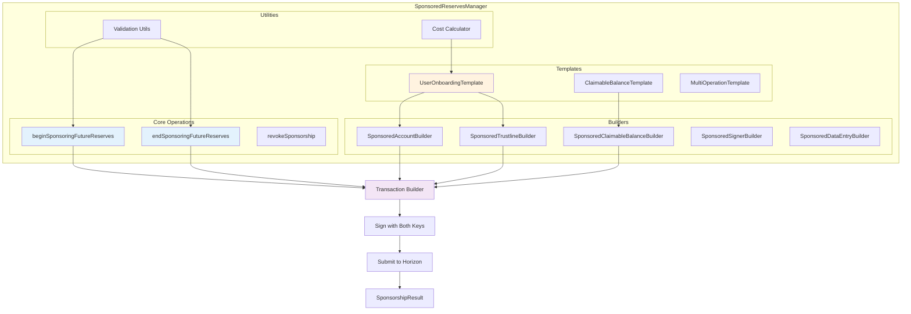
```mermaid
graph TB
    subgraph "SponsoredReservesManager"
        direction TB

        subgraph "Core Operations"
            Begin[beginSponsoringFutureReserves]
            End[endSponsoringFutureReserves]
            Revoke[revokeSponsorship]
        end

        subgraph "Builders"
            AccBuilder[SponsoredAccountBuilder]
            TLBuilder[SponsoredTrustlineBuilder]
            CBBuilder[SponsoredClaimableBalanceBuilder]
            SignBuilder[SponsoredSignerBuilder]
            DataBuilder[SponsoredDataEntryBuilder]
        end

        subgraph "Templates"
            Onboard[UserOnboardingTemplate]
            Airdrop[ClaimableBalanceTemplate]
            Multi[MultiOperationTemplate]
        end

        subgraph "Utilities"
            Validate[Validation Utils]
            Cost[Cost Calculator]
        end
    end

    Begin --> TxBuilder[Transaction Builder]
    End --> TxBuilder
    AccBuilder --> TxBuilder
    TLBuilder --> TxBuilder
    CBBuilder --> TxBuilder

    TxBuilder --> Sign[Sign with Both Keys]
    Sign --> Submit[Submit to Horizon]
    Submit --> Result[SponsorshipResult]

    Onboard --> AccBuilder
    Onboard --> TLBuilder
    Airdrop --> CBBuilder

    Validate --> Begin
    Validate --> End
    Cost --> Onboard

    style Begin fill:#e3f2fd
    style End fill:#e3f2fd
    style Onboard fill:#fff3e0
    style TxBuilder fill:#f3e5f5
```

**Sponsorship Transaction Flow**:

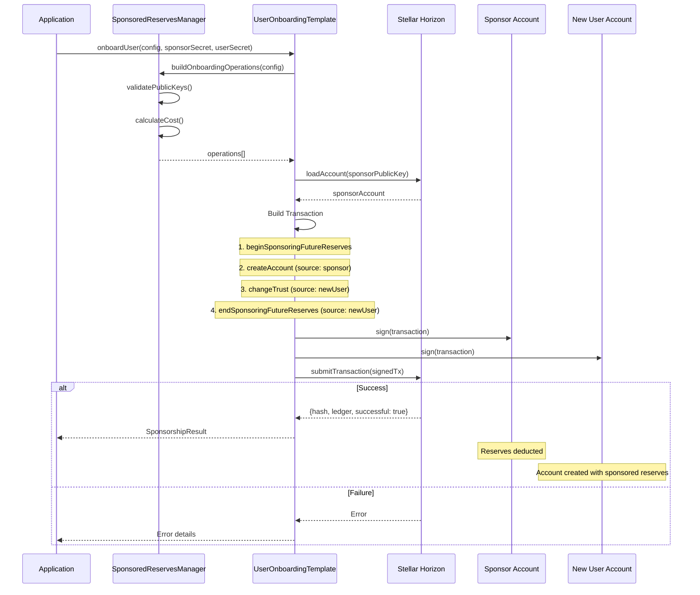
```mermaid
sequenceDiagram
    participant App as Application
    participant Manager as SponsoredReservesManager
    participant Template as UserOnboardingTemplate
    participant Horizon as Stellar Horizon
    participant Sponsor as Sponsor Account
    participant NewUser as New User Account

    App->>Template: onboardUser(config, sponsorSecret, userSecret)
    Template->>Manager: buildOnboardingOperations(config)
    Manager->>Manager: validatePublicKeys()
    Manager->>Manager: calculateCost()

    Manager-->>Template: operations[]

    Template->>Horizon: loadAccount(sponsorPublicKey)
    Horizon-->>Template: sponsorAccount

    Template->>Template: Build Transaction
    Note over Template: 1. beginSponsoringFutureReserves
    Note over Template: 2. createAccount (source: sponsor)
    Note over Template: 3. changeTrust (source: newUser)
    Note over Template: 4. endSponsoringFutureReserves (source: newUser)

    Template->>Sponsor: sign(transaction)
    Template->>NewUser: sign(transaction)

    Template->>Horizon: submitTransaction(signedTx)

    alt Success
        Horizon-->>Template: {hash, ledger, successful: true}
        Template-->>App: SponsorshipResult
        Note over Sponsor: Reserves deducted
        Note over NewUser: Account created with sponsored reserves
    else Failure
        Horizon-->>Template: Error
        Template-->>App: Error details
    end
```

**Base Reserve Costs**:

| Entry Type | Base Reserves | XLM Cost |
|------------|---------------|----------|
| Account | 2 | 1.0 XLM |
| Trustline | 1 | 0.5 XLM |
| Offer | 1 | 0.5 XLM |
| Data Entry | 1 | 0.5 XLM |
| Signer | 1 | 0.5 XLM |
| Claimable Balance | 1 | 0.5 XLM |

**Key Files**:
- `packages/core/stellar-sdk/src/sponsored-reserves/services/sponsored-reserves-manager.ts`
- `packages/core/stellar-sdk/src/sponsored-reserves/builders/`
- `packages/core/stellar-sdk/src/sponsored-reserves/templates/`

---

### 3. Automation Engine

**Purpose**: Enable DeFi automation with triggers, conditions, and actions.

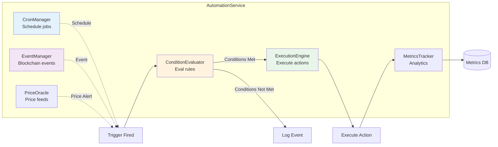
```mermaid
graph LR
    subgraph "AutomationService"
        CM[CronManager<br/>Schedule jobs]
        EM[EventManager<br/>Blockchain events]
        CE[ConditionEvaluator<br/>Eval rules]
        EE[ExecutionEngine<br/>Execute actions]
        PO[PriceOracle<br/>Price feeds]
        MT[MetricsTracker<br/>Analytics]
    end

    Trigger[Trigger Fired] --> CE
    CE -->|Conditions Met| EE
    CE -->|Conditions Not Met| Log[Log Event]
    EE --> Action[Execute Action]
    Action --> MT
    MT --> DB[(Metrics DB)]

    CM -.->|Schedule| Trigger
    EM -.->|Event| Trigger
    PO -.->|Price Alert| Trigger

    style CM fill:#e3f2fd
    style EM fill:#f3e5f5
    style CE fill:#fff3e0
    style EE fill:#e8f5e9
```

**Trigger Types**:
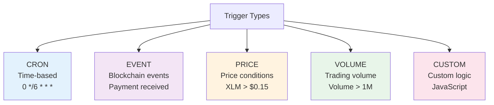
```mermaid
graph TD
    Triggers[Trigger Types]
    Triggers --> CRON[CRON<br/>Time-based<br/>0 */6 * * *]
    Triggers --> EVENT[EVENT<br/>Blockchain events<br/>Payment received]
    Triggers --> PRICE[PRICE<br/>Price conditions<br/>XLM > $0.15]
    Triggers --> VOLUME[VOLUME<br/>Trading volume<br/>Volume > 1M]
    Triggers --> CUSTOM[CUSTOM<br/>Custom logic<br/>JavaScript]

    style CRON fill:#e3f2fd
    style EVENT fill:#f3e5f5
    style PRICE fill:#fff3e0
    style VOLUME fill:#e8f5e9
    style CUSTOM fill:#fce4ec
```

**Execution Flow**:
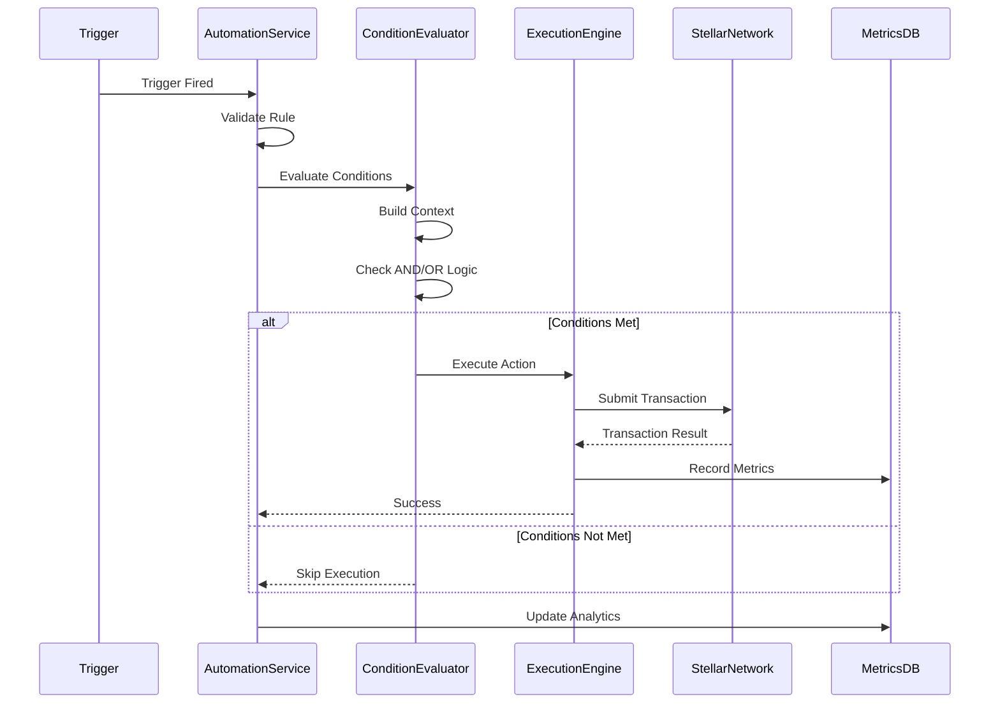
```mermaid
sequenceDiagram
    participant Trigger
    participant AutomationService
    participant ConditionEvaluator
    participant ExecutionEngine
    participant StellarNetwork
    participant MetricsDB

    Trigger->>AutomationService: Trigger Fired
    AutomationService->>AutomationService: Validate Rule
    AutomationService->>ConditionEvaluator: Evaluate Conditions
    ConditionEvaluator->>ConditionEvaluator: Build Context
    ConditionEvaluator->>ConditionEvaluator: Check AND/OR Logic

    alt Conditions Met
        ConditionEvaluator->>ExecutionEngine: Execute Action
        ExecutionEngine->>StellarNetwork: Submit Transaction
        StellarNetwork-->>ExecutionEngine: Transaction Result
        ExecutionEngine->>MetricsDB: Record Metrics
        ExecutionEngine-->>AutomationService: Success
    else Conditions Not Met
        ConditionEvaluator-->>AutomationService: Skip Execution
    end

    AutomationService->>MetricsDB: Update Analytics
```

---

## 💰 DeFi Integration Architecture

### Overview

The DeFi protocols package (`@galaxy/core-defi-protocols`) provides a unified integration layer for Stellar DeFi protocols. It uses the **Abstract Factory** pattern combined with **Template Method** pattern to ensure consistent interfaces while allowing protocol-specific implementations.

### Architecture Layers

```mermaid
graph TD
    subgraph "Application Layer"
        App[Application Code]
        API[REST/GraphQL APIs]
    end

    subgraph "DeFi Protocols Package"
        Factory[ProtocolFactory<br/>Singleton]
        IProtocol[IDefiProtocol<br/>Interface]
        BaseProtocol[BaseProtocol<br/>Abstract Class]

        subgraph "Protocol Implementations"
            Blend[BlendProtocol]
            Soroswap[SoroswapProtocol]
            Custom[CustomProtocol]
        end
    end

    subgraph "Infrastructure"
        Horizon[Stellar Horizon]
        Soroban[Soroban Runtime]
    end

    App --> Factory
    API --> Factory
    Factory --> IProtocol
    IProtocol <|.. BaseProtocol
    BaseProtocol <|-- Blend
    BaseProtocol <|-- Soroswap
    BaseProtocol <|-- Custom

    Blend --> Horizon
    Blend --> Soroban
    Soroswap --> Horizon
    Soroswap --> Soroban

    style Factory fill:#e3f2fd
    style IProtocol fill:#f3e5f5
    style BaseProtocol fill:#fff3e0
```

### Protocol Abstraction Layer

The `IDefiProtocol` interface defines the contract that all protocols must implement:

```typescript
interface IDefiProtocol {
  // Protocol Identification
  readonly protocolId: string;
  readonly name: string;
  readonly type: ProtocolType;
  readonly config: ProtocolConfig;

  // Lifecycle Management
  initialize(): Promise<void>;
  isInitialized(): boolean;
  getStats(): Promise<ProtocolStats>;

  // Lending & Borrowing Operations
  supply(walletAddress: string, privateKey: string, asset: Asset, amount: string): Promise<TransactionResult>;
  borrow(walletAddress: string, privateKey: string, asset: Asset, amount: string): Promise<TransactionResult>;
  repay(walletAddress: string, privateKey: string, asset: Asset, amount: string): Promise<TransactionResult>;
  withdraw(walletAddress: string, privateKey: string, asset: Asset, amount: string): Promise<TransactionResult>;

  // Position Management
  getPosition(address: string): Promise<Position>;
  getHealthFactor(address: string): Promise<HealthFactor>;

  // Protocol Information
  getSupplyAPY(asset: Asset): Promise<APYInfo>;
  getBorrowAPY(asset: Asset): Promise<APYInfo>;
  getTotalSupply(asset: Asset): Promise<string>;
  getTotalBorrow(asset: Asset): Promise<string>;

  // DEX Operations (Optional)
  swap?(walletAddress: string, privateKey: string, tokenIn: Asset, tokenOut: Asset, amountIn: string, minAmountOut: string): Promise<TransactionResult>;
  getSwapQuote?(tokenIn: Asset, tokenOut: Asset, amountIn: string): Promise<SwapQuote>;
  addLiquidity?(walletAddress: string, privateKey: string, tokenA: Asset, tokenB: Asset, amountA: string, amountB: string): Promise<TransactionResult>;
  removeLiquidity?(walletAddress: string, privateKey: string, poolAddress: string, liquidity: string): Promise<TransactionResult>;
}
```

### BaseProtocol Abstract Class

The `BaseProtocol` class provides common functionality and enforces implementation patterns:

```typescript
abstract class BaseProtocol implements IDefiProtocol {
  // Common properties
  protected horizonServer: HorizonServer;
  protected sorobanRpcUrl: string;
  protected networkPassphrase: string;
  protected initialized: boolean;

  // Template methods (implemented)
  public async initialize(): Promise<void> {
    await this.validateConfiguration();
    await this.setupProtocol(); // Abstract - must be implemented
    this.initialized = true;
  }

  // Validation utilities (implemented)
  protected validateAddress(address: string): void;
  protected validateAmount(amount: string): void;
  protected validateAsset(asset: Asset): void;

  // Abstract methods (must be implemented by subclasses)
  protected abstract getProtocolType(): ProtocolType;
  protected abstract setupProtocol(): Promise<void>;
  public abstract supply(...): Promise<TransactionResult>;
  public abstract borrow(...): Promise<TransactionResult>;
  // ... other abstract methods
}
```

### Protocol Factory Pattern

The factory uses singleton pattern for global protocol registry:

```typescript
class ProtocolFactory {
  private static instance: ProtocolFactory;
  private protocols: Map<string, ProtocolConstructor>;

  // Singleton access
  public static getInstance(): ProtocolFactory;

  // Protocol registration
  public register(protocolId: string, constructor: ProtocolConstructor): void;
  public createProtocol(config: ProtocolConfig): IDefiProtocol;

  // Protocol discovery
  public getSupportedProtocols(): string[];
  public isProtocolRegistered(protocolId: string): boolean;
}
```

### Protocol Integration Flow

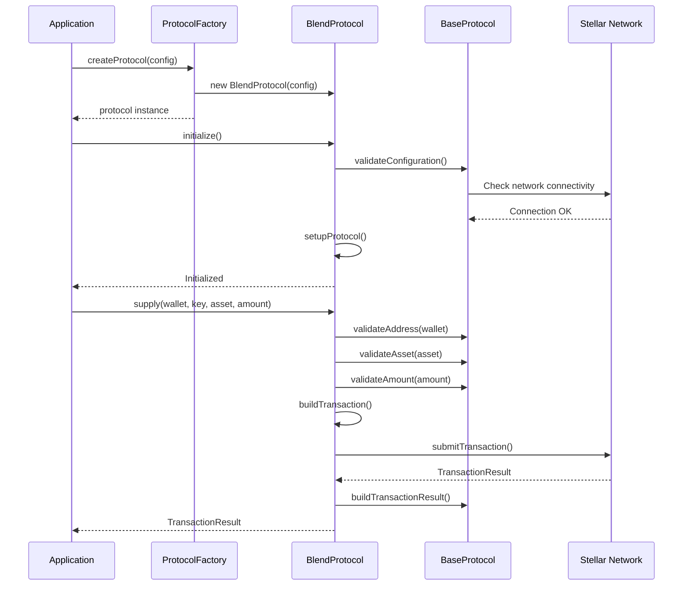
```mermaid
sequenceDiagram
    participant App as Application
    participant Factory as ProtocolFactory
    participant Protocol as BlendProtocol
    participant Base as BaseProtocol
    participant Horizon as Stellar Network

    App->>Factory: createProtocol(config)
    Factory->>Protocol: new BlendProtocol(config)
    Factory-->>App: protocol instance

    App->>Protocol: initialize()
    Protocol->>Base: validateConfiguration()
    Base->>Horizon: Check network connectivity
    Horizon-->>Base: Connection OK
    Protocol->>Protocol: setupProtocol()
    Protocol-->>App: Initialized

    App->>Protocol: supply(wallet, key, asset, amount)
    Protocol->>Base: validateAddress(wallet)
    Protocol->>Base: validateAsset(asset)
    Protocol->>Base: validateAmount(amount)
    Protocol->>Protocol: buildTransaction()
    Protocol->>Horizon: submitTransaction()
    Horizon-->>Protocol: TransactionResult
    Protocol->>Base: buildTransactionResult()
    Protocol-->>App: TransactionResult
```

### Security Architecture

**Input Validation Flow:**

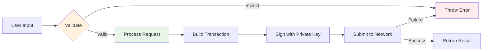
```mermaid
graph LR
    Input[User Input] --> Validate{Validate}
    Validate -->|Invalid| Error[Throw Error]
    Validate -->|Valid| Process[Process Request]

    Process --> BuildTx[Build Transaction]
    BuildTx --> Sign[Sign with Private Key]
    Sign --> Submit[Submit to Network]

    Submit -->|Success| Result[Return Result]
    Submit -->|Failure| Error

    style Validate fill:#fff3e0
    style Process fill:#e8f5e9
    style Error fill:#ffebee
```

**Validation Layers:**
1. **Type Validation** - TypeScript compile-time checks
2. **Input Validation** - Runtime validation of addresses, amounts, assets
3. **Business Logic Validation** - Protocol-specific rules (e.g., health factor checks)
4. **Network Validation** - Stellar network validation before submission

### Blend Protocol Integration

**Blend** is a lending protocol on Stellar Soroban.

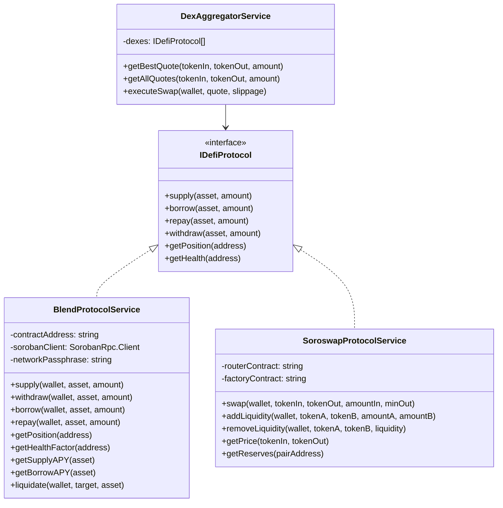
```mermaid
classDiagram
    class IDefiProtocol {
        <<interface>>
        +supply(asset, amount)
        +borrow(asset, amount)
        +repay(asset, amount)
        +withdraw(asset, amount)
        +getPosition(address)
        +getHealth(address)
    }

    class BlendProtocolService {
        -contractAddress: string
        -sorobanClient: SorobanRpc.Client
        -networkPassphrase: string

        +supply(wallet, asset, amount)
        +withdraw(wallet, asset, amount)
        +borrow(wallet, asset, amount)
        +repay(wallet, asset, amount)
        +getPosition(address)
        +getHealthFactor(address)
        +getSupplyAPY(asset)
        +getBorrowAPY(asset)
        +liquidate(wallet, target, asset)
    }

    class SoroswapProtocolService {
        -routerContract: string
        -factoryContract: string

        +swap(wallet, tokenIn, tokenOut, amountIn, minOut)
        +addLiquidity(wallet, tokenA, tokenB, amountA, amountB)
        +removeLiquidity(wallet, tokenA, tokenB, liquidity)
        +getPrice(tokenIn, tokenOut)
        +getReserves(pairAddress)
    }

    class DexAggregatorService {
        -dexes: IDefiProtocol[]

        +getBestQuote(tokenIn, tokenOut, amount)
        +getAllQuotes(tokenIn, tokenOut, amount)
        +executeSwap(wallet, quote, slippage)
    }

    IDefiProtocol <|.. BlendProtocolService
    IDefiProtocol <|.. SoroswapProtocolService
    DexAggregatorService --> IDefiProtocol
```

**Example Usage**:
```typescript
const blend = new BlendProtocolService({
  contractAddress: 'BLEND_CONTRACT_ADDRESS',
  network: 'mainnet'
});

// Supply USDC to earn interest
await blend.supply(wallet, { code: 'USDC', issuer: 'USDC_ISSUER' }, '1000');

// Borrow XLM against supplied collateral
await blend.borrow(wallet, { code: 'XLM' }, '500');

// Check position health
const health = await blend.getHealthFactor(wallet.publicKey);
console.log('Health factor:', health); // > 1.0 is healthy
```

### DEX Aggregator Flow

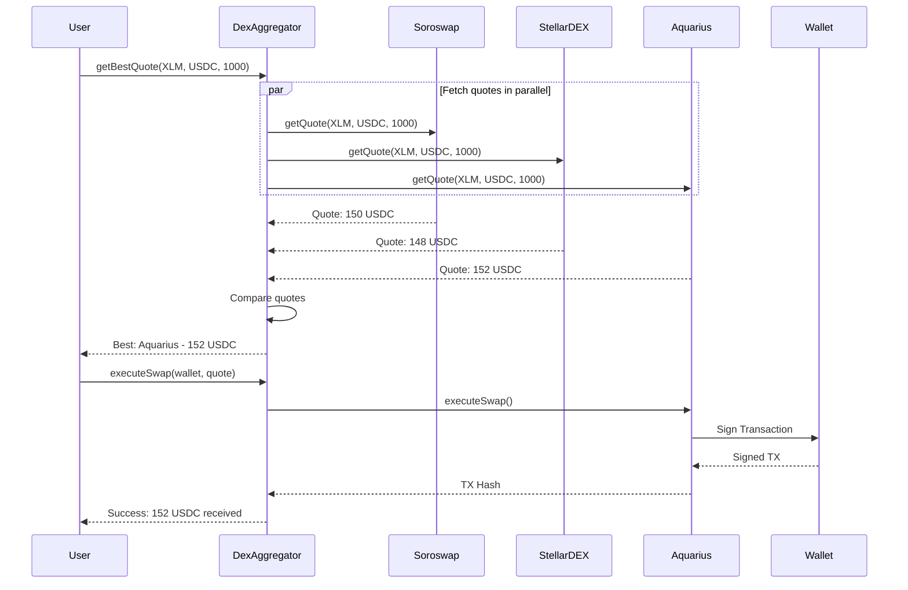
```mermaid
sequenceDiagram
    participant User
    participant DexAggregator
    participant Soroswap
    participant StellarDEX
    participant Aquarius
    participant Wallet

    User->>DexAggregator: getBestQuote(XLM, USDC, 1000)

    par Fetch quotes in parallel
        DexAggregator->>Soroswap: getQuote(XLM, USDC, 1000)
        DexAggregator->>StellarDEX: getQuote(XLM, USDC, 1000)
        DexAggregator->>Aquarius: getQuote(XLM, USDC, 1000)
    end

    Soroswap-->>DexAggregator: Quote: 150 USDC
    StellarDEX-->>DexAggregator: Quote: 148 USDC
    Aquarius-->>DexAggregator: Quote: 152 USDC

    DexAggregator->>DexAggregator: Compare quotes
    DexAggregator-->>User: Best: Aquarius - 152 USDC

    User->>DexAggregator: executeSwap(wallet, quote)
    DexAggregator->>Aquarius: executeSwap()
    Aquarius->>Wallet: Sign Transaction
    Wallet-->>Aquarius: Signed TX
    Aquarius-->>DexAggregator: TX Hash
    DexAggregator-->>User: Success: 152 USDC received
```

---

## 🔮 Oracle System

### Architecture

```mermaid
graph TB
    subgraph "Oracle Aggregator"
        OA[OracleAggregator<br/>Main Aggregator]
        Cache[PriceCache<br/>TTL Cache]
        Validator[PriceValidator<br/>Validation Logic]
        Outlier[OutlierDetection<br/>Statistical Filtering]
        
        subgraph "Strategies"
            Median[MedianStrategy]
            Weighted[WeightedAverageStrategy]
            TWAP[TWAPStrategy]
        end
    end

    subgraph "Oracle Sources"
        CG[CoinGecko<br/>IOracleSource]
        CMC[CoinMarketCap<br/>IOracleSource]
        Soroswap[Soroswap DEX<br/>IOracleSource]
        SDEX[Stellar DEX<br/>IOracleSource]
    end

    subgraph "Circuit Breaker"
        CB[Circuit Breaker<br/>Health Monitoring]
    end

    CG -->|getPrice| OA
    CMC -->|getPrice| OA
    Soroswap -->|getPrice| OA
    SDEX -->|getPrice| OA

    OA -->|Validate| Validator
    OA -->|Filter| Outlier
    OA -->|Cache| Cache
    OA -->|Monitor| CB

    OA -->|Aggregate| Median
    OA -->|Aggregate| Weighted
    OA -->|Aggregate| TWAP

    CB -->|Block Failed| CG
    CB -->|Block Failed| CMC

    style OA fill:#e3f2fd
    style Cache fill:#f3e5f5
    style Validator fill:#fff3e0
    style Outlier fill:#e8f5e9
    style CB fill:#ffebee
```

### Oracle Aggregation Flow

```mermaid
sequenceDiagram
    participant Client
    participant Aggregator as OracleAggregator
    participant Source1 as Source 1
    participant Source2 as Source 2
    participant Source3 as Source 3
    participant Cache as PriceCache
    participant Validator as PriceValidator
    participant Outlier as OutlierDetection
    participant Strategy as AggregationStrategy

    Client->>Aggregator: getAggregatedPrice('XLM')

    Note over Aggregator: Check cache first
    Aggregator->>Cache: getAggregatedPrice('XLM')
    Cache-->>Aggregator: null (cache miss)

    Note over Aggregator: Fetch from all sources in parallel
    par Parallel Fetch
        Aggregator->>Source1: getPrice('XLM')
        Aggregator->>Source2: getPrice('XLM')
        Aggregator->>Source3: getPrice('XLM')
    end

    Source1-->>Aggregator: PriceData {price: 100, source: 'source1'}
    Source2-->>Aggregator: PriceData {price: 101, source: 'source2'}
    Source3-->>Aggregator: PriceData {price: 200, source: 'source3'} (outlier)

    Note over Aggregator: Validate prices
    Aggregator->>Validator: validatePrices(prices)
    Validator-->>Aggregator: {valid: [...], invalid: []}

    Note over Aggregator: Detect outliers
    Aggregator->>Outlier: filterOutliers(prices)
    Outlier-->>Aggregator: {filtered: [source1, source2], outliers: [source3]}

    Note over Aggregator: Check minimum sources
    Aggregator->>Validator: requireMinimumSources(filtered, 2)
    Validator-->>Aggregator: true

    Note over Aggregator: Aggregate using strategy
    Aggregator->>Strategy: aggregate(filteredPrices)
    Strategy-->>Aggregator: 100.5 (median)

    Note over Aggregator: Cache result
    Aggregator->>Cache: setAggregatedPrice(result)

    Aggregator-->>Client: AggregatedPrice {price: 100.5, confidence: 0.67, sourcesUsed: ['source1', 'source2'], outliersFiltered: ['source3']}
```

### Price Validation Logic

```mermaid
graph TD
    Start[Price Data Received] --> Validate{Validate Price}
    
    Validate -->|Invalid Number| Reject1[Reject: Invalid Price]
    Validate -->|Invalid Symbol| Reject2[Reject: Invalid Symbol]
    Validate -->|Invalid Timestamp| Reject3[Reject: Invalid Timestamp]
    Validate -->|Stale| Reject4[Reject: Stale Price]
    Validate -->|Valid| CheckMin{Check Minimum<br/>Sources}
    
    CheckMin -->|Insufficient| Reject5[Reject: Need More Sources]
    CheckMin -->|Sufficient| CheckDev{Check Deviation}
    
    CheckDev -->|High Deviation| FilterDev[Filter by Deviation]
    CheckDev -->|Within Limits| CheckOutlier{Check Outliers}
    FilterDev --> CheckOutlier
    
    CheckOutlier -->|Has Outliers| FilterOutlier[Filter Outliers]
    CheckOutlier -->|No Outliers| Aggregate[Aggregate Prices]
    FilterOutlier --> Aggregate
    
    Aggregate --> Cache[Cache Result]
    Cache --> Return[Return Aggregated Price]

    style Validate fill:#fff3e0
    style CheckMin fill:#e3f2fd
    style CheckDev fill:#f3e5f5
    style CheckOutlier fill:#e8f5e9
    style Aggregate fill:#e1f5ff
```

### Caching Architecture

```mermaid
graph LR
    Request[Price Request] --> Cache{Check Cache}
    
    Cache -->|Hit| CheckTTL{Check TTL}
    Cache -->|Miss| Fetch[Fetch from Sources]
    
    CheckTTL -->|Valid| ReturnCache[Return Cached]
    CheckTTL -->|Expired| Fetch
    
    Fetch --> Validate[Validate Prices]
    Validate --> Aggregate[Aggregate]
    Aggregate --> StoreCache[Store in Cache]
    StoreCache --> Return[Return Price]
    
    StoreCache --> Evict{Check Max Size}
    Evict -->|Exceeded| LRU[Evict LRU Entry]
    Evict -->|OK| Keep[Keep Entry]
    
    style Cache fill:#e3f2fd
    style Fetch fill:#fff3e0
    style StoreCache fill:#e8f5e9
    style LRU fill:#ffebee
```

### Source Health Monitoring

```mermaid
stateDiagram-v2
    [*] --> CLOSED: Source Added
    
    CLOSED --> CLOSED: Success
    CLOSED --> HALF_OPEN: Failure Count >= Threshold
    
    HALF_OPEN --> CLOSED: Success (Recovered)
    HALF_OPEN --> OPEN: Failure in Half-Open
    
    OPEN --> HALF_OPEN: Reset Timeout Expired
    OPEN --> OPEN: Still Failing
    
    CLOSED: Source Healthy<br/>Calls Allowed
    HALF_OPEN: Testing Recovery<br/>Limited Calls
    OPEN: Source Unhealthy<br/>Calls Blocked
```

### On-Chain Oracle Contract

```rust
pub struct PriceOracle;

#[contractimpl]
impl PriceOracle {
    /// Set price (only trusted sources)
    pub fn set_price(
        env: &Env,
        source: Address,
        pair: Symbol,
        price: u128,
        timestamp: u64
    );

    /// Get latest price
    pub fn get_price(env: &Env, pair: Symbol) -> PriceData;

    /// Get TWAP (Time-Weighted Average Price)
    pub fn get_twap(env: &Env, pair: Symbol, window: u64) -> u128;

    /// Add trusted source
    pub fn add_trusted_source(env: &Env, source: Address);
}
```

### Price Update Flow

```mermaid
sequenceDiagram
    participant Scheduler
    participant OracleService
    participant Soroswap
    participant SDEX
    participant CoinGecko
    participant OnChainOracle
    participant Database
    participant WebSocket

    Scheduler->>OracleService: Every 60 seconds

    par Fetch prices in parallel
        OracleService->>Soroswap: getPrice(XLM/USDC)
        OracleService->>SDEX: getPrice(XLM/USDC)
        OracleService->>CoinGecko: getPrice(XLM/USDC)
    end

    Soroswap-->>OracleService: $0.1501
    SDEX-->>OracleService: $0.1499
    CoinGecko-->>OracleService: $0.1502

    OracleService->>OracleService: Calculate Median: $0.1501
    OracleService->>OracleService: Validate (no outliers)

    OracleService->>OnChainOracle: set_price(XLM/USDC, 0.1501)
    OnChainOracle-->>OracleService: Success

    OracleService->>Database: Store historical price
    OracleService->>WebSocket: Broadcast price update
    WebSocket-->>Subscribers: {pair: "XLM/USDC", price: 0.1501}
```

---

## 🔐 Social Recovery Architecture

### Overview

The social recovery system provides a secure mechanism for wallet recovery through trusted guardians, balancing security and recoverability. It uses Stellar's native multi-signature capabilities combined with a time-lock mechanism to prevent unauthorized recovery.

### Architecture Diagram

```mermaid
graph TB
    subgraph "SocialRecovery System"
        SR[SocialRecovery<br/>Main Controller]
        GM[GuardianManager<br/>Guardian CRUD]
        RP[RecoveryProcessor<br/>Recovery Flow]
        TL[TimeLockManager<br/>Delay & Warnings]
        FD[FraudDetector<br/>Risk Scoring]
        NS[NotificationService<br/>Alerts]
    end

    subgraph "Guardian Management"
        Add[Add Guardian]
        Verify[Verify Guardian]
        Remove[Remove Guardian]
        Status[Status Tracking]
    end

    subgraph "Recovery Flow"
        Init[Initiate Recovery]
        Approve[Guardian Approve]
        Threshold[Check Threshold]
        Execute[Execute Recovery]
        Cancel[Cancel Recovery]
    end

    subgraph "Stellar Network"
        MultiSig[Multi-Signature<br/>Account]
        Horizon[Horizon API]
    end

    subgraph "Storage"
        Requests[(Recovery Requests)]
        Approvals[(Guardian Approvals)]
        Logs[(Recovery Logs)]
        Contacts[(Emergency Contacts)]
    end

    User[Wallet Owner] --> Init
    Init --> FD
    FD -->|Valid| RP
    RP --> Requests
    RP --> NS
    
    NS --> Guardian1[Guardian 1]
    NS --> Guardian2[Guardian 2]
    NS --> Guardian3[Guardian 3]
    
    Guardian1 --> Approve
    Guardian2 --> Approve
    Guardian3 --> Approve
    
    Approve --> Approvals
    Approve --> Threshold
    Threshold -->|Reached| TL
    TL -->|Time Expired| Execute
    Execute --> MultiSig
    MultiSig --> Horizon
    
    User -->|Cancel| Cancel
    Cancel --> Requests
    
    GM --> Add
    GM --> Verify
    GM --> Remove
    GM --> Status
    
    SR --> GM
    SR --> RP
    SR --> TL
    SR --> FD
    SR --> NS
    
    RP --> Logs
    NS --> Contacts

    style SR fill:#e1f5ff
    style RP fill:#fff3e0
    style TL fill:#f3e5f5
    style FD fill:#ffebee
```

### Recovery Flow with Time-Locks

```mermaid
sequenceDiagram
    participant Owner as Wallet Owner
    participant SR as SocialRecovery
    participant G1 as Guardian 1
    participant G2 as Guardian 2
    participant G3 as Guardian 3
    participant NS as NotificationService
    participant Stellar as Stellar Network

    Owner->>SR: initiateRecovery(walletKey, newOwnerKey)
    SR->>SR: verifyRecoveryRequest()
    SR->>SR: createRecoveryRequest()
    SR->>NS: notifyGuardians()
    NS->>G1: Approval Request
    NS->>G2: Approval Request
    NS->>G3: Approval Request
    NS->>Owner: Recovery Initiated
    
    G1->>SR: guardianApprove(requestId, guardianKey)
    SR->>SR: checkThreshold()
    SR->>NS: notifyOwner(Threshold Reached)
    
    G2->>SR: guardianApprove(requestId, guardianKey)
    SR->>SR: checkThreshold()
    SR->>SR: thresholdReached = true
    SR->>SR: startTimeLock()
    SR->>NS: notifyOwner(Time-Lock Started)
    
    Note over SR,Stellar: Time-Lock Period (48 hours)
    
    SR->>NS: sendTimeLockWarning(24h remaining)
    NS->>Owner: Warning Notification
    
    Note over SR,Stellar: Time-Lock Expires
    
    Owner->>SR: completeRecovery(requestId, secretKey)
    SR->>Stellar: executeRecoveryOnStellar()
    Stellar->>Stellar: Multi-Sig Transaction
    Stellar-->>SR: Transaction Hash
    SR->>NS: notifyAll(Recovery Executed)
    NS->>Owner: Recovery Completed
    NS->>G1: Recovery Completed
    NS->>G2: Recovery Completed
    NS->>G3: Recovery Completed
```

### Security Mechanisms

```mermaid
graph LR
    subgraph "Fraud Detection"
        Risk[Risk Scoring]
        Indicators[Fraud Indicators]
        Logging[Attempt Logging]
    end
    
    subgraph "Verification"
        MultiFactor[Multi-Factor Verification]
        Signature[Cryptographic Signatures]
        Validation[Request Validation]
    end
    
    subgraph "Time-Lock Protection"
        Delay[Configurable Delay]
        Warning[Early Warnings]
        Cancellation[Owner Cancellation]
    end
    
    subgraph "Guardian Security"
        Encryption[Encrypted Contacts]
        Verification[Guardian Verification]
        Status[Status Tracking]
    end
    
    Request[Recovery Request] --> Risk
    Risk --> Indicators
    Indicators --> Validation
    Validation --> MultiFactor
    MultiFactor --> Signature
    Signature --> Delay
    Delay --> Warning
    Warning --> Cancellation
    
    Guardian[Guardian] --> Encryption
    Encryption --> Verification
    Verification --> Status
    
    Request --> Logging
    Logging --> Audit[Audit Trail]

    style Risk fill:#ffebee
    style Delay fill:#f3e5f5
    style Encryption fill:#e8f5e9
```

### Component Details

**SocialRecovery Class:**
- Manages entire recovery lifecycle
- Coordinates guardian approvals
- Handles time-lock mechanism
- Performs fraud detection
- Emits events for integration

**Guardian Management:**
- Add/remove guardians with validation
- Guardian verification workflow
- Encrypted contact storage
- Status tracking (active, pending, suspended, removed)

**Recovery Process:**
- Initiate recovery with fraud checks
- Guardian approval workflow
- Threshold-based execution
- Time-lock countdown
- Recovery execution on Stellar network
- Cancellation support

**Time-Lock Mechanism:**
- Configurable delay (default: 48 hours)
- Early warning notifications (24 hours before)
- Owner cancellation rights
- Automatic execution after expiry

**Notification System:**
- Email/SMS/Push support
- Encrypted contact information
- Event-driven architecture
- Status updates for all parties

**Fraud Detection:**
- Risk scoring (0-100)
- Fraud indicator detection
- Multiple recovery attempt tracking
- Suspicious pattern recognition

### Configuration

```typescript
interface SocialRecoveryConfig {
  guardians: Guardian[];           // Minimum 3, recommended 5-7
  threshold: number;              // Default: 60% of guardians
  timeLockHours: number;          // Default: 48 hours
  notificationMethod?: 'email' | 'sms' | 'push';
  enableTesting?: boolean;        // Dry-run mode
  minGuardians?: number;          // Default: 3
  maxGuardians?: number;          // Default: 10
}
```

### Best Practices

1. **Guardian Selection:**
   - Minimum 3 guardians (recommended: 5-7)
   - Diverse set: family, friends, trusted contacts
   - Active people who respond promptly
   - Geographic diversity
   - Technical capability

2. **Threshold Configuration:**
   - Default: 60% of guardians
   - Balance security vs. accessibility
   - Consider use case requirements

3. **Time-Lock Settings:**
   - Default: 48 hours
   - Gives owner cancellation window
   - Adjust based on security needs

4. **Security:**
   - Always verify guardians
   - Regular status checks
   - Monitor recovery attempts
   - Use encrypted contact storage

### Integration Points

- **Stellar Network**: Multi-signature account operations
- **Notification Services**: Email, SMS, Push notifications
- **Storage**: Recovery requests, approvals, logs
- **Event System**: EventEmitter for integration hooks

---

# Multi-Signature Architecture

## Overview

The Multi-Signature system decouples transaction creation from execution. It utilizes Stellar's native multi-sig capabilities for security enforcement while providing an off-chain layer for proposal management and signature collection.

## System Components

```mermaid
graph TB
    subgraph "Off-Chain Coordination"
        MSW[MultiSigWallet]
        TP[TransactionProposal]
        SC[SignatureCollector]
        NS[NotificationService]
    end

    subgraph "State Management"
        Store[(Proposal Store)]
        Config[Signer Config]
    end

    subgraph "Stellar Network"
        Horizon[Horizon API]
        Native[Native Verification]
    end

    User[Creator] -->|Propose| MSW
    Signer[Signer] -->|Sign| MSW
    
    MSW -->|Create| TP
    TP -->|Persist| Store
    MSW -->|Validate| SC
    MSW -->|Alert| NS
    
    SC -->|Verify| Native
    MSW -->|Execute| Horizon
    
    style MSW fill:#e1f5ff
    style TP fill:#fff3e0
    style Horizon fill:#f3e5f5
```

## Consensus Flow

The consensus mechanism ensures that a transaction is only submitted to the network when the sum of weights from collected signatures meets or exceeds the required threshold.

```mermaid
sequenceDiagram
    participant Creator
    participant Wallet as MultiSigWallet
    participant SignerA
    participant SignerB
    participant Stellar

    Note over Stellar: Threshold: 2 (Medium)

    Creator->>Wallet: proposeTransaction(XDR)
    Wallet->>Wallet: Create Proposal (Pending)
    Wallet-->>SignerA: Notify: New Proposal
    Wallet-->>SignerB: Notify: New Proposal

    SignerA->>Wallet: signProposal(SigA)
    Note right of Wallet: SignerA Weight: 1
    Wallet->>Wallet: CurrentWeight: 1 < 2 (Pending)

    SignerB->>Wallet: signProposal(SigB)
    Note right of Wallet: SignerB Weight: 1
    Wallet->>Wallet: CurrentWeight: 1+1 = 2 (Ready)
    
    Wallet->>Stellar: executeProposal()
    Stellar->>Stellar: Verify Signatures & Threshold
    Stellar-->>Wallet: Success (TxHash)
    Wallet->>Creator: Notify: Executed
```

## Security Considerations

1. **Atomic Weight Calculation**: Weights are calculated dynamically based on the current signer configuration vs. the requirements captured at proposal time.
2. **Signature Validation**: Every signature submitted is cryptographically verified against the transaction hash and the signer's public key before being stored.
3. **Threshold Enforcement**: The final gatekeeper is the Stellar Network itself. Even if the off-chain logic fails, the Stellar network will reject the transaction if signatures are missing.
4. **Replay Protection**: Transaction proposals are bound to specific sequence numbers via the Stellar SDK, preventing replay attacks.

## 🔄 Data Flow

### Wallet Creation Flow

```mermaid
sequenceDiagram
    participant User
    participant API
    participant IWService as InvisibleWalletService
    participant KeyMgmt as KeyManagementService
    participant Encryption
    participant Supabase
    participant Session

    User->>API: POST /api/v1/wallets<br/>{email, password}
    API->>IWService: createWallet(config, password)
    IWService->>KeyMgmt: generateKeypair()
    KeyMgmt-->>IWService: {publicKey, secretKey}

    IWService->>Encryption: encryptPrivateKey(secretKey, password)
    Encryption->>Encryption: PBKDF2 key derivation
    Encryption->>Encryption: AES-256-GCM encryption
    Encryption-->>IWService: encryptedPrivateKey

    IWService->>Supabase: INSERT INTO invisible_wallets
    Supabase-->>IWService: wallet_id

    IWService->>Session: createSession(wallet_id, user_id)
    Session-->>IWService: sessionToken

    IWService-->>API: {wallet, session}
    API-->>User: 201 Created
```

### Payment Flow

```mermaid
sequenceDiagram
    participant User
    participant API
    participant IWService as InvisibleWalletService
    participant KeyMgmt as KeyManagementService
    participant StellarService
    participant Horizon
    participant EventLog

    User->>API: POST /api/v1/payments<br/>{walletId, destination, amount}
    API->>IWService: sendPayment(walletId, sessionToken, params)
    
    IWService->>KeyMgmt: validateSession(sessionToken)
    KeyMgmt-->>IWService: valid
    
    IWService->>KeyMgmt: decryptPrivateKey(password)
    KeyMgmt-->>IWService: privateKey
    
    IWService->>StellarService: sendPayment(wallet, params)
    StellarService->>StellarService: buildTransaction()
    StellarService->>StellarService: signTransaction(privateKey)
    
    StellarService->>Horizon: submitTransaction()
    
    alt Success
        Horizon-->>StellarService: {hash, ledger, status: success}
        StellarService->>EventLog: Log TRANSACTION_SENT
        StellarService-->>IWService: PaymentResult
        IWService-->>API: {hash, status, ledger}
        API-->>User: 200 OK
    else Failure
        Horizon-->>StellarService: Error
        StellarService->>StellarService: Retry (up to 3 times)
        StellarService-->>API: Error details
        API-->>User: 400 Bad Request
    end
```

### Claimable Balance Flow

```mermaid
sequenceDiagram
    participant Sender
    participant StellarService
    participant CBM as ClaimableBalanceManager
    participant Horizon
    participant Claimant
    participant Network

    Note over Sender,Network: Create Claimable Balance Flow
    Sender->>StellarService: createClaimableBalance(wallet, params, password)
    StellarService->>CBM: createClaimableBalance(wallet, params, password)
    CBM->>CBM: Validate parameters & predicates
    CBM->>CBM: Build claimants with Stellar predicates
    CBM->>CBM: Build transaction with createClaimableBalance operation
    CBM->>Network: Submit transaction
    Network-->>CBM: Transaction result
    CBM->>Horizon: Query operations for balance ID
    Horizon-->>CBM: Balance ID
    CBM-->>StellarService: ClaimableBalanceResult {balanceId, hash}
    StellarService-->>Sender: Balance created

    Note over Claimant,Network: Claim Balance Flow
    Claimant->>StellarService: claimBalance(wallet, {balanceId}, password)
    StellarService->>CBM: claimBalance(wallet, params, password)
    CBM->>CBM: Validate balance ID
    CBM->>Horizon: Get balance details
    Horizon-->>CBM: Balance info with predicates
    CBM->>CBM: Evaluate predicates (check time, conditions)
    alt Predicate Valid
        CBM->>CBM: Build transaction with claimClaimableBalance operation
        CBM->>Network: Submit transaction
        Network-->>CBM: Transaction result
        CBM-->>StellarService: ClaimableBalanceResult
        StellarService-->>Claimant: Balance claimed
    else Predicate Invalid
        CBM-->>StellarService: Error: Cannot claim
        StellarService-->>Claimant: Claim failed
    end
```

### Predicate Evaluation

```mermaid
graph TD
    Start[Evaluate Predicate] --> CheckType{Check Type}
    
    CheckType -->|unconditional| Unconditional[Return TRUE]
    CheckType -->|abs_before| CheckAbsTime{Current Time < Deadline?}
    CheckType -->|rel_before| CheckRelTime{Current Time < Creation + Duration?}
    CheckType -->|not| EvalNot[Evaluate Sub-Predicate<br/>Return NOT Result]
    CheckType -->|and| EvalAnd1[Evaluate Predicate 1]
    CheckType -->|or| EvalOr1[Evaluate Predicate 1]
    
    CheckAbsTime -->|Yes| ReturnTrue[Return TRUE]
    CheckAbsTime -->|No| ReturnFalse[Return FALSE]
    
    CheckRelTime -->|Yes| ReturnTrue
    CheckRelTime -->|No| ReturnFalse
    
    EvalNot --> NotResult{Sub-Predicate Result}
    NotResult -->|TRUE| ReturnFalse
    NotResult -->|FALSE| ReturnTrue
    
    EvalAnd1 --> AndResult1{Result 1}
    AndResult1 -->|TRUE| EvalAnd2[Evaluate Predicate 2]
    AndResult1 -->|FALSE| ReturnFalse
    EvalAnd2 --> AndResult2{Result 2}
    AndResult2 -->|TRUE| ReturnTrue
    AndResult2 -->|FALSE| ReturnFalse
    
    EvalOr1 --> OrResult1{Result 1}
    OrResult1 -->|TRUE| ReturnTrue
    OrResult1 -->|FALSE| EvalOr2[Evaluate Predicate 2]
    EvalOr2 --> OrResult2{Result 2}
    OrResult2 -->|TRUE| ReturnTrue
    OrResult2 -->|FALSE| ReturnFalse
    
    style Start fill:#e3f2fd
    style ReturnTrue fill:#e8f5e9
    style ReturnFalse fill:#ffebee
```

### Liquidity Pool Operations Flow

```mermaid
sequenceDiagram
    participant User
    participant StellarService
    participant LPM as LiquidityPoolManager
    participant Calc as Calculations
    participant Horizon
    participant Network

    Note over User,Network: Deposit Liquidity Flow
    User->>StellarService: depositLiquidity(wallet, params, password)
    StellarService->>LPM: depositLiquidity(wallet, params, password)
    LPM->>LPM: validateDepositParams(params)
    LPM->>Horizon: getPoolDetails(poolId)
    Horizon-->>LPM: Pool {reserveA, reserveB, totalShares}
    LPM->>Calc: calculateDepositShares(amountA, amountB, pool)
    Calc->>Calc: Calculate optimal ratio
    Calc-->>LPM: {shares, actualAmountA, actualAmountB}
    LPM->>LPM: Build liquidityPoolDeposit operation
    LPM->>Network: Submit transaction
    Network-->>LPM: Transaction result
    LPM-->>StellarService: LiquidityPoolResult {poolId, hash}
    StellarService-->>User: Deposit successful

    Note over User,Network: Withdraw Liquidity Flow
    User->>StellarService: withdrawLiquidity(wallet, params, password)
    StellarService->>LPM: withdrawLiquidity(wallet, params, password)
    LPM->>LPM: validateWithdrawParams(params)
    LPM->>Horizon: getPoolDetails(poolId)
    Horizon-->>LPM: Pool details
    LPM->>Calc: calculateWithdrawAmounts(shares, pool)
    Calc-->>LPM: {amountA, amountB}
    LPM->>Horizon: getUserShares(publicKey, poolId)
    Horizon-->>LPM: User's share balance
    LPM->>LPM: Validate sufficient shares
    LPM->>LPM: Build liquidityPoolWithdraw operation
    LPM->>Network: Submit transaction
    Network-->>LPM: Transaction result
    LPM-->>StellarService: LiquidityPoolResult
    StellarService-->>User: Withdrawal successful
```

### Liquidity Pool AMM Formula

```mermaid
graph TD
    Start[Pool State] --> Formula[Constant Product Formula<br/>x × y = k]

    Formula --> DepositQ{Deposit or Withdraw?}

    DepositQ -->|Deposit| CheckFirst{First Deposit?}
    CheckFirst -->|Yes| GeometricMean[Shares = √amountA × amountB]
    CheckFirst -->|No| CalcRatio[Calculate Ratios<br/>ratioA = amountA / reserveA<br/>ratioB = amountB / reserveB]

    CalcRatio --> MinRatio[minRatio = min ratioA, ratioB]
    MinRatio --> PropShares[shares = minRatio × totalShares]
    PropShares --> ActualAmounts[actualAmountA = minRatio × reserveA<br/>actualAmountB = minRatio × reserveB]

    DepositQ -->|Withdraw| ShareRatio[shareRatio = shares / totalShares]
    ShareRatio --> WithdrawAmounts[amountA = shareRatio × reserveA<br/>amountB = shareRatio × reserveB]

    GeometricMean --> UpdatePool[Update Pool State]
    ActualAmounts --> UpdatePool
    WithdrawAmounts --> UpdatePool

    UpdatePool --> NewK[New k = newReserveA × newReserveB]
    NewK --> SpotPrice[Spot Price = reserveB / reserveA]
    SpotPrice --> PriceImpact[Price Impact = abs spotPrice - oldPrice / oldPrice]

    style Start fill:#e3f2fd
    style Formula fill:#fff9c4
    style UpdatePool fill:#e8f5e9
    style GeometricMean fill:#f3e5f5
    style PropShares fill:#f3e5f5
```

### Liquidity Pool Architecture

```mermaid
graph TB
    subgraph "Service Layer"
        SS[StellarService]
    end

    subgraph "Manager Layer"
        LPM[LiquidityPoolManager<br/>• depositLiquidity<br/>• withdrawLiquidity<br/>• getPoolDetails<br/>• getUserShares<br/>• getPoolAnalytics]
    end

    subgraph "Business Logic"
        Calc[Calculations<br/>• calculateDepositShares<br/>• calculateWithdrawAmounts<br/>• calculatePriceImpact<br/>• estimateDeposit<br/>• estimateWithdraw]

        Valid[Validation<br/>• validatePoolId<br/>• validateAmount<br/>• validateSlippage<br/>• validateDepositParams<br/>• validateWithdrawParams]

        Helper[Helpers<br/>• calculateShareValue<br/>• calculateImpermanentLoss<br/>• formatPoolAssets<br/>• wouldImpactPrice<br/>• calculateOptimalDeposit]
    end

    subgraph "Types"
        Types[Types<br/>• LiquidityPool<br/>• LiquidityPoolDeposit<br/>• LiquidityPoolWithdraw<br/>• PoolAnalytics<br/>• DepositEstimate]
    end

    subgraph "External APIs"
        Horizon[Horizon API<br/>• liquidityPools<br/>• loadAccount<br/>• submitTransaction]
        Network[Stellar Network]
    end

    SS --> LPM
    LPM --> Calc
    LPM --> Valid
    LPM --> Helper
    LPM --> Types
    LPM --> Horizon
    Horizon --> Network

    style SS fill:#e3f2fd
    style LPM fill:#e8f5e9
    style Calc fill:#fff9c4
    style Valid fill:#ffe0b2
    style Helper fill:#f3e5f5
    style Types fill:#e0f2f1
    style Horizon fill:#fce4ec
    style Network fill:#f1f8e9
```

### Automation Execution Flow

```mermaid
flowchart TD
    Start[Trigger Fired<br/>CRON/Event/Price] --> Validate{Validate Rule}
    Validate -->|Invalid| LogError[Log Error]
    Validate -->|Valid| CheckStatus{Check Status}

    CheckStatus -->|Inactive| Skip[Skip Execution]
    CheckStatus -->|Active| CheckLimits{Check Limits}

    CheckLimits -->|Exceeded| Disable[Disable Rule]
    CheckLimits -->|OK| BuildContext[Build Context<br/>Market data, Account data]

    BuildContext --> EvalConditions[Evaluate Conditions]
    EvalConditions --> ConditionsMet{Conditions Met?}

    ConditionsMet -->|No| LogConditions[Log: Conditions Not Met]
    ConditionsMet -->|Yes| Execute[Execute Action]

    Execute --> ActionType{Action Type}

    ActionType -->|PAYMENT| SendPayment[Send Payment]
    ActionType -->|SWAP| ExecuteSwap[Execute Swap]
    ActionType -->|CONTRACT| CallContract[Call Contract]
    ActionType -->|WEBHOOK| CallWebhook[Call Webhook]

    SendPayment --> RecordMetrics
    ExecuteSwap --> RecordMetrics
    CallContract --> RecordMetrics
    CallWebhook --> RecordMetrics

    RecordMetrics[Record Metrics] --> Emit[Emit Event]
    Emit --> Broadcast[WebSocket Broadcast]
    Broadcast --> End[End]

    LogError --> End
    Skip --> End
    Disable --> End
    LogConditions --> End

    style Start fill:#e3f2fd
    style Execute fill:#e8f5e9
    style RecordMetrics fill:#fff3e0
    style End fill:#f3e5f5
```

---

## 🔐 Security Architecture

### Encryption

**Wallet Private Keys**:
```mermaid
graph LR
    PK[Private Key<br/>Plain Text] --> PBKDF2[PBKDF2<br/>100k iterations]
    Password[Password] --> PBKDF2
    Salt[Salt<br/>32 bytes] --> PBKDF2

    PBKDF2 --> DerivedKey[Derived Key<br/>256 bits]

    DerivedKey --> AES[AES-256-GCM<br/>Encryption]
    PK --> AES
    IV[IV<br/>16 bytes] --> AES

    AES --> Ciphertext[Ciphertext]
    AES --> AuthTag[Auth Tag<br/>16 bytes]

    Ciphertext --> Store[(Encrypted Data<br/>Supabase)]
    AuthTag --> Store
    Salt --> Store
    IV --> Store

    style PBKDF2 fill:#e3f2fd
    style AES fill:#f3e5f5
    style Store fill:#fff3e0
```

**Encrypted Data Structure**:
```typescript
interface EncryptedData {
  ciphertext: string;  // Base64
  iv: string;          // Base64
  salt: string;        // Base64
  authTag: string;     // Base64
  algorithm: 'aes-256-gcm';
}
```

### Access Control

```mermaid
graph TD
    Request[HTTP Request] --> CheckAPI{API Key Valid?}
    CheckAPI -->|No| Reject1[401 Unauthorized]
    CheckAPI -->|Yes| CheckRL{Rate Limit OK?}

    CheckRL -->|No| Reject2[429 Too Many Requests]
    CheckRL -->|Yes| CheckSession{Session Valid?}

    CheckSession -->|No| Reject3[403 Forbidden]
    CheckSession -->|Yes| CheckOwnership{Resource Ownership?}

    CheckOwnership -->|No| Reject4[403 Forbidden]
    CheckOwnership -->|Yes| Execute[Execute Operation]

    Execute --> LogEvent[Log Audit Event]
    LogEvent --> Response[200 OK]

    style Request fill:#e3f2fd
    style Execute fill:#e8f5e9
    style LogEvent fill:#fff3e0
```

### Audit Logging

```typescript
interface WalletEvent {
  id: string;
  walletId: string;
  userId: string;
  eventType: WalletEventType;
  timestamp: Date;
  metadata: {
    ipAddress?: string;
    userAgent?: string;
    deviceInfo?: DeviceInfo;
    [key: string]: any;
  };
}

enum WalletEventType {
  CREATED = 'created',
  UNLOCKED = 'unlocked',
  LOCKED = 'locked',
  TRANSACTION_SENT = 'transaction_sent',
  BACKUP_CREATED = 'backup_created',
  PASSWORD_CHANGED = 'password_changed',
  RECOVERY_INITIATED = 'recovery_initiated'
}
```

---

## 📈 Scalability

### Horizontal Scaling

```mermaid
graph TB
    LB[Load Balancer<br/>Nginx/HAProxy]

    subgraph "API Servers (Stateless)"
        API1[API Server 1]
        API2[API Server 2]
        API3[API Server N]
    end

    subgraph "WebSocket Servers"
        WS1[WS Server 1]
        WS2[WS Server 2]
        WS3[WS Server N]
        Redis[(Redis Adapter<br/>Pub/Sub)]
    end

    subgraph "Background Workers"
        W1[Worker 1<br/>Automation]
        W2[Worker 2<br/>Oracles]
        W3[Worker N<br/>Jobs]
        Queue[(Job Queue<br/>Bull/BullMQ)]
    end

    subgraph "Database Layer"
        Primary[(Primary DB<br/>Write)]
        Replica1[(Replica 1<br/>Read)]
        Replica2[(Replica N<br/>Read)]
    end

    LB --> API1
    LB --> API2
    LB --> API3

    LB --> WS1
    LB --> WS2
    LB --> WS3

    WS1 --> Redis
    WS2 --> Redis
    WS3 --> Redis

    API1 --> Primary
    API2 --> Replica1
    API3 --> Replica2

    Queue --> W1
    Queue --> W2
    Queue --> W3

    W1 --> Primary
    W2 --> Primary
    W3 --> Primary

    style LB fill:#e3f2fd
    style Redis fill:#fff3e0
    style Queue fill:#f3e5f5
    style Primary fill:#e8f5e9
```

### Caching Strategy

```mermaid
graph LR
    Request[Request] --> L1{Redis Cache<br/>Layer 1}

    L1 -->|Hit| Return1[Return Cached]
    L1 -->|Miss| L2{Application Cache<br/>Layer 2}

    L2 -->|Hit| Return2[Return + Cache L1]
    L2 -->|Miss| DB[(Database)]

    DB --> Cache[Cache Result]
    Cache --> Return3[Return]

    style L1 fill:#e3f2fd
    style L2 fill:#f3e5f5
    style DB fill:#fff3e0
```

**Cache TTLs**:
- Account Info: 60 seconds
- Transaction History: 300 seconds (5 minutes)
- Price Data: 60 seconds
- Protocol Stats: 300 seconds (5 minutes)

### Rate Limiting

```mermaid
graph TD
    Request[Incoming Request] --> Identify[Identify Client<br/>API Key / IP]
    Identify --> Check{Rate Limit<br/>Check}

    Check -->|Within Limit| Allow[Allow Request]
    Check -->|Exceeded| Block[Block Request<br/>429 Too Many Requests]

    Allow --> Tiers{Client Tier}

    Tiers -->|Free| T1[100 req/min]
    Tiers -->|Basic| T2[1,000 req/min]
    Tiers -->|Pro| T3[10,000 req/min]
    Tiers -->|Enterprise| T4[Unlimited]

    style Request fill:#e3f2fd
    style Allow fill:#e8f5e9
    style Block fill:#ffebee
```

---

## 🖥️ CLI Architecture

### Overview

The Galaxy CLI (`@galaxy/cli`) provides command-line tools for developers to interact with the Galaxy DevKit ecosystem. It includes commands for project creation, wallet management, DeFi operations, oracle queries, and real-time network monitoring.

### CLI Architecture Diagram

```mermaid
graph TB
    subgraph "CLI Entry Point"
        Main[index.ts<br/>Commander.js]
    end

    subgraph "Command Groups"
        Create[create<br/>Project Scaffolding]
        Wallet[wallet<br/>Wallet Management]
        Blend[blend<br/>DeFi Operations]
        Oracle[oracle<br/>Price Data]
        Watch[watch<br/>Real-time Monitoring]
        Interactive[interactive<br/>REPL Mode]
    end

    subgraph "Utilities"
        Template[Template Loader]
        Scaffolder[Project Scaffolder]
        Installer[Dependency Installer]
    end

    subgraph "Services"
        WalletSvc[Wallet Service]
        BlendSvc[Blend Service]
        OracleSvc[Oracle Service]
        WatchSvc[Watch Service]
    end

    subgraph "External Dependencies"
        Galaxy[@galaxy/core-defi-protocols]
        Oracles[@galaxy/core-oracles]
        Stellar[@stellar/stellar-sdk]
    end

    Main --> Create
    Main --> Wallet
    Main --> Blend
    Main --> Oracle
    Main --> Watch
    Main --> Interactive

    Create --> Template
    Create --> Scaffolder
    Create --> Installer

    Wallet --> WalletSvc
    Blend --> BlendSvc
    Oracle --> OracleSvc
    Watch --> WatchSvc

    WalletSvc --> Stellar
    BlendSvc --> Galaxy
    OracleSvc --> Oracles
    WatchSvc --> Stellar

    style Main fill:#e3f2fd
    style Create fill:#fff3e0
    style Wallet fill:#e8f5e9
    style Blend fill:#f3e5f5
    style Oracle fill:#fce4ec
    style Watch fill:#e1f8f9
    style Interactive fill:#f1f8e9
```

### Command Architecture

#### Project Creation (`galaxy create`)

```mermaid
sequenceDiagram
    participant User
    participant CLI as Galaxy CLI
    participant Template as TemplateLoader
    participant Scaffolder as ProjectScaffolder
    participant Installer as DependencyInstaller
    participant FileSystem as File System

    User->>CLI: galaxy create my-app --template basic
    CLI->>Template: loadTemplate('basic')
    Template->>FileSystem: Read template.json
    FileSystem-->>Template: Template config
    Template-->>CLI: Template data

    CLI->>Scaffolder: scaffoldProject(template, 'my-app')
    Scaffolder->>Scaffolder: substituteVariables()
    Scaffolder->>FileSystem: Create directory structure
    Scaffolder->>FileSystem: Write files

    CLI->>Installer: installDependencies('my-app')
    Installer->>Installer: Detect package manager
    Installer->>Installer: Run install command
    Installer-->>CLI: Dependencies installed

    CLI-->>User: Project created successfully
```

#### Wallet Commands (`galaxy wallet`)

```mermaid
graph LR
    subgraph "Wallet Commands"
        Create[wallet create<br/>Create new wallet]
        Import[wallet import<br/>Import from secret]
        List[wallet list<br/>List all wallets]
        Balance[wallet balance<br/>Check balance]
        Send[wallet send<br/>Send payment]
    end

    subgraph "Wallet Service"
        WS[WalletService]
    end

    subgraph "Stellar Network"
        Horizon[Horizon API]
    end

    Create --> WS
    Import --> WS
    List --> WS
    Balance --> WS
    Send --> WS

    WS --> Horizon

    style Create fill:#e8f5e9
    style WS fill:#e3f2fd
    style Horizon fill:#fff3e0
```

#### Oracle Commands (`galaxy oracle`)

```mermaid
graph LR
    subgraph "Oracle Commands"
        Price[oracle price<br/>Query current price]
        History[oracle history<br/>TWAP calculation]
        Sources[oracle sources<br/>Manage sources]
        Validate[oracle validate<br/>Validate prices]
    end

    subgraph "Oracle Service"
        OS[OracleService]
        Aggregator[OracleAggregator]
    end

    subgraph "Price Sources"
        CG[CoinGecko]
        CMC[CoinMarketCap]
        DEX[Stellar DEX]
    end

    Price --> OS
    History --> OS
    Sources --> OS
    Validate --> OS

    OS --> Aggregator
    Aggregator --> CG
    Aggregator --> CMC
    Aggregator --> DEX

    style Price fill:#fce4ec
    style OS fill:#e3f2fd
    style Aggregator fill:#fff3e0
```

#### Watch Commands (`galaxy watch`)

```mermaid
graph TB
    subgraph "Watch Commands"
        Account[watch account<br/>Monitor account]
        Tx[watch transaction<br/>Track transaction]
        OracleWatch[watch oracle<br/>Stream prices]
        Contract[watch contract<br/>Monitor contract]
        Network[watch network<br/>Network stats]
        Dashboard[watch dashboard<br/>Combined view]
    end

    subgraph "Watch Service"
        WS[WatchService]
        Dashboard_UI[Dashboard UI<br/>Blessed/Blessed-Contrib]
    end

    subgraph "Data Sources"
        Horizon[Horizon API<br/>Streaming]
        Oracle_Svc[Oracle Service]
        Soroban[Soroban RPC]
    end

    Account --> WS
    Tx --> WS
    OracleWatch --> WS
    Contract --> WS
    Network --> WS
    Dashboard --> Dashboard_UI

    WS --> Horizon
    WS --> Oracle_Svc
    WS --> Soroban

    Dashboard_UI --> Horizon
    Dashboard_UI --> Oracle_Svc

    style Dashboard fill:#e1f8f9
    style WS fill:#e3f2fd
    style Dashboard_UI fill:#fff3e0
```

#### Interactive Mode (`galaxy interactive`)

```mermaid
graph TB
    subgraph "Interactive Mode"
        REPL[REPL Interface]
        Autocomplete[Tab Completion]
        History[Command History]
        Session[Session Management]
    end

    subgraph "Features"
        Commands[All CLI Commands]
        Workflows[Guided Workflows]
        Variables[Session Variables]
    end

    REPL --> Autocomplete
    REPL --> History
    REPL --> Session

    Autocomplete --> Commands
    History --> Commands
    Session --> Variables
    Commands --> Workflows

    style REPL fill:#f1f8e9
    style Commands fill:#e3f2fd
    style Workflows fill:#fff3e0
```

### CLI Execution Flow

```mermaid
sequenceDiagram
    participant User
    participant Entry as index.ts
    participant Commander as Commander.js
    participant Command as Command Handler
    participant Service as Service Layer
    participant Network as Stellar/Soroban

    User->>Entry: galaxy <command> [options]
    Entry->>Entry: Check if interactive mode

    alt Interactive Mode
        Entry->>Interactive: Launch REPL
        Interactive->>User: 🌌 Interactive Mode
    else Direct Command
        Entry->>Commander: Parse command
        Commander->>Command: Execute command
        Command->>Service: Call service method
        Service->>Network: API request
        Network-->>Service: Response
        Service-->>Command: Result
        Command-->>User: Output formatted result
    end
```

### Configuration

The CLI uses configuration files for network settings, API keys, and user preferences:

```typescript
// galaxy.config.js
module.exports = {
  network: 'testnet',
  horizonUrl: 'https://horizon-testnet.stellar.org',
  sorobanRpcUrl: 'https://soroban-testnet.stellar.org',
  defaultWallet: 'my-wallet',
  // ...
};
```

### Error Handling

```mermaid
graph TD
    Command[Command Execution] --> Validate{Validate Input}

    Validate -->|Invalid| FormatError[Format Error Message]
    Validate -->|Valid| Execute[Execute Command]

    Execute --> TryCatch{Try/Catch}

    TryCatch -->|Success| FormatSuccess[Format Success Message]
    TryCatch -->|Error| CategorizeError{Categorize Error}

    CategorizeError -->|Network Error| NetworkMsg[Network Error Message]
    CategorizeError -->|Validation Error| ValidationMsg[Validation Error Message]
    CategorizeError -->|API Error| APIMsg[API Error Message]
    CategorizeError -->|Unknown| UnknownMsg[Generic Error Message]

    FormatError --> Display[Display to User]
    FormatSuccess --> Display
    NetworkMsg --> Display
    ValidationMsg --> Display
    APIMsg --> Display
    UnknownMsg --> Display

    style Validate fill:#fff3e0
    style Execute fill:#e8f5e9
    style Display fill:#e3f2fd
    style FormatError fill:#ffebee
```

### CLI Development

**Building the CLI:**
```bash
# Navigate to CLI directory
cd tools/cli

# Install dependencies
npm install

# Build TypeScript
npm run build

# Link globally for testing
npm link

# Test commands
galaxy --version
galaxy help
```

**Adding New Commands:**
1. Create command file in `src/commands/`
2. Implement command logic
3. Register in `index.ts`
4. Add tests
5. Update documentation

**Example Command:**
```typescript
// src/commands/my-command.ts
import { Command } from 'commander';

export const myCommand = new Command('my-command')
  .description('Description of my command')
  .option('-o, --option <value>', 'Option description')
  .action(async (options) => {
    // Command logic here
  });
```

---

## 🧪 Testing Strategy

```mermaid
graph TB
    subgraph "Testing Pyramid"
        E2E[E2E Tests<br/>Full user flows]
        Integration[Integration Tests<br/>API + DB + Stellar]
        Unit[Unit Tests<br/>Core logic<br/>90%+ coverage]
    end

    subgraph "Contract Testing"
        Soroban[Soroban Contract Tests<br/>Every public function]
        Edge[Edge Cases<br/>Failure scenarios]
    end

    subgraph "CI/CD Pipeline"
        Lint[Linting<br/>ESLint/Prettier]
        Type[Type Check<br/>TypeScript]
        Test[Run Tests]
        Build[Build]
        Deploy[Deploy]
    end

    Unit --> Integration
    Integration --> E2E

    Soroban --> Edge

    Lint --> Type
    Type --> Test
    Test --> Build
    Build --> Deploy

    style Unit fill:#e8f5e9
    style Integration fill:#fff3e0
    style E2E fill:#e3f2fd
    style Soroban fill:#f3e5f5
```

---

**Last Updated**: 2024-01-15
**Version**: 1.0.0
