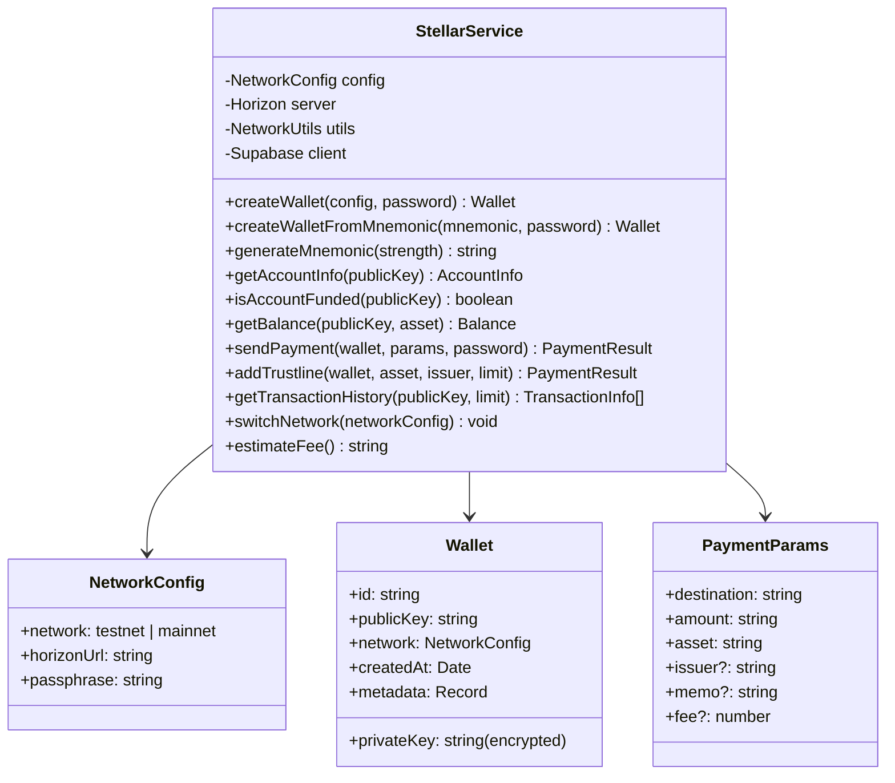
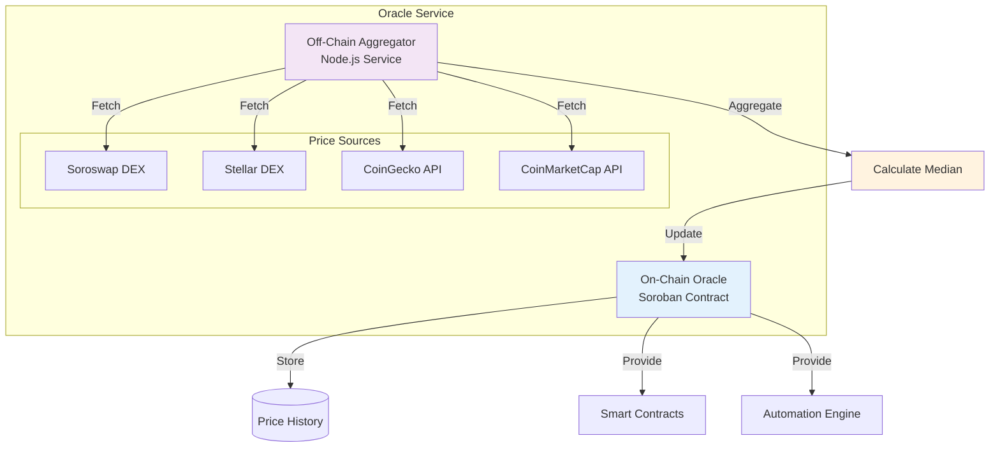
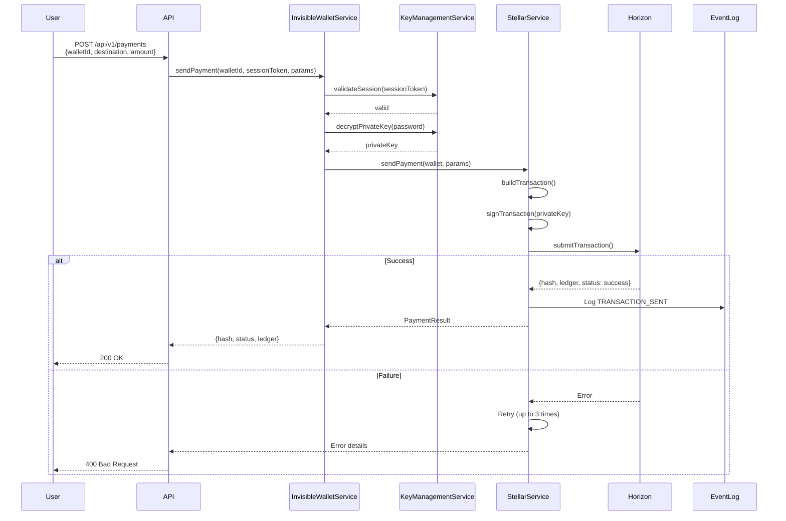
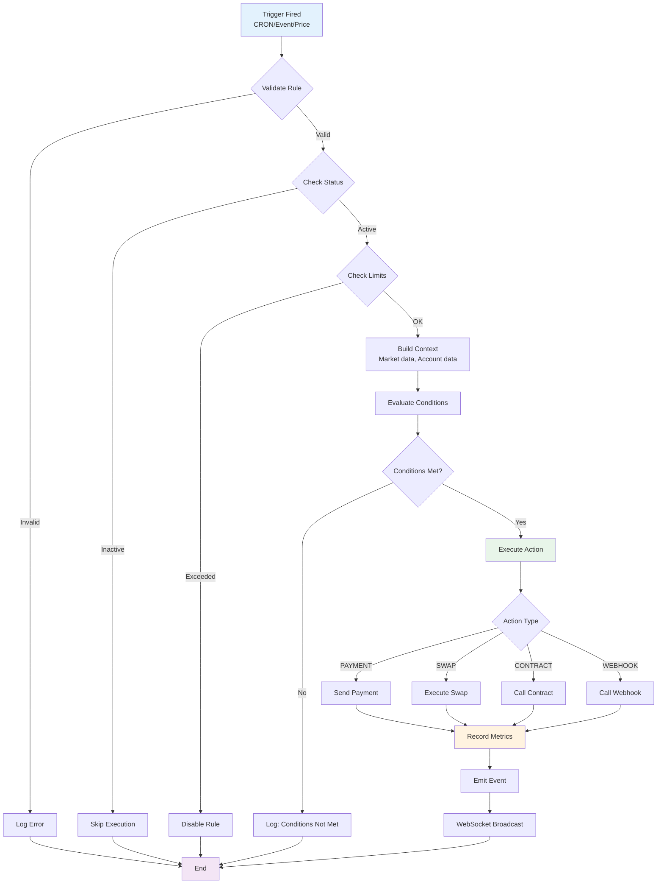
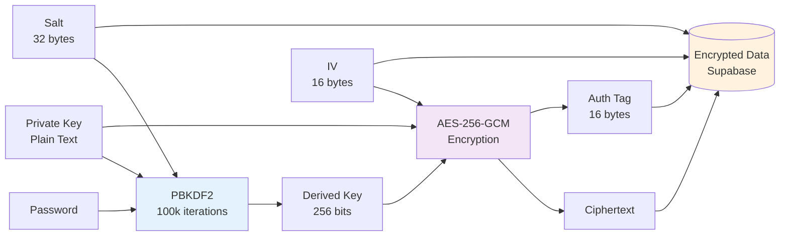
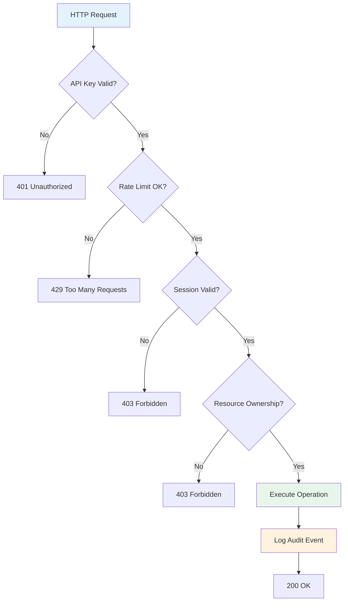
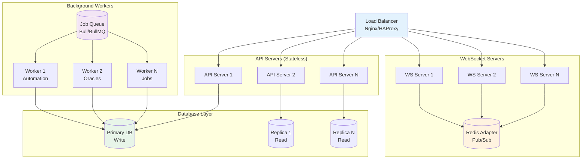
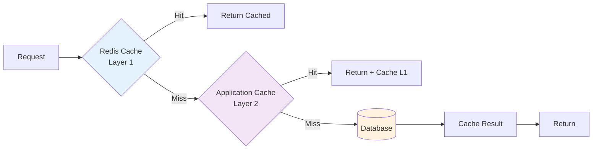
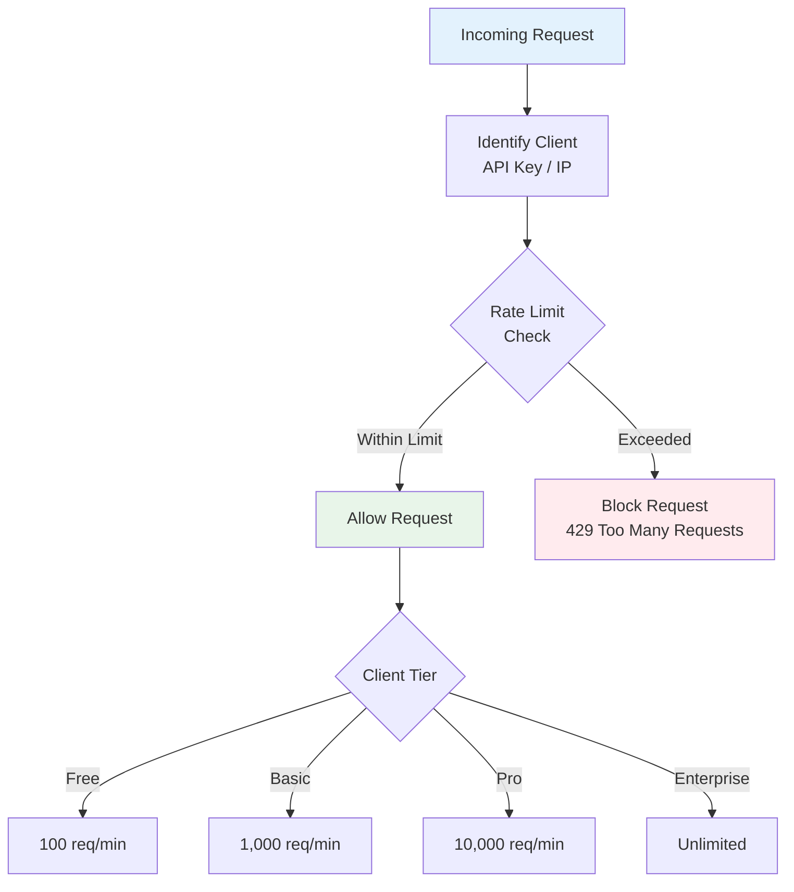

# 🏗️ Galaxy DevKit - Architecture Documentation

## 📋 Table of Contents
- [System Overview](#system-overview)
- [Core Components](#core-components)
- [DeFi Integration Architecture](#defi-integration-architecture)
- [Oracle System](#oracle-system)
- [Data Flow](#data-flow)
- [Security Architecture](#security-architecture)
- [Scalability](#scalability)

---

## 🎯 System Overview

Galaxy DevKit is a **modular, layered architecture** for Stellar blockchain development.


---

## 🔧 Core Components

### 1. Invisible Wallet System

**Purpose**: Provide seamless wallet management without exposing private keys to users.


**Key Features**:
- ED25519 keypair generation (Stellar native)
- BIP39/BIP44 mnemonic derivation (m/44'/148'/0')
- AES-256-GCM encryption with PBKDF2 key derivation
- Session-based authentication with configurable timeout
- Multi-device support with device fingerprinting
- Event logging for audit trail

**Database Schema**:
```sql
-- Wallets table
CREATE TABLE invisible_wallets (
  id TEXT PRIMARY KEY,
  user_id TEXT NOT NULL,
  public_key TEXT NOT NULL,
  encrypted_private_key TEXT NOT NULL,
  encrypted_seed TEXT,
  network JSONB NOT NULL,
  created_at TIMESTAMP NOT NULL,
  updated_at TIMESTAMP NOT NULL,
  last_accessed_at TIMESTAMP,
  metadata JSONB,
  backup_status JSONB
);

-- Sessions table
CREATE TABLE wallet_sessions (
  id TEXT PRIMARY KEY,
  wallet_id TEXT REFERENCES invisible_wallets(id),
  user_id TEXT NOT NULL,
  session_token TEXT UNIQUE NOT NULL,
  expires_at TIMESTAMP NOT NULL,
  created_at TIMESTAMP NOT NULL,
  is_active BOOLEAN DEFAULT true,
  device_info JSONB
);

-- Events table
CREATE TABLE wallet_events (
  id TEXT PRIMARY KEY,
  wallet_id TEXT REFERENCES invisible_wallets(id),
  user_id TEXT NOT NULL,
  event_type TEXT NOT NULL,
  timestamp TIMESTAMP NOT NULL,
  metadata JSONB
);
```

---

### 2. Stellar SDK Wrapper

**Purpose**: Abstract and simplify Stellar SDK operations.



**Network Configurations**:
```typescript
// Testnet
{
  network: 'testnet',
  horizonUrl: 'https://horizon-testnet.stellar.org',
  passphrase: 'Test SDF Network ; September 2015'
}

// Mainnet
{
  network: 'mainnet',
  horizonUrl: 'https://horizon.stellar.org',
  passphrase: 'Public Global Stellar Network ; September 2015'
}
```

---

### 3. Automation Engine

**Purpose**: Enable DeFi automation with triggers, conditions, and actions.


**Trigger Types**:


**Execution Flow**:


---

## 💰 DeFi Integration Architecture

### Protocol Abstraction Layer

```typescript
interface IDefiProtocol {
  readonly name: string;
  readonly protocolId: string;
  readonly contractAddress: string;

  // Lending & Borrowing
  supply(asset: Asset, amount: string): Promise<TransactionResult>;
  borrow(asset: Asset, amount: string): Promise<TransactionResult>;
  repay(asset: Asset, amount: string): Promise<TransactionResult>;
  withdraw(asset: Asset, amount: string): Promise<TransactionResult>;

  // Position Management
  getPosition(address: string): Promise<Position>;
  getHealth(address: string): Promise<HealthFactor>;

  // Protocol Info
  getSupplyAPY(asset: Asset): Promise<number>;
  getBorrowAPY(asset: Asset): Promise<number>;
  getTotalSupply(asset: Asset): Promise<string>;
  getTotalBorrow(asset: Asset): Promise<string>;
}
```

### Blend Protocol Integration

**Blend** is a lending protocol on Stellar Soroban.


**Example Usage**:
```typescript
const blend = new BlendProtocolService({
  contractAddress: 'BLEND_CONTRACT_ADDRESS',
  network: 'mainnet'
});

// Supply USDC to earn interest
await blend.supply(wallet, { code: 'USDC', issuer: 'USDC_ISSUER' }, '1000');

// Borrow XLM against supplied collateral
await blend.borrow(wallet, { code: 'XLM' }, '500');

// Check position health
const health = await blend.getHealthFactor(wallet.publicKey);
console.log('Health factor:', health); // > 1.0 is healthy
```

### DEX Aggregator Flow


---

## 🔮 Oracle System

### Architecture



### On-Chain Oracle Contract

```rust
pub struct PriceOracle;

#[contractimpl]
impl PriceOracle {
    /// Set price (only trusted sources)
    pub fn set_price(
        env: &Env,
        source: Address,
        pair: Symbol,
        price: u128,
        timestamp: u64
    );

    /// Get latest price
    pub fn get_price(env: &Env, pair: Symbol) -> PriceData;

    /// Get TWAP (Time-Weighted Average Price)
    pub fn get_twap(env: &Env, pair: Symbol, window: u64) -> u128;

    /// Add trusted source
    pub fn add_trusted_source(env: &Env, source: Address);
}
```

### Price Update Flow


---

## 🔄 Data Flow

### Wallet Creation Flow


### Payment Flow



### Automation Execution Flow



---

## 🔐 Security Architecture

### Encryption

**Wallet Private Keys**:


**Encrypted Data Structure**:
```typescript
interface EncryptedData {
  ciphertext: string;  // Base64
  iv: string;          // Base64
  salt: string;        // Base64
  authTag: string;     // Base64
  algorithm: 'aes-256-gcm';
}
```

### Access Control



### Audit Logging

```typescript
interface WalletEvent {
  id: string;
  walletId: string;
  userId: string;
  eventType: WalletEventType;
  timestamp: Date;
  metadata: {
    ipAddress?: string;
    userAgent?: string;
    deviceInfo?: DeviceInfo;
    [key: string]: any;
  };
}

enum WalletEventType {
  CREATED = 'created',
  UNLOCKED = 'unlocked',
  LOCKED = 'locked',
  TRANSACTION_SENT = 'transaction_sent',
  BACKUP_CREATED = 'backup_created',
  PASSWORD_CHANGED = 'password_changed',
  RECOVERY_INITIATED = 'recovery_initiated'
}
```

---

## 📈 Scalability

### Horizontal Scaling



### Caching Strategy



**Cache TTLs**:
- Account Info: 60 seconds
- Transaction History: 300 seconds (5 minutes)
- Price Data: 60 seconds
- Protocol Stats: 300 seconds (5 minutes)

### Rate Limiting



---

## 🧪 Testing Strategy

```mermaid
graph TB
    subgraph "Testing Pyramid"
        E2E[E2E Tests<br/>Full user flows]
        Integration[Integration Tests<br/>API + DB + Stellar]
        Unit[Unit Tests<br/>Core logic<br/>90%+ coverage]
    end

    subgraph "Contract Testing"
        Soroban[Soroban Contract Tests<br/>Every public function]
        Edge[Edge Cases<br/>Failure scenarios]
    end

    subgraph "CI/CD Pipeline"
        Lint[Linting<br/>ESLint/Prettier]
        Type[Type Check<br/>TypeScript]
        Test[Run Tests]
        Build[Build]
        Deploy[Deploy]
    end

    Unit --> Integration
    Integration --> E2E

    Soroban --> Edge

    Lint --> Type
    Type --> Test
    Test --> Build
    Build --> Deploy

    style Unit fill:#e8f5e9
    style Integration fill:#fff3e0
    style E2E fill:#e3f2fd
    style Soroban fill:#f3e5f5
```



---

**Last Updated**: 2024-01-15
**Version**: 1.0.0
