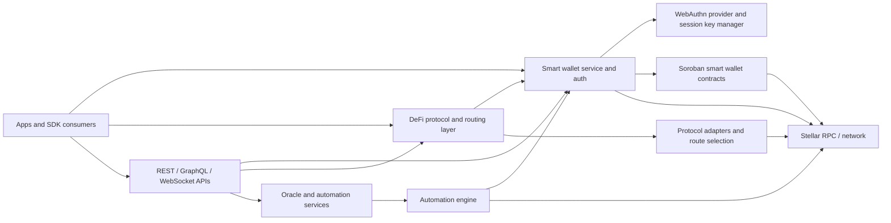
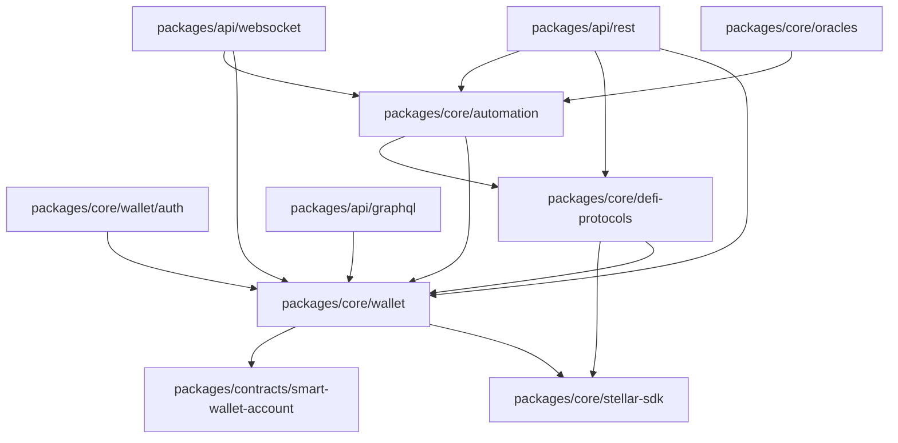
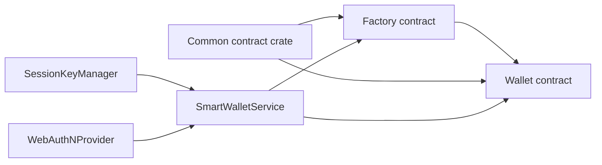
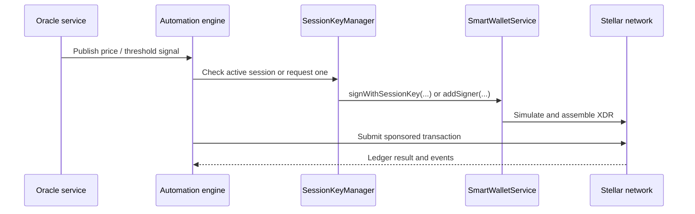
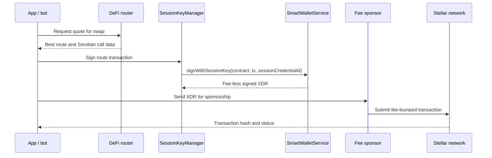

# Galaxy DevKit Architecture Overview

This document maps the current Galaxy DevKit codebase to the Soroban smart wallet, session key, oracle, and DeFi aggregation flows that now exist in the repository.

## Scope

- `packages/core/wallet`
- `packages/core/wallet/auth`
- `packages/core/defi-protocols`
- `packages/core/oracles`
- `packages/contracts/smart-wallet-account`
- `packages/api/*`

## System Overview

## Package Dependency Graph

## Smart Wallet Components

- The factory deploys deterministic wallet contracts keyed by the admin credential ID.
- The wallet contract stores admin signers in persistent storage and session signers in temporary storage.
- `SmartWalletService` now encapsulates factory deploy transaction construction and session signer revocation.

## Current Runtime Flows

### Smart Wallet Auth Flow

The passkey-driven Soroban auth path is documented in [smart-wallet-auth-flow.md](./smart-wallet-auth-flow.md).

### Session Key Lifecycle

The short-lived delegate signer flow is documented in [session-key-flow.md](./session-key-flow.md).

### DeFi Aggregation

The route selection and signing path is documented in [defi-aggregation-flow.md](./defi-aggregation-flow.md).

### Oracle and Automation Loop

## Complete Swap Data Flow

## Related Docs

- [Smart wallet auth flow](./smart-wallet-auth-flow.md)
- [Session key flow](./session-key-flow.md)
- [DeFi aggregation flow](./defi-aggregation-flow.md)
- [Smart wallet contract guide](../contracts/smart-wallet-contract.md)
- [Contract deployment guide](../contracts/deployment.md)
