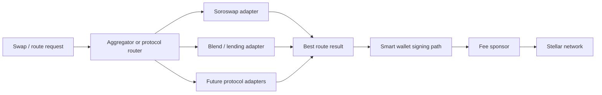
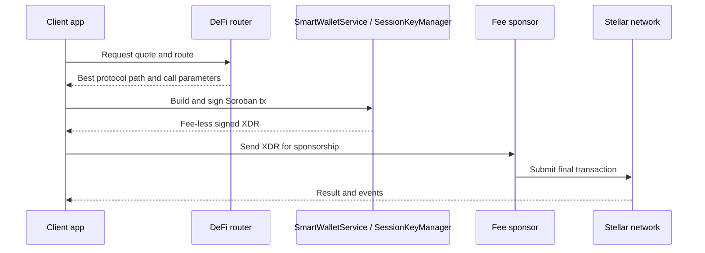

# DeFi Aggregation Flow

This document shows how quote selection, wallet authorization, and submission fit together for DeFi operations.

## Routing Diagram

## End-to-End Sequence

## Why Session Keys Matter Here

- High-frequency flows should avoid a biometric prompt on every swap.
- Session keys let bots or automations sign repeated transactions within a bounded TTL.
- Revocation and expiry keep those delegated rights time-limited.
