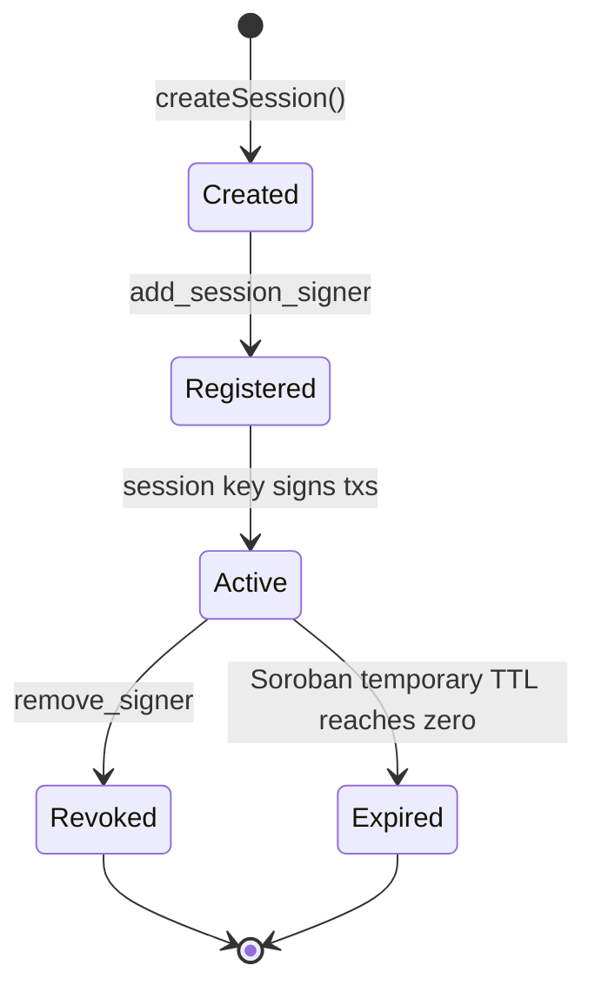
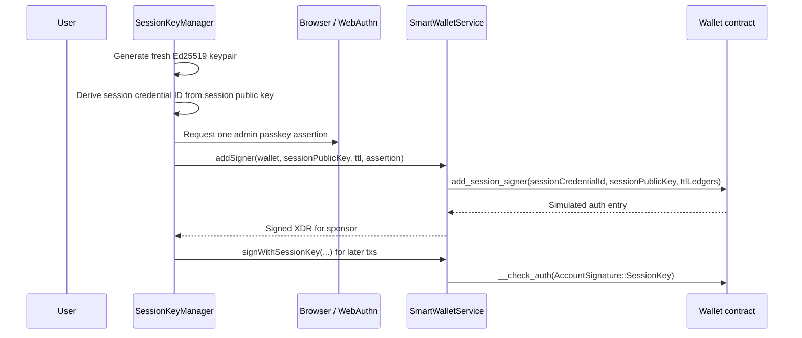

# Session Key Flow

This document describes how short-lived Ed25519 session signers are created, used, revoked, and allowed to expire on-chain.

## Lifecycle Diagram

## Detailed Flow

## Storage Model

- Admin signers live in persistent storage.
- Session signers live in Soroban temporary storage.
- Temporary storage TTL is extended on successful use and disappears automatically at expiry.

## Revocation Notes

- `SessionKeyManager.revoke()` clears the in-memory private key before awaiting the network path.
- `SmartWalletService.removeSigner()` now builds the `remove_signer` invocation and signs it with the admin passkey.
- The session credential ID used for `add_session_signer`, `remove_signer`, and `signWithSessionKey` is the same base64 encoding of the raw 32-byte session public key.
