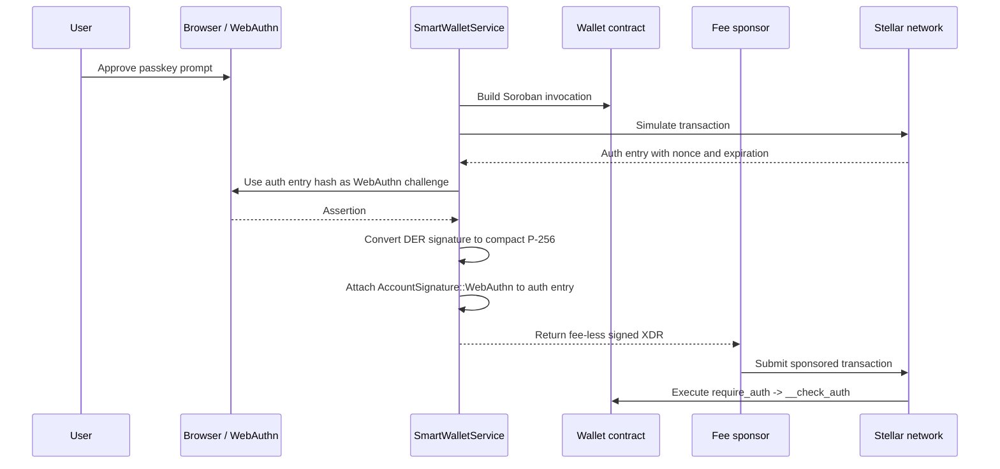

# Smart Wallet Auth Flow

This document covers the passkey-to-Soroban authorization path used by the smart wallet contracts and `SmartWalletService`.

## Flow Diagram

## Responsibilities

- `WebAuthNProvider` owns the browser credential ceremony.
- `SmartWalletService` builds the Soroban transaction, simulates it, hashes the auth entry, and binds the WebAuthn assertion to that exact payload.
- The wallet contract verifies the challenge and the P-256 signature in `__check_auth`.

## Key Properties

- The challenge is derived from the simulated auth entry, not a random detached nonce.
- The returned XDR is fee-less so a sponsor can add fees separately.
- Admin passkeys authenticate contract management calls such as deploy, add signer, and remove signer.
