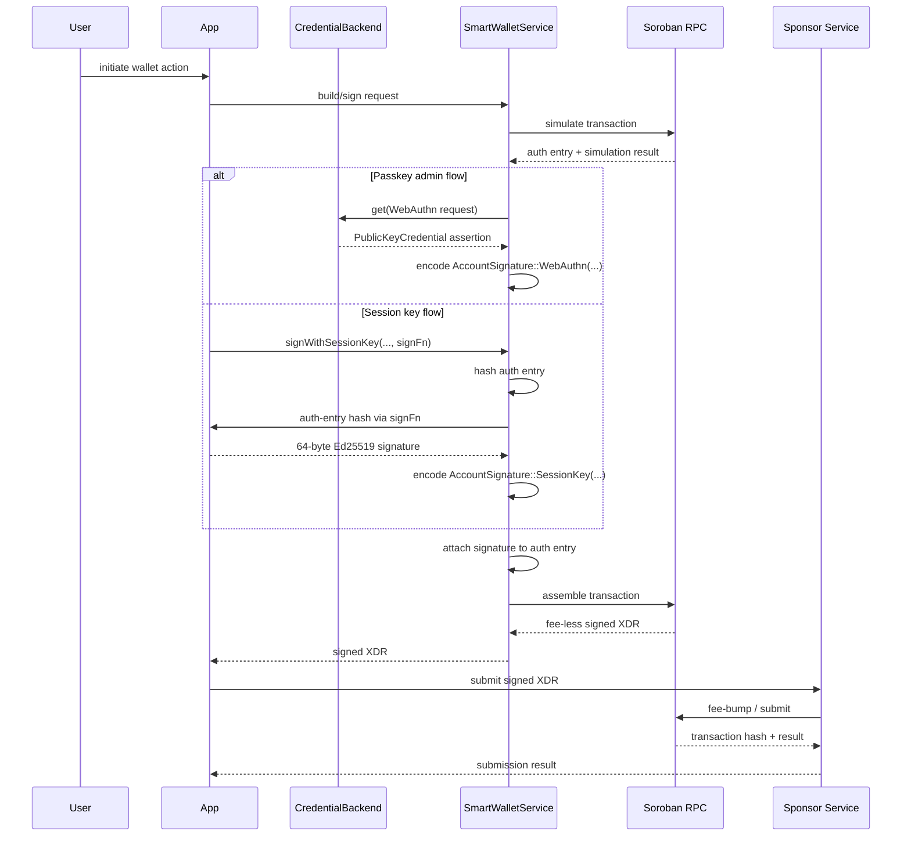

# Smart Wallet Flow

This document focuses on the Smart Wallet authorization path used by `SmartWalletService`.

## Sequence Diagram

## Why The Flow Returns XDR

`SmartWalletService` intentionally stops at signed XDR:
- credentials stay client-side,
- fee sponsorship stays server-side,
- transaction policy can be enforced by the sponsor before submission.

## Credential Backends

The credential backend abstraction exists so this flow works outside the browser:
- Browser: wrap `navigator.credentials`
- Tests: inject prebuilt assertion credentials
- React Native: wrap a passkey/mobile biometric package
- Server/HSM: wrap a custom signing service

## Related Docs

- [Smart Wallet API Reference](../smart-wallet/api-reference.md)
- [Smart Wallet Integration Guide](../smart-wallet/integration-guide.md)
