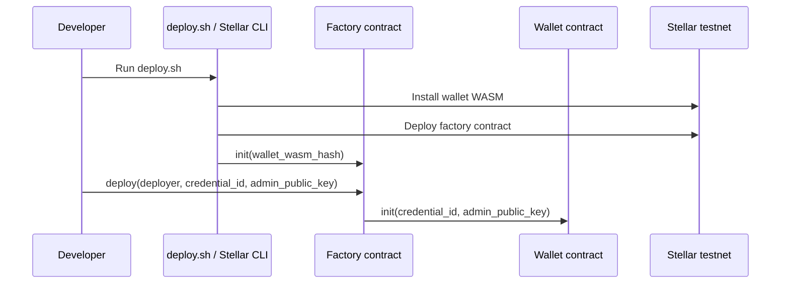

# Soroban Smart Wallet Deployment Guide

This guide walks through building and deploying the smart wallet contracts to Stellar testnet.

## Prerequisites

- Rust toolchain with `wasm32-unknown-unknown`
- Stellar CLI with Soroban support
- A funded Stellar testnet account configured in the local CLI
- Access to the repository root

## Build

From `packages/contracts/smart-wallet-account`:

```bash
cargo build --target wasm32-unknown-unknown
stellar contract build
```

The workspace script currently uses `stellar contract build` and writes the WASM artifacts consumed by `scripts/deploy.sh`.

## Environment Setup

The deployment script expects:

- `NETWORK=testnet`
- `SOURCE=deployer`
- A local Stellar CLI identity named `deployer`

Create and fund a testnet identity if needed:

```bash
stellar keys generate deployer
stellar keys fund deployer --network testnet
```

## Deploy With Script

Run:

```bash
cd packages/contracts/smart-wallet-account
./scripts/deploy.sh
```

The script performs:

1. Contract build.
2. Wallet WASM install.
3. Factory contract deploy.
4. Factory initialization with the installed wallet WASM hash.

Expected outputs:

- `FACTORY_CONTRACT_ID=<contract-id>`
- `WALLET_WASM_HASH=<wasm-hash>`

## Manual Verification

After deployment you can confirm the factory lookup path by invoking:

```bash
stellar contract invoke \
  --id "$FACTORY_CONTRACT_ID" \
  --source deployer \
  --network testnet \
  -- get_wallet --credential_id <base64-or-hex-encoded-bytes>
```

## Interaction Model



## Testing On Testnet

- Fund the deployer and any fee sponsor accounts before contract calls.
- Use a browser or Playwright virtual authenticator to obtain a real WebAuthn credential for admin signer flows.
- Use `packages/core/wallet/src/tests/smart-wallet.e2e.test.ts` as the reference integration flow for deploy, sign, and submit.

## Related Docs

- [Contract reference](./smart-wallet-contract.md)
- [Deployment runbook](./deployment-runbook.md) — full step-by-step guide including fee-bump sponsor setup and mainnet promotion checklist
- [Package README](../../packages/contracts/smart-wallet-account/README.md)
- [Stellar testnet docs](https://developers.stellar.org/docs/networks/testnet)
