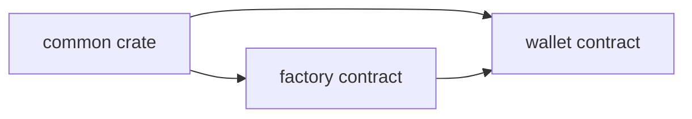

# Soroban Smart Wallet Contract Guide

This guide documents the smart wallet Soroban workspace in `packages/contracts/smart-wallet-account`.

## Architecture



## Crates

- `contracts/common`: shared contract types such as signer variants, storage keys, and wallet errors.
- `contracts/factory`: deterministic wallet deployment and credential-to-wallet lookup.
- `contracts/wallet`: signer management and custom account auth via `__check_auth`.

## Signer Types

### AdminSigner

- Backed by a WebAuthn P-256 public key.
- Stored in persistent storage.
- Used for wallet management operations and initial deployment.

### SessionSigner

- Backed by a raw Ed25519 public key.
- Stored in temporary storage with a Soroban TTL.
- Intended for short-lived delegated signing.

## Factory Contract Reference

### `init(wallet_wasm_hash: BytesN<32>) -> ()`

- Stores the wallet WASM hash used for future deployments.
- Must only be called once.

### `deploy(deployer: Address, credential_id: Bytes, public_key: BytesN<65>) -> Address`

- Requires `deployer.require_auth()`.
- Derives a deterministic salt from `sha256(credential_id)`.
- Deploys the wallet contract and immediately calls `wallet.init(credential_id, public_key)`.
- Returns the new wallet contract address.

### `get_wallet(credential_id: Bytes) -> Option<Address>`

- Looks up the previously deployed wallet address for a credential ID.
- Extends the TTL of the mapping on successful reads.

## Wallet Contract Reference

### `init(credential_id: Bytes, public_key: BytesN<65>) -> Result<(), WalletError>`

- Initializes the wallet once.
- Stores the first admin signer.

### `add_signer(credential_id: Bytes, public_key: BytesN<65>) -> Result<(), WalletError>`

- Adds another admin signer.
- Requires wallet self-auth through `require_auth`.

### `add_session_signer(credential_id: Bytes, public_key: BytesN<32>, ttl_ledgers: u32) -> Result<(), WalletError>`

- Registers a session signer in temporary storage.
- `credential_id` is the session signer identifier used later in `__check_auth`.
- `ttl_ledgers` controls the lifetime of the temporary entry.

### `remove_signer(credential_id: Bytes) -> Result<(), WalletError>`

- Removes either an admin signer or a session signer.
- Prevents deletion of the final admin signer.

### `__check_auth(signature_payload: Hash<32>, signature: AccountSignature, auth_contexts: Vec<Context>) -> Result<(), WalletError>`

- Verifies either:
- `AccountSignature::WebAuthn` for admin passkeys.
- `AccountSignature::SessionKey` for Ed25519 session signers.
- Extends TTLs for active signers after successful verification.

## TTL Behavior

- Admin signer entries use persistent storage with explicit extension constants.
- Session signer entries use temporary storage and naturally disappear when TTL reaches zero.
- Reuse of an active session signer extends its remaining TTL up to the stored session limit.

## Developer Notes

- `SmartWalletService.deploy()` now constructs the factory deploy invocation internally.
- `SmartWalletService.addSigner()` and `removeSigner()` build Soroban invocations and return fee-less XDR for sponsorship.
- The session credential ID should be stable across registration, signing, and revocation. In the TypeScript integration this is derived from the raw session public key bytes.

## Fee-bump sponsor architecture

Galaxy DevKit uses a **fee-bump sponsor** pattern so users never need to hold XLM to pay transaction fees.

```
Client (browser)                        Server (Galaxy DevKit API)
──────────────────                      ─────────────────────────
SmartWalletService.sign()               POST /api/v1/wallets/submit-tx
  │                                       │
  │  1. Simulate tx → authEntry           │
  │  2. WebAuthn assertion                │
  │  3. Attach signature to authEntry     │
  │  4. Build fee-less XDR (fee = 0)      │
  │                                       │
  └──── signedTxXdr ───────────────────►  │
                                          │  5. Parse inner tx
                                          │  6. buildFeeBumpTransaction(sponsorKeypair, fee, innerTx)
                                          │  7. feeBumpTx.sign(sponsorKeypair)
                                          │  8. Submit to Soroban RPC
                                          │  9. Poll until confirmed
                                          │
                                         ◄── { transactionHash, ledger }
```

**Security properties:**
- The backend signs only the outer fee-bump envelope with `FEE_SPONSOR_SECRET_KEY`.
- The backend never sees, derives, or touches the user's private key.
- The inner transaction (user's signed operation) is unmodified.

See the [Deployment Runbook](./deployment-runbook.md) for sponsor account setup and the [REST API Reference](../api/api-reference.md) for the `submit-tx` endpoint.

## Useful External References

- [Stellar smart contracts docs](https://developers.stellar.org/docs/build/smart-contracts/overview)
- [Soroban CLI docs](https://developers.stellar.org/docs/tools/soroban-cli)
- [Deployment runbook](./deployment-runbook.md) — step-by-step deploy guide with fee-bump sponsor setup
