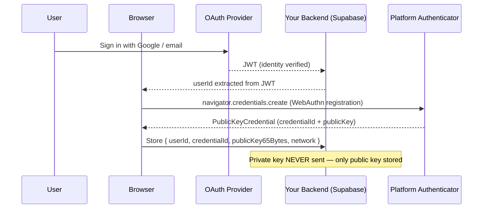
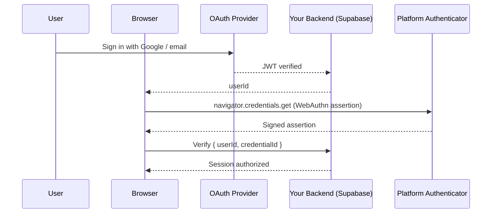

# Social Login Integration Guide

This guide explains how to use `SocialLoginProvider` to onboard users from an OAuth provider (Supabase Auth, Auth0, Google OAuth) into a non-custodial Stellar wallet backed by a WebAuthn passkey — without the backend ever touching private key material.

## Two-layer security model

`SocialLoginProvider` is **not** a standard OAuth library and is **not** a standard WebAuthn library. It is the bridge between them.

| Layer | Purpose | Who verifies it |
|-------|---------|----------------|
| OAuth JWT | Identifies the user (email / social account) | Your backend + Supabase / Auth0 |
| WebAuthn passkey | Protects the Stellar private key on-device | The client device (TPM / Secure Enclave) |

These two layers are **independent**. The OAuth token never touches the key. The private key never leaves the device.

```
┌──────────────────────────────────────────────────────────┐
│  OAuth layer (identity)                                  │
│  Google/Auth0/Supabase → JWT → your backend              │
│  Backend extracts userId and passes it to client         │
└──────────────────────────────────────────────────────────┘
         │  userId only (no token forwarded to WebAuthn)
         ▼
┌──────────────────────────────────────────────────────────┐
│  WebAuthn layer (key protection)                         │
│  navigator.credentials.create / .get                    │
│  Platform authenticator (Touch ID, Windows Hello, …)    │
│  Private key lives in TEE / Secure Enclave — never sent  │
└──────────────────────────────────────────────────────────┘
         │  publicKey65Bytes (safe to store), credentialId
         ▼
┌──────────────────────────────────────────────────────────┐
│  Stellar layer (wallet)                                  │
│  SmartWalletService uses credential to sign Soroban txs  │
└──────────────────────────────────────────────────────────┘
```

## Sequence diagrams

### Onboarding (first login)



### Returning user (login)



## Installation

```bash
npm install @galaxy-kj/core-wallet
```

## Setting up the providers

```ts
import { WebAuthNProvider } from '@galaxy-kj/core-wallet/auth/providers/WebAuthNProvider';
import { SocialLoginProvider } from '@galaxy-kj/core-wallet/auth/providers/SocialLoginProvider';

const webAuthnProvider = new WebAuthNProvider({
  rpId: 'yourdomain.com',      // must match window.location.hostname in production
  rpName: 'Your App Name',
});

const socialLogin = new SocialLoginProvider(webAuthnProvider);
```

## Onboarding flow

Call `onboard(userId)` after your OAuth provider has authenticated the user and you have extracted their `userId`. This registers a new WebAuthn passkey on the device.

```ts
// After Supabase / OAuth sign-in succeeds and you have the userId:
async function onboardUser(userId: string) {
  const result = await socialLogin.onboard(userId);
  // result = { userId, credentialId, publicKey65Bytes }

  // Store these in Supabase — publicKey65Bytes is safe to persist
  await supabase.from('smart_wallets').insert({
    user_id: result.userId,
    credential_id: result.credentialId,
    public_key: Buffer.from(result.publicKey65Bytes).toString('base64'),
    network: 'testnet',
  });

  return result;
}
```

**What to store in Supabase:**

| Column | Value | Notes |
|--------|-------|-------|
| `user_id` | `result.userId` | From OAuth provider |
| `credential_id` | `result.credentialId` | WebAuthn credential identifier |
| `public_key` | `Buffer.from(result.publicKey65Bytes).toString('base64')` | 65-byte P-256 uncompressed point — safe to store |
| `network` | `'testnet'` or `'mainnet'` | Stellar network |

**Never store:** the private key, the seed phrase, or any derived secret. The backend has no access to these and should not.

## Login flow

Call `login(userId)` on subsequent visits after OAuth re-authentication. This asserts the existing passkey.

```ts
async function loginUser(userId: string) {
  const result = await socialLogin.login(userId);
  // result = { userId, credentialId }

  // Verify that credentialId belongs to userId in your backend
  const { data: wallet } = await supabase
    .from('smart_wallets')
    .select('credential_id, public_key')
    .eq('user_id', result.userId)
    .eq('credential_id', result.credentialId)
    .single();

  if (!wallet) {
    throw new Error('Unknown credential — passkey not registered for this account');
  }

  // User is now authenticated at both layers
  return { userId: result.userId, credentialId: result.credentialId };
}
```

## Full Supabase example

The example below wires together Supabase Auth (Google OAuth) with `SocialLoginProvider`.

```ts
import { createClient } from '@supabase/supabase-js';
import { WebAuthNProvider } from '@galaxy-kj/core-wallet/auth/providers/WebAuthNProvider';
import { SocialLoginProvider } from '@galaxy-kj/core-wallet/auth/providers/SocialLoginProvider';
import { SmartWalletService } from '@galaxy-kj/core-wallet';

const supabase = createClient(process.env.SUPABASE_URL!, process.env.SUPABASE_ANON_KEY!);

const webAuthnProvider = new WebAuthNProvider({ rpId: window.location.hostname });
const socialLogin = new SocialLoginProvider(webAuthnProvider);

// ── Sign-in / sign-up handler ─────────────────────────────────────────────────
async function handleAuthCallback() {
  // 1. Finish OAuth exchange
  const { data: { session }, error } = await supabase.auth.getSession();
  if (error || !session) throw new Error('OAuth session missing');

  const userId = session.user.id; // Supabase UUID

  // 2. Check whether this user already has a passkey registered
  const { data: existing } = await supabase
    .from('smart_wallets')
    .select('id')
    .eq('user_id', userId)
    .maybeSingle();

  if (existing) {
    // Returning user — assert passkey
    const loginResult = await socialLogin.login(userId);
    console.log('Authenticated credential:', loginResult.credentialId);
  } else {
    // New user — register passkey and create wallet record
    const onboardResult = await socialLogin.onboard(userId);

    await supabase.from('smart_wallets').insert({
      user_id: onboardResult.userId,
      credential_id: onboardResult.credentialId,
      public_key: Buffer.from(onboardResult.publicKey65Bytes).toString('base64'),
      network: 'testnet',
    });

    console.log('Wallet created for', userId);
  }
}
```

## Provider examples

### Auth0

```ts
// After Auth0 redirect callback:
const { user } = await auth0Client.handleRedirectCallback();
const userId = user.sub; // Auth0 subject — stable per user

const result = await socialLogin.onboard(userId);
```

### Google OAuth (raw)

```ts
// After Google sign-in returns an ID token and you decode it server-side:
// Send userId from your backend to the client
const result = await socialLogin.onboard(googleUserId);
```

## Backend server-side verification

For sensitive operations your backend should verify **both** layers before authorising a request.

```ts
// Pseudocode — adapt to your framework
async function verifyDualAuth(jwtToken: string, credentialId: string) {
  // Layer 1: verify OAuth JWT
  const payload = verifyJwt(jwtToken, SUPABASE_JWT_SECRET);
  const userId = payload.sub;

  // Layer 2: verify credentialId belongs to this user
  const { data: wallet } = await supabase
    .from('smart_wallets')
    .select('credential_id')
    .eq('user_id', userId)
    .eq('credential_id', credentialId)
    .single();

  if (!wallet) throw new Error('Credential does not belong to this user');

  return { userId, credentialId };
}
```

For WebAuthn assertion verification (e.g., from a relay flow), use `@simplewebauthn/server` on the Node.js backend:

```ts
import { verifyAuthenticationResponse } from '@simplewebauthn/server';

const verification = await verifyAuthenticationResponse({
  response: clientAuthResponse,
  expectedChallenge,
  expectedOrigin: 'https://yourdomain.com',
  expectedRPID: 'yourdomain.com',
  authenticator: {
    credentialPublicKey: storedPublicKeyBytes,
    credentialID: Buffer.from(storedCredentialId, 'base64'),
    counter: storedCounter,
  },
});
```

## Security guarantees

| Property | Guarantee |
|----------|-----------|
| Private key stays on device | `SocialLoginProvider` only calls `navigator.credentials.create/get`. The private key never leaves the platform authenticator. |
| Public key is safe to store | The 65-byte uncompressed P-256 point (`publicKey65Bytes`) can be stored in Supabase without security risk. |
| OAuth token does not derive keys | The JWT is only used to identify the user (`userId`). No key derivation is performed from OAuth tokens — the two layers are independent. |
| Passkey is device-bound | Loss of device does not expose the key. Use [Social Recovery](../smart-wallet/integration-guide.md) for backup. |
| Replay protection | Each WebAuthn assertion uses a fresh server-issued challenge. Reuse of an assertion will fail verification. |

**Do NOT store:**
- Private keys
- Seed phrases
- Session key secrets
- Any bytes returned by the platform authenticator that are not the `credentialId` or public key

## Error handling

| Error | Cause | Resolution |
|-------|-------|-----------|
| `No credentials found. Please onboard first.` | `login()` called before `onboard()` | Run the onboarding flow first |
| `WebAuthn authentication failed` | User cancelled or authenticator error | Show retry prompt |
| `Authentication cancelled` | User dismissed the passkey prompt | Treat as user cancellation |
| `NotAllowedError` | Browser policy or missing gesture | Ensure call is inside a user gesture |
| `SecurityError` | `rpId` mismatch | `rpId` must match `window.location.hostname` |

## Testing

```ts
import { WebAuthNProvider } from '@galaxy-kj/core-wallet/auth/providers/WebAuthNProvider';
import { SocialLoginProvider } from '@galaxy-kj/core-wallet/auth/providers/SocialLoginProvider';

// Mock navigator.credentials
const mockCredential = {
  id: 'test-credential-id',
  rawId: new ArrayBuffer(32),
  response: {
    getPublicKey: () => new ArrayBuffer(91), // 26-byte header + 65-byte point
    attestationObject: new ArrayBuffer(0),
    clientDataJSON: new ArrayBuffer(0),
  },
  type: 'public-key',
};

Object.defineProperty(globalThis.navigator, 'credentials', {
  configurable: true,
  value: {
    create: jest.fn().mockResolvedValue(mockCredential),
    get: jest.fn().mockResolvedValue({ ...mockCredential, response: {} }),
  },
});

const provider = new WebAuthNProvider({ rpId: 'localhost' });
const socialLogin = new SocialLoginProvider(provider);

test('onboard registers a credential', async () => {
  const result = await socialLogin.onboard('user-abc');
  expect(result.userId).toBe('user-abc');
  expect(result.credentialId).toBeDefined();
  expect(result.publicKey65Bytes).toHaveLength(65);
});
```

## Related docs

- [WebAuthn Integration Guide](../smart-wallet/webauthn-guide.md) — deep-dive on WebAuthn internals and `SmartWalletService` integration
- [Smart Wallet Integration Guide](../smart-wallet/integration-guide.md) — full wallet lifecycle including session keys and social recovery
- [Getting Started](./getting-started.md) — project setup
