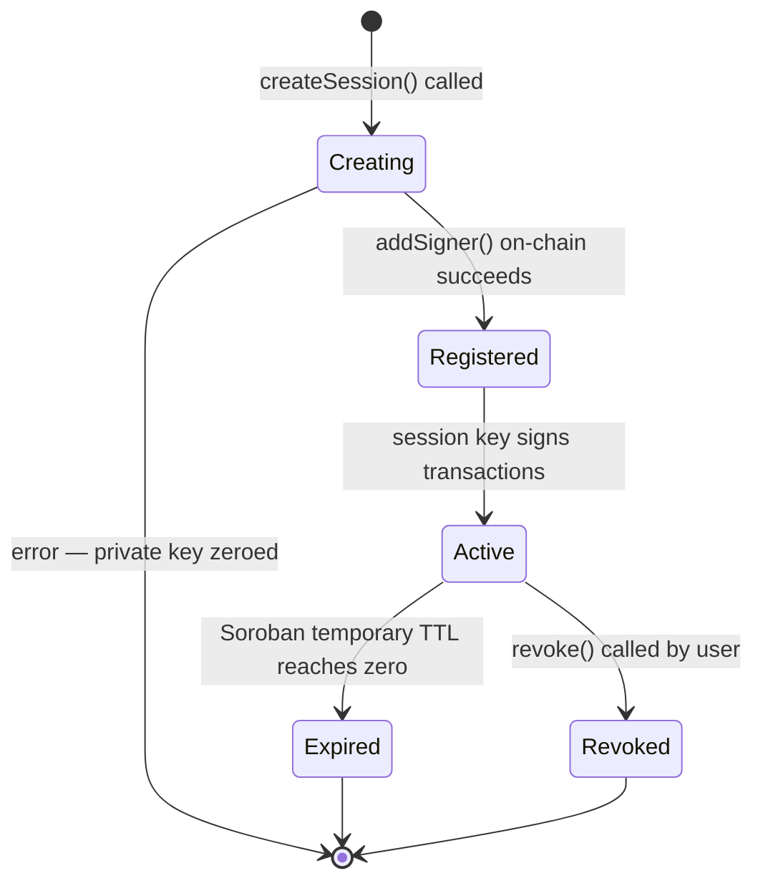
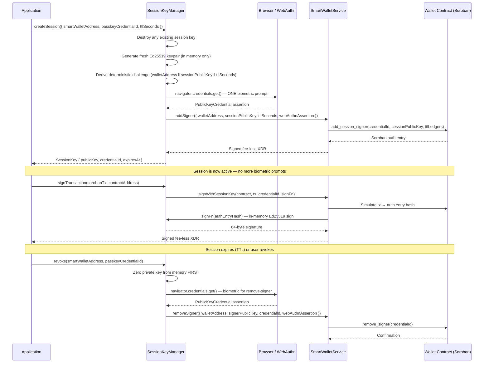

# Session Key Lifecycle Guide

Session keys are short-lived Ed25519 delegate signers that let users authorize repeated Soroban transactions without a biometric prompt on every operation. A single passkey assertion at session creation is all that is needed — subsequent transactions are signed silently in memory.

This guide covers the full lifecycle: creation, on-chain registration, transaction signing, TTL strategy, on-chain vs in-memory state, security considerations, and error handling.

---

## What Is a Session Key and Why Does It Exist?

Every Soroban smart wallet transaction requires an authorization signature. Without session keys, that means a biometric prompt (Touch ID, Face ID, Windows Hello) for every swap, DCA tick, or micro-payment — a terrible UX for high-frequency operations.

A session key solves this by acting as a temporary delegate:

1. The user approves **once** (one biometric prompt) to register the session key on-chain.
2. The Ed25519 private key lives **only in memory** for the duration of the session.
3. All subsequent transactions are signed with the in-memory key — no further user interaction.
4. The key is gone when the session expires (TTL) or is explicitly revoked.

This is the core UX pattern of Galaxy DevKit non-custodial wallets.

---

## Session Lifecycle



### Detailed Sequence



---

## SessionKeyManager API Reference

Import from the auth package:

```ts
import { SessionKeyManager } from '@galaxy/core-wallet/auth/session/SessionKeyManager';
import type { SessionKey, CreateSessionOptions } from '@galaxy/core-wallet/auth/session/SessionKeyManager';
```

### Constructor

```ts
const sessionKeyManager = new SessionKeyManager(
  webAuthnProvider,   // IWebAuthnProvider — must expose rpId
  smartWalletService  // ISmartWalletService
);
```

---

### `createSession(options)`

Creates a new session: generates a fresh Ed25519 keypair, obtains one WebAuthn assertion, and registers the session signer on-chain.

```ts
const session = await sessionKeyManager.createSession({
  smartWalletAddress: 'C...contract...address',
  passkeyCredentialId: 'base64-encoded-credential-id',
  ttlSeconds: 3600, // 1 hour
});

console.log(session.publicKey);   // Ed25519 G-address
console.log(session.credentialId); // base64 session credential ID
console.log(session.expiresAt);   // Unix timestamp (seconds)
```

**Parameters:**

| Field | Type | Description |
|---|---|---|
| `smartWalletAddress` | `string` | Bech32 address of the deployed smart wallet contract |
| `passkeyCredentialId` | `string` | Base64-encoded WebAuthn credential ID of the admin passkey |
| `ttlSeconds` | `number` | Session duration in seconds (e.g. `3600` for 1 hour) |

**Returns:** `Promise<SessionKey>`

**Throws:** If WebAuthn assertion is cancelled, or if `addSigner` fails on-chain. The private key is zeroed on any error path.

---

### `signTransaction(sorobanTx, contractAddress, credentialId?)`

Signs a Soroban transaction using the active in-memory session key. No biometric prompt.

```ts
const signedXdr = await sessionKeyManager.signTransaction(
  sorobanTx,        // Transaction object from @stellar/stellar-sdk
  contractAddress,  // Bech32 smart wallet contract address
  // credentialId is optional — defaults to the active session's credentialId
);

// Send signedXdr to your fee sponsor service
await fetch('/api/submit', {
  method: 'POST',
  body: JSON.stringify({ signedTxXdr: signedXdr }),
});
```

**Parameters:**

| Field | Type | Description |
|---|---|---|
| `sorobanTx` | `Transaction` | The Soroban invocation transaction to sign |
| `contractAddress` | `string` | Bech32 address of the smart wallet contract |
| `credentialId` | `string` (optional) | Session credential ID — defaults to active session |

**Returns:** `Promise<string>` — fee-less signed XDR (base64) for sponsor submission.

**Throws:** If no active session exists or the session has expired.

---

### `revoke(smartWalletAddress, passkeyCredentialId)`

Removes the session signer from the smart wallet contract and zeroes the private key from memory.

```ts
await sessionKeyManager.revoke(
  contractAddress,
  passkeyCredentialId
);
```

**Important:** The private key is zeroed **before** the async network call. Even if the network call fails, the key is gone from memory.

A fresh biometric prompt is issued for the `remove_signer` transaction — this is intentional, since revocation is a deliberate, infrequent user action.

Safe to call when no session is active (no-op).

---

### `isActive()`

Returns `true` if an unexpired session key is held in memory.

```ts
if (!sessionKeyManager.isActive()) {
  // Re-create session or prompt user
  await sessionKeyManager.createSession({ ... });
}
```

---

### `sign(txHash)`

Low-level primitive. Signs a 32-byte buffer with the active session key. Prefer `signTransaction()` for the full Soroban flow.

```ts
const signature = sessionKeyManager.sign(authEntryHashBuffer); // returns 64-byte Buffer
```

---

## TTL Strategy

Choosing the right TTL is a balance between UX convenience and security exposure.

### Short TTL (60–300 seconds)

Use for:
- Single-operation flows (one swap, one payment)
- High-value transactions where re-authentication is acceptable
- Environments with strict security requirements

```ts
await sessionKeyManager.createSession({
  smartWalletAddress,
  passkeyCredentialId,
  ttlSeconds: 120, // 2 minutes
});
```

### Medium TTL (900–3600 seconds)

Use for:
- Active trading sessions (15 min – 1 hour)
- DCA bots during a user-supervised session
- Standard wallet UX where the user is present

```ts
await sessionKeyManager.createSession({
  smartWalletAddress,
  passkeyCredentialId,
  ttlSeconds: 3600, // 1 hour
});
```

### Long TTL (3600–86400 seconds)

Use for:
- Automated background operations (DCA, recurring payments)
- Server-side automation where the user has explicitly delegated
- Only when combined with explicit revocation on logout

```ts
await sessionKeyManager.createSession({
  smartWalletAddress,
  passkeyCredentialId,
  ttlSeconds: 86400, // 24 hours
});
```

### TTL to Ledger Conversion

Soroban stores TTL in ledgers, not seconds. `SmartWalletService.ttlSecondsToLedgers()` handles the conversion (assumes 5 seconds per ledger, rounds up):

```ts
service.ttlSecondsToLedgers(3600); // → 720 ledgers
```

The contract uses Soroban **temporary storage** for session signers, so the entry disappears automatically when the TTL reaches zero — no server-side cleanup needed.

---

## On-Chain vs In-Memory State

Understanding what lives where is critical for debugging and security reasoning.

| State | Location | Lifetime | Notes |
|---|---|---|---|
| Session public key | Soroban temporary storage | Until TTL expires or `remove_signer` | Automatically cleaned up by the ledger |
| Session credential ID | Soroban temporary storage | Same as above | Used as the key for `__check_auth` |
| Session private key | JavaScript heap (memory only) | Until `revoke()`, page unload, or process exit | **Never** written to disk, localStorage, or any persistent store |
| Admin passkey credential ID | `localStorage` / server DB | Persistent | Managed by `WebAuthNProvider` |
| Admin passkey public key | Soroban persistent storage | Until explicitly removed | Lives in the wallet contract's persistent storage |

### What Happens at Expiry

When the Soroban TTL reaches zero:
- The on-chain session signer entry is automatically removed by the ledger.
- The in-memory private key is **not** automatically zeroed — it remains until `revoke()` is called or the page unloads.
- `isActive()` returns `false` once `Date.now() / 1000 >= expiresAt`, so `signTransaction()` will throw before attempting any network call.

Best practice: call `revoke()` explicitly on logout rather than relying on TTL expiry to clean up the in-memory key.

---

## Security Considerations

### Key Zeroization

The private key is stored as a `Buffer` and zeroed with `Buffer.fill(0)` in every exit path:

- `revoke()` — explicit user revocation
- `createSession()` error path — if on-chain registration fails
- `sign()` / `signTransaction()` — if the session is detected as expired before signing

```ts
// Internal — called on every exit path
private _destroyPrivateKey(): void {
  if (this._privateKeyBytes) {
    this._privateKeyBytes.fill(0); // overwrite with zeros
    this._privateKeyBytes = null;
  }
  this._sessionKey = null;
}
```

### Memory Exposure Window

The private key exists in memory from the moment `createSession()` generates the keypair until `revoke()` or page unload. This window is the primary attack surface:

- Keep TTLs short for sensitive operations.
- Call `revoke()` explicitly on logout — don't rely on TTL expiry.
- Avoid long-lived sessions in shared or untrusted environments.
- The key is never serialized, so heap dumps are the main risk vector.

### Challenge Binding

The WebAuthn challenge for `createSession()` is derived deterministically from the operation parameters:

```
challenge = SHA-256(walletAddress ‖ sessionPublicKey ‖ ttlSeconds)
```

This binds the passkey assertion to this specific `add_session_signer` invocation, preventing replay attacks across different transactions or wallet addresses.

### No Persistent Storage

Session private keys are **never** written to:
- `localStorage` or `sessionStorage`
- IndexedDB
- Supabase or any backend database
- Cookies or any network-transmitted store

If you need to persist a session across page reloads, you must call `createSession()` again (one new biometric prompt).

### Revocation Before Network Call

`revoke()` zeroes the private key **before** awaiting the `removeSigner` network call. This ensures the key is gone from memory even if the network call throws or times out.

---

## Error Scenarios

### Expired Session

```
Error: No active session. Call createSession() first.
```

Thrown by `signTransaction()` and `sign()` when `isActive()` returns `false`. The session TTL has elapsed.

**Resolution:** Call `createSession()` again to start a new session.

```ts
if (!sessionKeyManager.isActive()) {
  await sessionKeyManager.createSession({ smartWalletAddress, passkeyCredentialId, ttlSeconds });
}
```

### Missing Session

```
Error: No active session. Call createSession() first.
```

Same error, different cause — `createSession()` was never called, or the page was reloaded (clearing in-memory state).

**Resolution:** Always check `isActive()` before calling `signTransaction()`.

### Revoked Session

After `revoke()`, the in-memory key is zeroed and the on-chain signer is removed. Any subsequent `signTransaction()` call will throw the same "No active session" error.

**Resolution:** Call `createSession()` to start a fresh session.

### WebAuthn Assertion Cancelled

```
Error: WebAuthn assertion cancelled or returned null.
```

The user dismissed the biometric prompt during `createSession()` or `revoke()`.

**Resolution:** Catch the error and prompt the user to try again.

```ts
try {
  await sessionKeyManager.createSession({ ... });
} catch (err) {
  if (err.message.includes('cancelled')) {
    // Show retry UI
  }
}
```

### On-Chain Registration Failure

```
Error: addSigner simulation failed: ...
```

The `add_session_signer` Soroban simulation or submission failed. The private key is zeroed automatically.

**Resolution:** Check the Soroban RPC endpoint, verify the wallet contract address, and retry `createSession()`.

### Missing Credential ID

```
Error: No active session credential ID. Call createSession() first.
```

`signTransaction()` was called without an active session and without passing an explicit `credentialId`.

---

## Full Integration Example

```ts
import { Networks } from '@stellar/stellar-sdk';
import { WebAuthNProvider } from '@galaxy/core-wallet/auth/providers/WebAuthNProvider';
import { BrowserCredentialBackend } from '@galaxy/core-wallet/credential-backends/browser.backend';
import { SmartWalletService } from '@galaxy/core-wallet/smart-wallet.service';
import { SessionKeyManager } from '@galaxy/core-wallet/auth/session/SessionKeyManager';

// 1. Setup
const provider = new WebAuthNProvider({ rpId: 'app.example.com' });
const credentialBackend = new BrowserCredentialBackend();

const smartWalletService = new SmartWalletService(
  provider,
  'https://soroban-testnet.stellar.org',
  process.env.FACTORY_CONTRACT_ID,
  Networks.TESTNET,
  credentialBackend
);

const sessionKeyManager = new SessionKeyManager(provider, smartWalletService);

// 2. Create session (one biometric prompt)
const session = await sessionKeyManager.createSession({
  smartWalletAddress: contractAddress,
  passkeyCredentialId: storedCredentialId,
  ttlSeconds: 3600,
});

console.log(`Session active until ${new Date(session.expiresAt * 1000).toISOString()}`);

// 3. Sign transactions without biometric prompts
for (const tx of pendingTransactions) {
  if (!sessionKeyManager.isActive()) {
    throw new Error('Session expired — re-authenticate');
  }

  const signedXdr = await sessionKeyManager.signTransaction(tx, contractAddress);

  await fetch('/api/submit-soroban-xdr', {
    method: 'POST',
    headers: { 'Content-Type': 'application/json' },
    body: JSON.stringify({ signedTxXdr: signedXdr }),
  });
}

// 4. Revoke on logout (one biometric prompt)
await sessionKeyManager.revoke(contractAddress, storedCredentialId);
```

---

## Related Docs

- [SmartWalletService API Reference](./api-reference.md)
- [Smart Wallet Integration Guide](./integration-guide.md)
- [WebAuthn / Passkey Guide](./webauthn-guide.md)
- [Session Key Architecture Flow](../architecture/session-key-flow.md)
- [Architecture Overview](../architecture/architecture.md)
- [Wallet Auth Package README](../../packages/core/wallet/auth/README.md)
