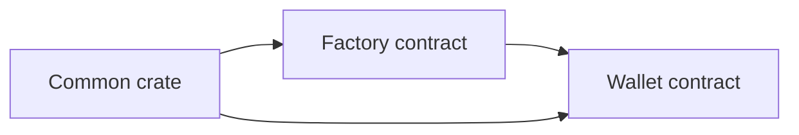

# Smart Wallet Account Contracts

Soroban smart wallet contracts for Galaxy DevKit.

## Workspace Layout

- `contracts/common`: shared signer types, storage keys, and errors
- `contracts/factory`: deterministic wallet deployment
- `contracts/wallet`: signer management and custom account auth
- `scripts/deploy.sh`: testnet deployment helper

## Contract Architecture



## Build

```bash
cd packages/contracts/smart-wallet-account
cargo build --target wasm32-unknown-unknown
stellar contract build
```

## Deploy To Testnet

```bash
cd packages/contracts/smart-wallet-account
./scripts/deploy.sh
```

The script:

1. Builds the contract workspace.
2. Installs the wallet WASM.
3. Deploys the factory contract.
4. Initializes the factory with the installed wallet WASM hash.

## Core Functions

### Factory

- `init(wallet_wasm_hash)`: stores the wallet WASM hash.
- `deploy(deployer, credential_id, public_key)`: deploys and initializes a deterministic wallet.
- `get_wallet(credential_id)`: returns the deployed wallet address if it exists.

### Wallet

- `init(credential_id, public_key)`: stores the first admin signer.
- `add_signer(credential_id, public_key)`: adds another admin passkey signer.
- `add_session_signer(credential_id, public_key, ttl_ledgers)`: registers a short-lived session signer.
- `remove_signer(credential_id)`: removes an admin or session signer.
- `__check_auth(...)`: validates WebAuthn or session-key signatures.

## Storage Model

- Admin signers use persistent storage.
- Session signers use temporary storage with Soroban TTL auto-expiry.
- Factory credential-to-wallet mappings use persistent storage.

## Additional Documentation

- [Contract reference](../../../docs/contracts/smart-wallet-contract.md)
- [Deployment guide](../../../docs/contracts/deployment.md)
- [Architecture overview](../../../docs/architecture/architecture.md)
